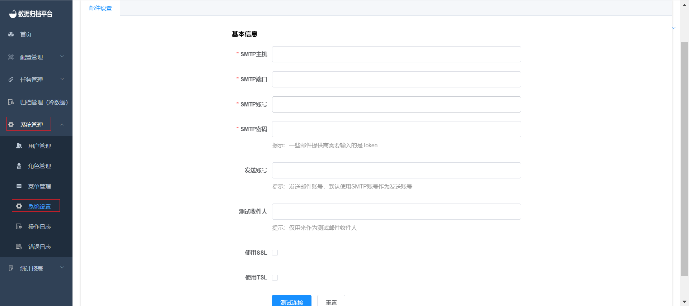

## SMTP Email Configuration

To configure SMTP email settings, follow these steps:

1. Click on the "System Management" menu and select "System Settings." This page is only accessible to the administrator user. The page displays SMTP configuration options.

   

2. Fill in the required information for the SMTP configuration, including SMTP server, port, username, password, sender email, and recipient email.

3. After filling in the basic configuration, click the "Test Connection" button. If the test is successful and you receive a test email, the "Save" button will appear. Click on "Save" to save the SMTP configuration.

Once the SMTP configuration is saved, all task configuration alerts will be sent using the email settings provided in this configuration.

Please note that proper SMTP configuration is essential for receiving alerts and notifications from the system. Make sure to verify the accuracy of the configuration before saving it.