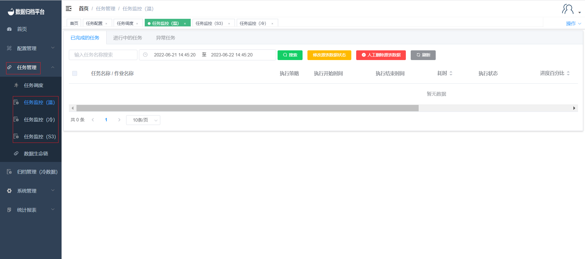

## Task Execution Monitoring

After clicking "Execute Now" on the task scheduling page or when the scheduled execution time is reached, different types of tasks will appear in different sections of the task monitoring page under the "Task Management" menu. For example, warm data tasks will appear in the "Task Monitoring (Warm)" section, cold data tasks will appear in the "Task Monitoring (Cold)" section, and so on. Each section provides information about the task's status, including "Completed," "In Progress," and "Exception."

You can monitor the execution status of your tasks in the respective monitoring sections for warm, cold, and S3 data tasks.