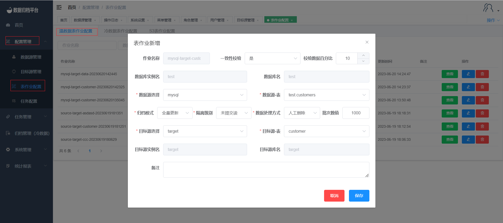
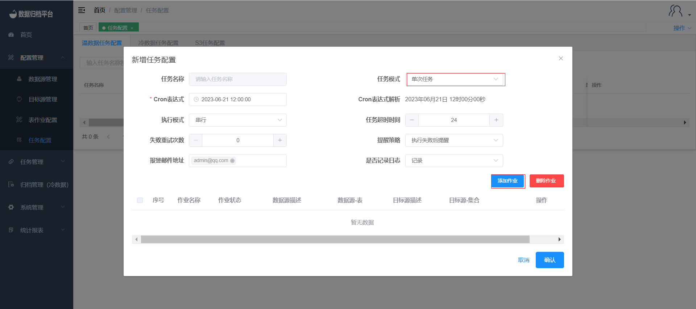

## Warm Job Demo

### 1. Add Data Source and Target Source

#### Add Data Source
Click on the "Data Source Management" page under the "Configuration Management" menu. On this page, click the blue "Add" button and fill in the relevant information for the data source. After passing the test, click "Confirm" to save this data source.

#### Add Target Source
Click on the "Target Source Management" page under the "Configuration Management" menu. On this page, click the blue "Add" button and fill in the relevant information for the target source. After passing the test, click "Confirm" to save this target source.

### 2. Permission Assignment

After adding the data source and target source, the administrator user can assign database permissions to users on the "User Management" page under the "System Management" menu.

### 3. Create Warm Job

Click on the "Table Job Configuration" under the "Configuration Management" menu. On the warm data table job page, click the blue "Add" button to open the following form. Choose the data source and target source you want to synchronize. Table jobs have consistency verification functionality. After selecting "Yes," you can enter the desired verification percentage. After synchronization, the platform will perform consistency checks on the synchronized data. For MySQL-related jobs, you can choose the isolation level. When synchronizing from MongoDB to MongoDB, you can choose whether to synchronize Gridfs. If you choose "No," the platform will only synchronize ordinary documents. The data processing mode can be selected as manual deletion or system deletion. This feature will delete the source table by batch after synchronization is completed.

### 4. Create Task

#### Add Task Configuration
Click on the "Task Configuration" under the "Task Configuration" menu. This page displays all tasks. Click the blue "Add" button to open the form shown in the second image. Fill in the task configuration according to your needs. If there are many table jobs in this task, you can set the execution mode, task timeout, and failure retry times according to your needs. After selecting a reminder strategy, you can add email addresses for receiving alert notifications. After the task is completed, alerts will be sent via email according to the selected strategy.

#### Add Table Jobs to the Task
Click on "Add Job" to open the data configuration shown in the third image. Check the desired job and click "OK" to bind this job to the newly created task. A task can be bound to multiple table jobs.

#### Administrator Approval

After configuring the task, the administrator user can review the task configuration. After approval, the task can be executed.

### 5. Task Scheduling

Click on "Task Scheduling" under the "Task Management" menu to view the status of the task. Click "Execute Now" to immediately run the task.

### 6. Task Monitoring

After clicking "Execute Now" on the task scheduling page or when the task execution time arrives, you can view the execution status of the task in the task monitoring (Warm) section under the "Task Management" menu.

