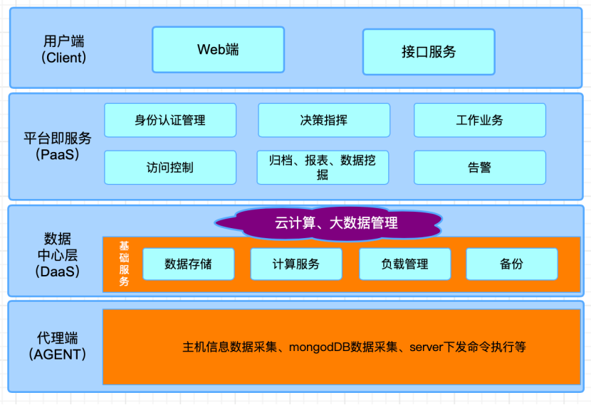

## Whaleal-data Introduction

The Archiving Platform is a data archiving software that supports different types of archiving: cold, hot, and S3. Hot data archiving supports synchronizing data from MySQL, Oracle, DB2, and MongoDB to MongoDB, and from MySQL to MySQL. Cold data archiving supports archiving MongoDB data to disk files. S3 data archiving supports uploading MongoDB Gridfs data to target S3. The homepage displays task execution statistics, archiving capacity statistics, table job statistics, business access count, total archiving capacity, and user operations. The platform allows custom configuration of data sources and target sources, selecting a source endpoint to sync with a target endpoint in table jobs. Multiple table jobs can be configured within a single task configuration. After creating a task, it can be managed in the task scheduling section, where jobs can be enabled, disabled, executed immediately, or taken offline. After executing a job, its status can be monitored in the task monitoring section. Admin users can access various operation details.

### Platform Architecture


### Software Structure


## Whaleal Platform Introduction

Whaleal Platform (WAP) is an intelligent operations hosting platform that provides 24/7 continuous monitoring and management.

WAP is an open-source MongoDB database supervision and control solution that performs troubleshooting and diagnostics on MongoDB.


## Architecture Introduction



The system architecture diagram depicts the overall structure of the system, illustrating the relationships between various modules. The functional module division involves decomposing a complex system into multiple functionally singular modules. The specific functional modules of the data sharing and exchange system are summarized based on the analysis of the system's functionality.

## WAP Feature

- WAP allows highly customizable deployment of MongoDB nodes based on business/data/security requirements.
- WAP provides centralized control over each MongoDB node, enabling accurate perception.
- WAP ensures data security and privacy through encrypted communication.
- WAP audits operation logs for historical traceability, reducing troubleshooting time.
- WAP associates time group logs to clarify the relationships between operations.
- WAP associates host monitoring with MongoDB monitoring for comprehensive troubleshooting.
- WAP supports real-time diagnosis, slowest operation identification, and Explain.
- WAP leverages years of MongoDB usage and operations experience.

## WAP Roadmap

- WAP adds automatic inspection functionality.
- WAP adds intelligent diagnosis module.
- WAP adds data archiving module.
- WAP adds real-time data migration module.
- WAP gradually integrates with AWS, GCP, Azure, Alibaba Cloud, Huawei Cloud, Tencent Cloud, and more.
- WAP gradually supports other major OS distributions.
- WAP continues to optimize performance.
- WAP addresses bugs.

## Popular Solutions

#### MongoDB Ops Manager Server

```
Safely, securely, and seamlessly manage MongoDB in your own environment. Available through the MongoDB Enterprise Advanced subscription, Ops Manager eliminates operational overhead by automating key administration tasks such as deployment, upgrades, and more.
```

- Monitoring
> Monitor, visualize, and alert on 100+ performance metrics

- Backup
> Capture continuous, incremental backups, with point-in-time recovery

- Automation
> Perform single-click installations, upgrades, and index maintenance, with zero downtime

- Query Optimization
> Seamlessly identify and address slow-running queries with the Visual Query Profiler, index suggestions, and automated index roll-outs

#### Zabbix
```
Zabbix is an open source monitoring software tool for diverse IT components, including networks, servers, virtual machines (VMs) and cloud services. Zabbix provides monitoring metrics, such as network utilization, CPU load and disk space consumption.
```

> collect from any source

> flexible metric collection

> agent/agent-less monitoring

> custom collection method

#### Percona Monitoring and Management
```
Percona Monitoring and Management Percona Monitoring and Management (PMM) is an open source database monitoring, management, and observability solution for MySQL, PostgreSQL, and MongoDB.

It allows you to observe the health of your database systems, explore new patterns in their behavior, troubleshoot them and perform database management operations no matter where they are located - on-prem or in the cloud.
```

> PMM collects thousands of out-of-the-box performance metrics from databases and their hosts.

> The PMM web UI visualizes data in dashboards.

> Additional features include advisors for database health assessments.

#### Homogeneous Comparison

```
Based on the information provided, a comparison between similar solutions can be made.
```

|     |Ops Manager  | Zabbix   |PMM  |WAP  |
|  :----:  | :----:  |:----: | :----: |:----: |
| Change Management  | ✓ |× |× |✓ |
| Monitoring & Alerts  | Detailed | General | Detailed | Detailed |
| Backup & Recovery  | ✓ | × | Other solutions | Other solutions |
| Licensing  | Enterprise Edition | Open Source | Open Source | Open Source |
| Advantages  | Official tool, comprehensive platform | Widely used enterprise monitoring platform with easy integration | Open source MySQL monitoring platform, integrated with MongoDB | Years of troubleshooting experience, tailored for Chinese users |
| Disadvantages  | Requires good understanding of MongoDB, high learning curve; | Metrics not as detailed, limited diagnostics; | Overwhelming number of dashboards, complex navigation;