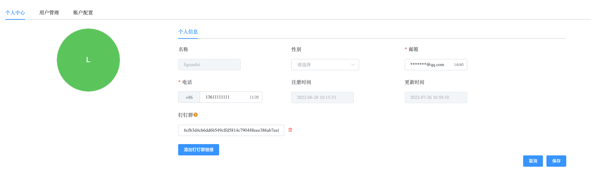
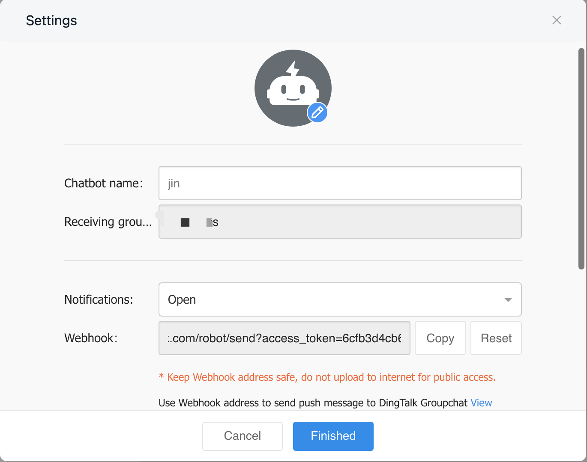

## Account Center

```
Account Center allows you to configure the following:
 - Email
 - Phone Number
 - Dingding URL
```

a. Navigate to the left sidebar on the page.

b. Click on the "Account" option button and select the "Personal Center" option.

c. Click on the "Edit Profile" option button to modify your personal information.




### Email

Modify the email address in the personal information section while editing your profile. In Whaleal, after configuring alerts, notification emails will be sent to your personal email address.

### Phone Number

Modify the phone number in the personal information section while editing your profile. In Whaleal, after configuring alerts, alert notifications will be sent to your phone as text messages.

### Dingding URL

You can add a robot in your Dingding (DingTalk) group. After adding it, you will receive a Webhook URL that contains an `access_token` value. Configure this `access_token` value in the Whaleal Account Center page. Alert notifications will be sent to the Dingding group.

