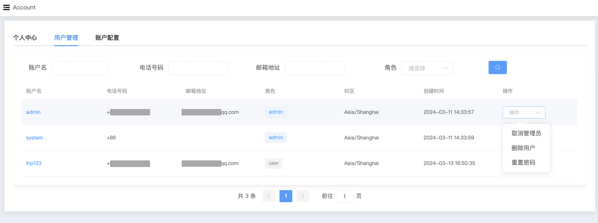
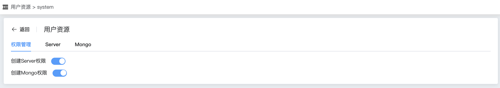
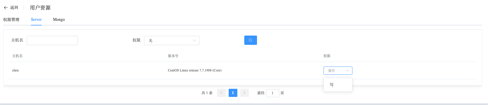
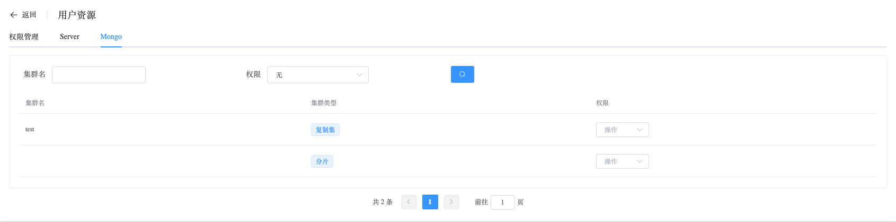

## Users

```
Users provide the following operations:
 - Operation
 - Management
 - Server
 - MongoDB
```

### Operation

Whaleal can configure administrator permissions for users, allowing administrators to perform user deletion operations.



### Management

Whaleal can configure whether users have permissions to create Servers and MongoDB instances.



### Server

Whaleal provides access restrictions for server resources.



### MongoDB

Whaleal provides access restrictions for MongoDB resources.

