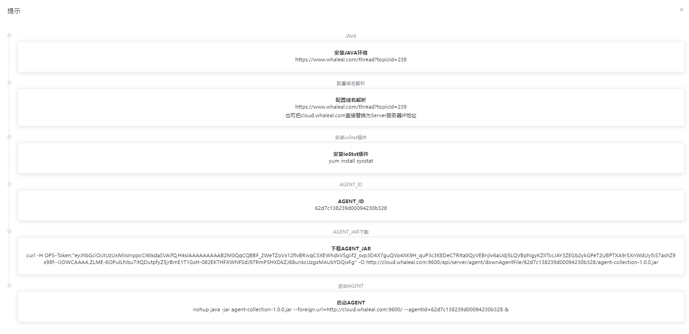

## Add Host

```
The process of adding a host is divided into the following two parts:
 - Prerequisites
 - Procedure
```

Adding a host in the Whaleal platform involves creating and managing MongoDB clusters on the platform.

### Prerequisites

Before adding a host, make sure that you have installed the JAVA environment. If not, please [install it](../../01-Intstall/01-Installation.md).

If you encounter access issues with the page, ensure that you have configured domain name resolution.

Ensure that the host has the ioStat plugin installed; if not, please install it.

<br>

##### Prerequisites Reference
1. Install the JAVA environment

- Visit the [Oracle official website](http://www.oracle.com/technetwork/java/javase/downloads/jdk8-downloads-2133151.html) and download the appropriate JDK version. In this example, we'll use jdk-8u151-linux-x64.tar.gz. If you download a different version, make sure the file extension is .tar.gz.

- Create a directory and unzip the JDK:
  ```
  mkdir /usr/java
  cd /usr/java
  tar -zxvf jdk-8u151-linux-x64.tar.gz
  ```

- Edit the /etc/profile file and add the following lines, then save:
  ```
  # Set Java environment variables
  JAVA_HOME={jdk_path}
  JRE_HOME={jre_path}
  CLASS_PATH=.:$JAVA_HOME/lib/dt.jar:$JAVA_HOME/lib/tools.jar:$JRE_HOME/lib
  PATH=$PATH:$JAVA_HOME/bin:$JRE_HOME/bin
  export JAVA_HOME JRE_HOME CLASS_PATH PATH
  ```
  ```
  # Make changes take effect
  source /etc/profile
  ```

<br>

2. Configure domain name resolution
- For Linux hosts:
    - Domain: cloud.whaleal.com
    - Domain's corresponding IP: 192.168.3.200
    - Execute the command:
      ```
      echo "192.168.3.200 cloud.whaleal.com" >> /etc/hosts
      ```
      You can also replace cloud.whaleal.com with the IP address of the Server.

3. Install the ioStat plugin
   ```
   yum install sysstat
   ```

<br>

<br>

### Procedure

Step 1. Navigate to the page

a. Click the "Server" navigation item to enter the host page. Click the "Add Host" button on the right to open the prompt page.

The first three steps in the prompt are part of the "Prerequisites" section, the fourth step generates the agentId (which acts as a unique identifier for the host), and the remaining steps involve executing commands on the host's command line.



<br>

Step 2. Download Agent for the Host

b. After completing the prerequisites, click the "Generate Agent" button on the prompt page. The subsequent operations will be executed on the host's command line.

- Copy the command for downloading AGENT_JAR and execute it in the command line:
  ```
  curl -H whaleal-Token:"{your_token}" -O http://cloud.whaleal.com:9600/api/server/agent/downAgentFile/62d8e617239d00094230b3b2/agent-collection-1.0.0.jar
  ```
  

- Copy the command for starting the AGENT and execute it in the command line:
  ```
  nohup java -jar agent-collection-1.0.0.jar --foreign.url=http://cloud.whaleal.com:9600/ --agentId=62d8e617239d00094230b3b2 &
  ```
  

After completion, the host will be displayed in the Server host list, and you can find the agent process by querying the java processes from the command line.


