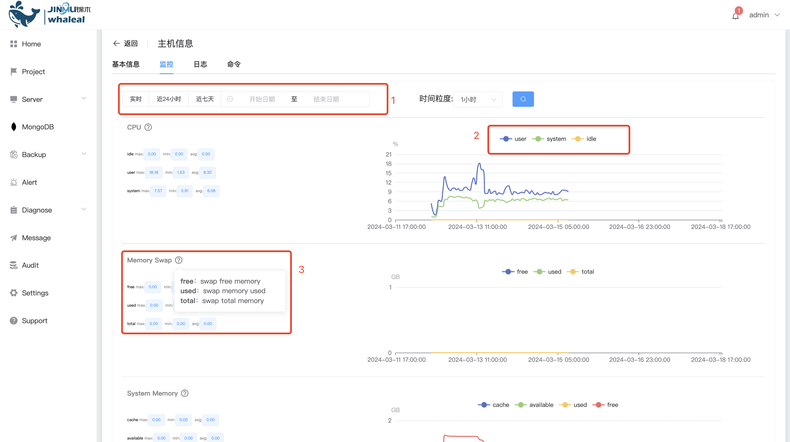
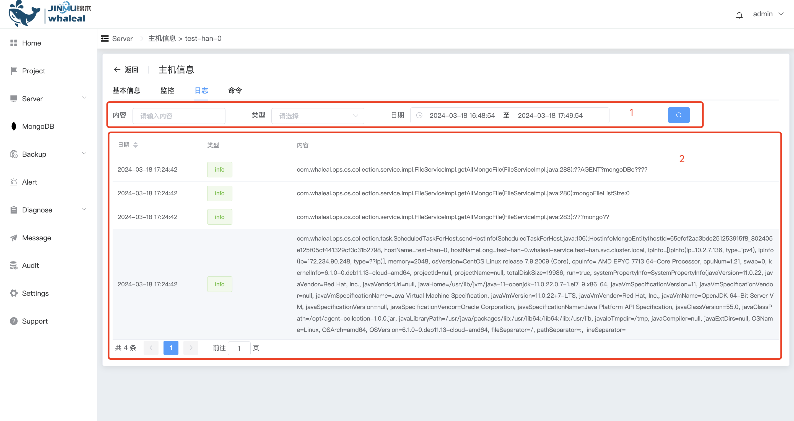

## Host Information

```
Host Information includes the following sections:
 - Basic Host Information
 - Host Update and Removal
 - Host Details and Operations
```

### Basic Host Information

Displays basic information about the host.

a. Host Name

b. System Information

c. Host Kernel

d. Agent Uptime

e. Host Status

f. Host Operations


<br>

#### Host Update and Removal

Actions for updating and removing hosts.

a. Removing a host (detaching it from management), detailed steps can be found in [RemoveHost](RemoveHost.md).

b. Updating host information involves retrieving the host's information again, and then updating the page's content. This includes the host's static information, monitoring data, and status. Note that if a host experiences an abnormal shutdown and is manually restarted, the frontend may not automatically update the host's status. Clicking the "Update Host Information" button will refresh the host's status.

<br>

### Host Details and Operations

Clicking on the host name leads to the host information page, where you can view details and perform operations on the host.

a. Host Information

This section displays the host's basic static information.


<br>

b. Monitoring

The monitoring information displays graphical representations of data related to MEMORY, CPU, NET, and DISKIO.
- The "1" section allows you to select different time ranges for displaying the graphical data or different granularities within a time range.
- The "2" section for NET and DISKIO allows you to choose what content you want to display using the dropdown menu.
- The "3" section lets you hide or show data by clicking on the corresponding buttons.



<br>

c. Logs

The logs record the host's activities, including operator actions and scheduled tasks. It provides detailed information about the execution events, status, and specific content of each event.
- The "1" section allows you to filter logs based on criteria like time range, type, or content.
- The "2" section displays the selected log information on the frontend.



<br>

d. Commands

The commands section includes operations at the host level or operations on MongoDB clusters. It displays the operation's status, content, event, and result, along with the event's execution process.
- MSG: Displays the operation's function, including host-level operations and manual operations.
- Status: Displays the status at different stages of the operation (real-time updates).
- Content: Click "View Details" to see the details of the cluster or operation.
- Event: The events include both host operation events and operator operation events. Click "View Details" to see the detailed execution process of the event. (Events for frontend operations are grouped into logs. Click "View Details" to see the event's execution process.)

- The "1" section allows you to set filters, perform fuzzy searches for MSG content, and display commands within a specific time range.
- The "2" section allows you to click "View Details" to display detailed command information in JSON format.
- The "3" section allows you to click "View Event Log" to view detailed event execution information.


<br>

e. Alerts

Alerts involve setting thresholds for various indicators on the host. When a threshold is breached, alerts are triggered, and notifications are sent via DingTalk, email, or SMS to notify users of abnormal conditions on the host. This page allows users to set thresholds and conditions for triggering alerts based on their specific requirements.

