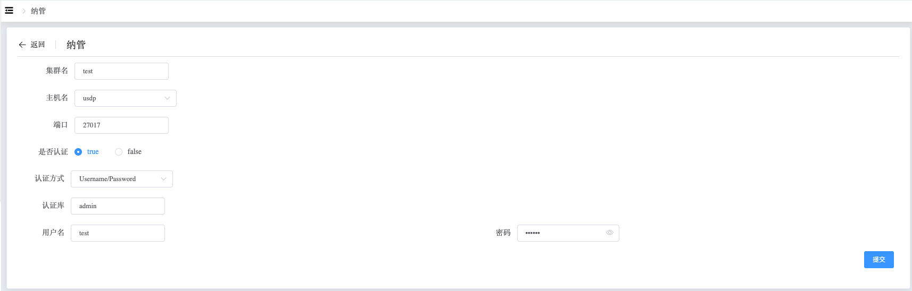

## Existing MongoDB Deployment

```
The Existing MongoDB Deployment section provides the following operations:
 - Existing MongoDB Deployment
```

### Existing MongoDB Deployment

a. Navigate to the left-side navigation bar.

b. Click on the "MongoDB" option.

c. Select the "MongoList" option.

d. Click on the "Create Project" button, then select "Manage".

By configuring the information of any node in the cluster, Whaleal Platform will discover all nodes in the cluster, allowing for monitoring and management of all nodes.

