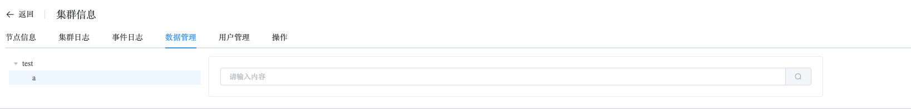

## Data

```
Data provides the following operation:
 - Find Data
```

### Find Data

View data within the cluster

a. Navigate to the left-side navigation bar.

b. Click on the "MongoDB" option.

c. Select the "MongoList" option.

d. On the MongoDB static information page, click on the name of the cluster with the type "ReplicaSet".

e. On the cluster information page, select "Data Management".

You can use this page to view the data stored in the cluster, making it convenient for users to perform data queries.



Perform a query by entering your search criteria in the input box.

