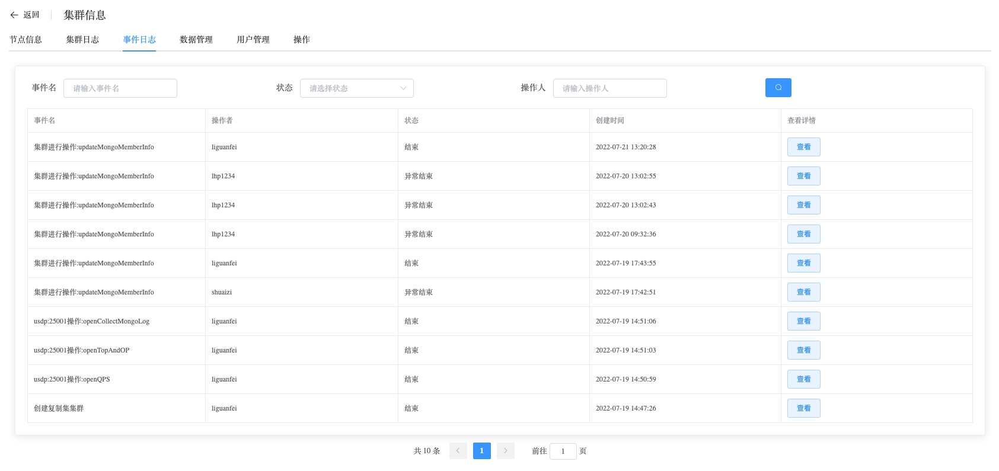

## Event Logs

```
Event Logs provides the following operation:
 - Event Logs
```

### Event Logs

View event logs data

a. Navigate to the left-side navigation bar.

b. Click on the "MongoDB" option.

c. Select the "MongoList" option.

d. On the MongoDB static information page, click on the name of the cluster with the type "ReplicaSet".

e. On the cluster information page, select "Event Logs".

Event logs record all the actions that users perform on the cluster and keep track of the progress and results of the actions.



Click the "View" button to see detailed information about an event.

