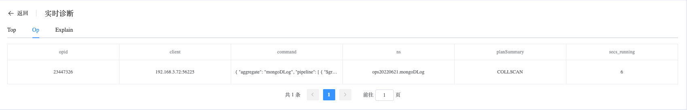
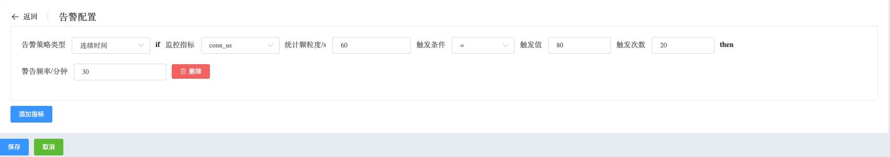

## Info ReplicaSet

```
Manage ReplicaSet provides the following operations:
 - Monitoring Data
 - MongoDB Logs
 - Real-time Diagnosis
 - Alert
 - Details
 - Operation
```

View ReplicaSet node data

a. Navigate to the left-side navigation bar.

b. Click on the "MongoDB" option.

c. Select the "MongoList" option.

d. On the MongoDB static information page, click on the name of the cluster with the type "ReplicaSet".

### Monitoring Data

View Monitoring data

a. On the cluster information page, select "Node Info".

b. Under "Node Info", click on the node name (usually in the format hostname:port).

Whaleal Platform provides a rich set of monitoring metrics and allows you to query and filter data for any time range.


### MongoDB Logs

View MongoDB Logs data

a. On the cluster information page, select "Node Info".

b. Under "Node Info", click on "View Logs".

Whaleal Platform records and stores complete MongoDB logs, providing filtering options to quickly locate issues.


### Real-time Diagnosis

View Real-time Diagnosis data

a. On the cluster information page, select "Node Info".

b. Under "Node Info", click on "Real-time Diagnosis".

**Top**

Top displays hot collections at the current moment.


**Op**



**Explain**


### Alert

View Alert data

a. On the cluster information page, select "Node Info".

b. Under "Node Info", click on "Alert Monitoring".



### Details

View Details data

a. On the cluster information page, select "Node Info".

b. Under "Node Info", click on "Details".


### Operation

Perform various operations on this node, including updating node information, starting, shutting down, restarting, deleting nodes, removing nodes from management, enabling/disabling QPS monitoring, enabling/disabling TopAndOp monitoring, enabling/disabling MongoDB log collection.

* Update Node Information: By default, node information is updated every 10 seconds. Click the button to trigger an immediate update and display the latest status information of the node.

* Start Node: Click to start a stopped node.

* Shutdown Node: Click to shut down a running node.

* Restart Node: Restart a running node.

* Delete Node: Remove this node from the cluster.

* Remove from Management: Whaleal Platform will no longer monitor or manage this node.

* Enable/Disable QPS Monitoring: Decide whether to collect QPS monitoring data.

* Enable/Disable TopAndOp Monitoring: Decide whether to collect real-time diagnosis data.

* Enable/Disable MongoDB Log Collection: Decide whether to collect MongoDB log data.

