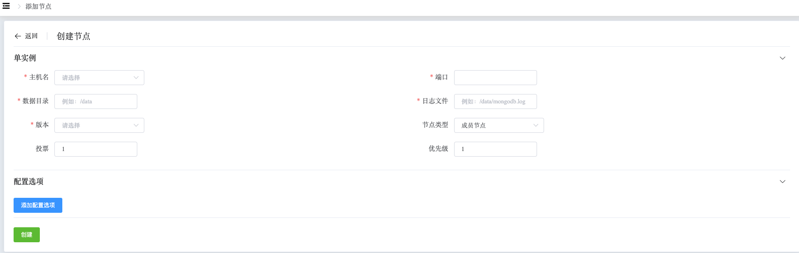
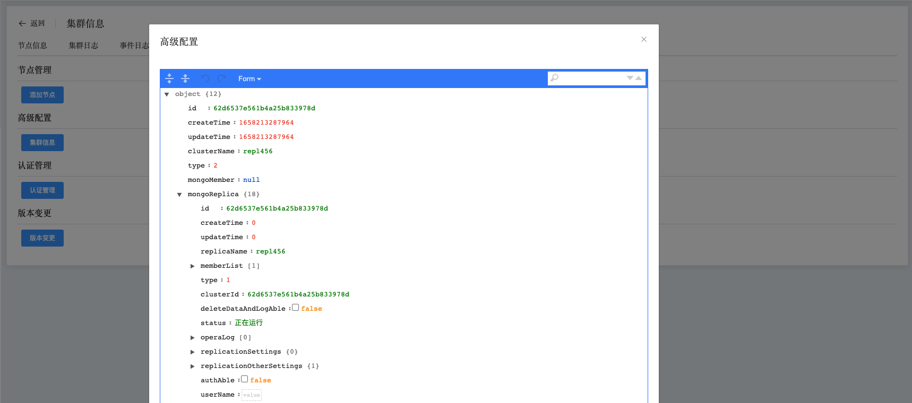
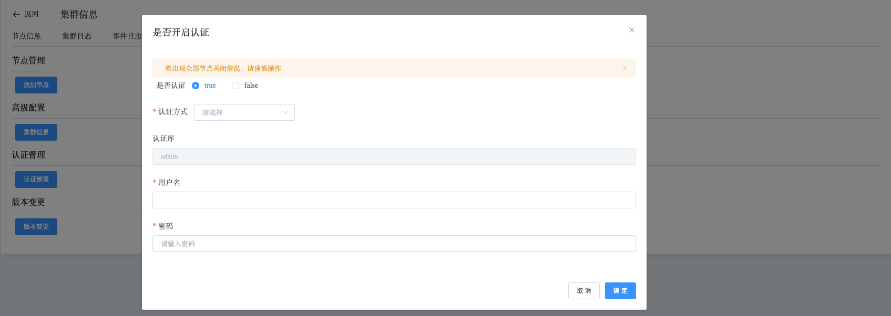
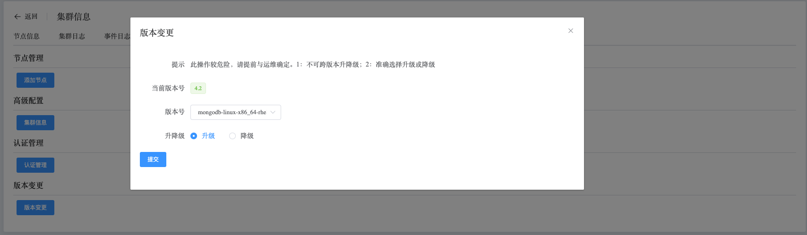

## Operation

```
Operation provides the following operations:
 - Add Node
 - Cluster Info
 - Authentication
 - Modify Version
```

Cluster Operations

a. Navigate to the left-side navigation bar.

b. Click on the "MongoDB" option.

c. Select the "MongoList" option.

d. On the MongoDB static information page, click on the name of the cluster with the type "ReplicaSet".

e. On the cluster information page, select "Operation".

### Add Node

This operation allows you to add nodes to the ReplicaSet cluster and specify node configuration information.



### Cluster Info

View configuration information of nodes in the cluster.



### Authentication

Enable authentication. You must specify a user in the admin database.

Automated user creation, configuration file modification, and service restart operation.



### Modify Version

Upgrade or downgrade the version of the cluster by selecting a version. One-click operation to modify FCV, change the media package, and restart services.

