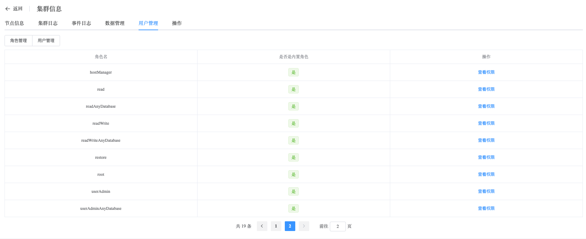
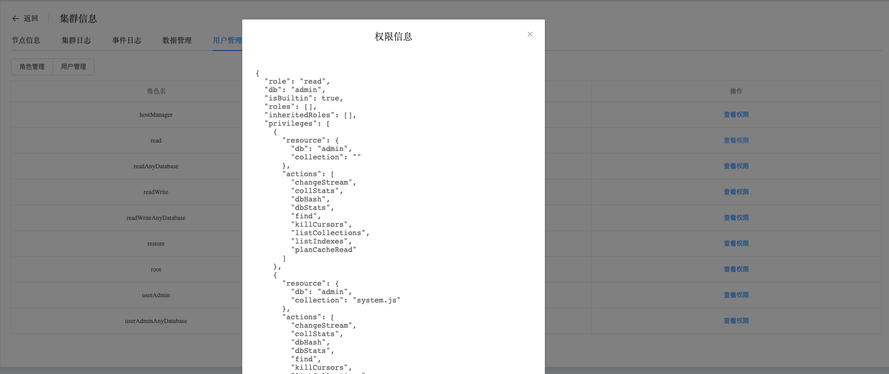
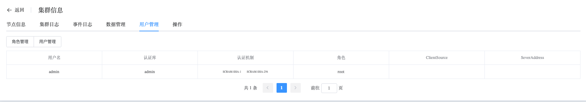

## Role And User

```
Role And User provides the following operations:
 - Role
 - User
```

View Role and User data

a. Navigate to the left-side navigation bar.

b. Click on the "MongoDB" option.

c. Select the "MongoList" option.

d. On the MongoDB static information page, click on the name of the cluster with the type "ReplicaSet".

e. On the cluster information page, select "User Management".

### Role

Click on the "Role Management" button to display all role information in the cluster.



Click on the "View Permissions" button for a role to see its specific permissions.



### User

Click on the "User Management" button to display all users in the cluster.

