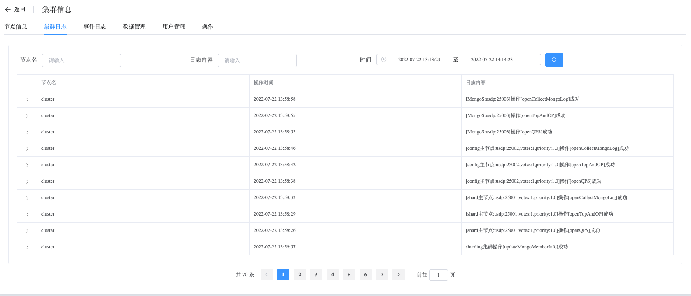

## Cluster Logs

```
Cluster Logs provides the following operation:
 - Cluster Logs
```

### Cluster Logs

View Cluster Logs data

a. Navigate to the left-side navigation bar.

b. Click on the "MongoDB" option.

c. Select the "MongoList" option.

d. On the MongoDB static information page, click on the name of the cluster with the type "Sharded Cluster".

e. On the cluster information page, select "Cluster Logs".

Collect logs from all nodes within the cluster, analyze them, and confirm the status of the cluster.

