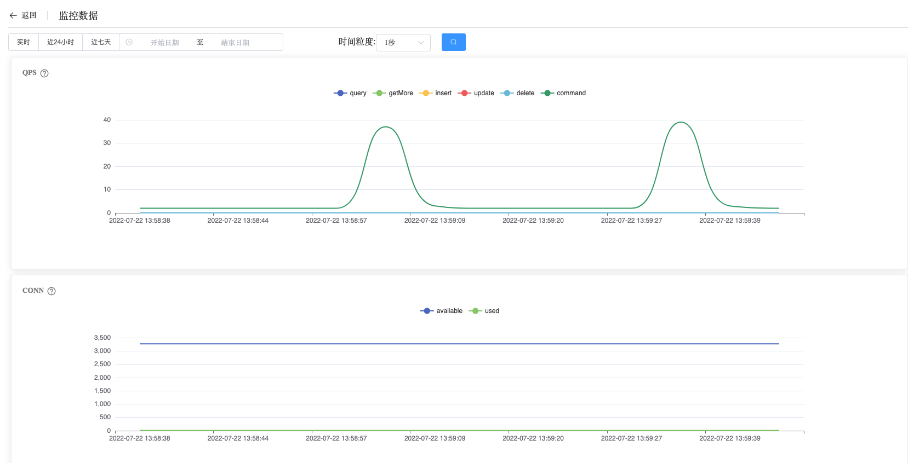
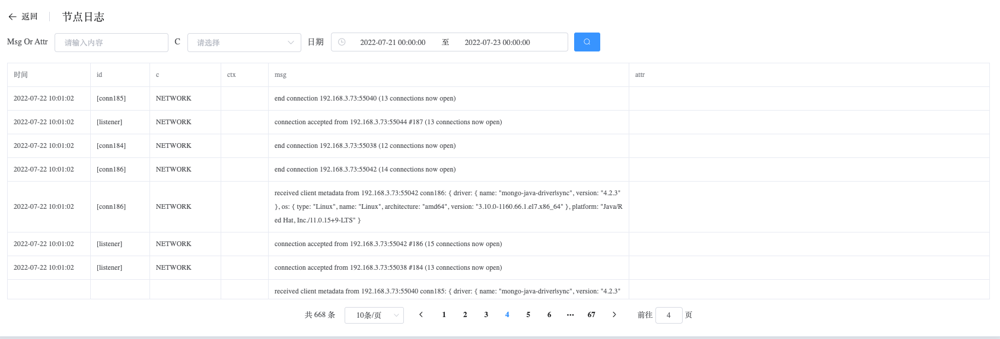
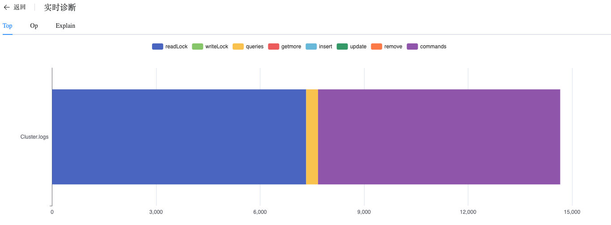
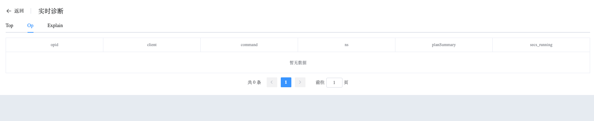
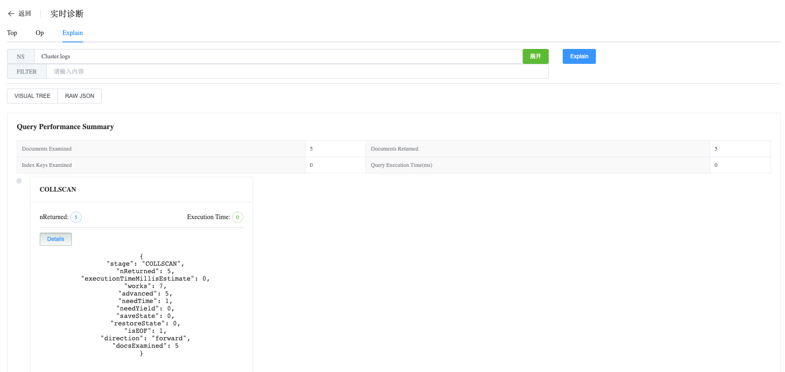
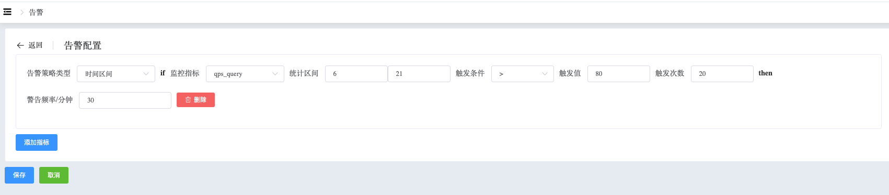
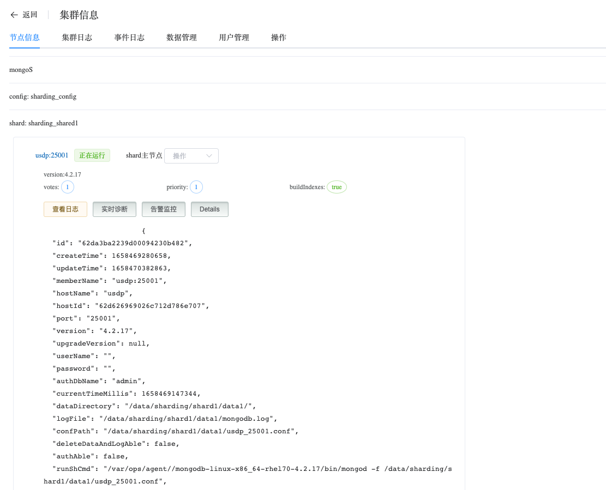
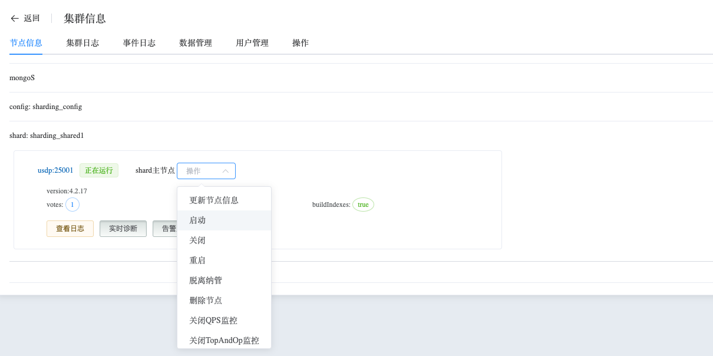

## Info Sharding

```
The Info Sharding section provides the following operations:
 - Monitoring Data
 - MongoDB Logs
 - Real-time Diagnosis
 - Alert
 - Details
 - Operation
```

View Sharding node data

a. Navigate to the left-side navigation bar.

b. Click on the "MongoDB" option.

c. Select the "MongoList" option.

d. On the MongoDB static information page, click on the name of the cluster with the type "Sharded Cluster".

### Monitoring Data

View Monitoring Data

a. On the cluster information page, select node information.

b. Under node information, click on the node name (usually in the format hostname:port).

Whaleal Platform provides a rich set of monitoring metrics and allows filtering for any time range.



### MongoDB Logs

View MongoDB Logs data

a. On the cluster information page, select node information.

b. Under node information, click on "View Logs".

Whaleal Platform records and stores complete MongoDB logs, providing filtering options to easily locate and diagnose issues.



### Real-time Diagnosis

View Real-time Diagnosis data

a. On the cluster information page, select node information.

b. Under node information, click on "Real-time Diagnosis".

**Top**

Top displays hot collections at the current time.



**Op**

Op displays specific operation commands executed at the current time.



**Explain**

Explain analyzes query operation execution plans, facilitating query optimization and adjustments.



### Alert

View Alert data

a. On the cluster information page, select node information.

b. Under node information, click on "Alert Monitoring".

Configure alerts for specific metrics. When triggered, alerts can be sent to users via email, SMS, DingTalk, etc.



### Details

View Details data

a. On the cluster information page, select node information.

b. Under node information, click on "Details".

Displays detailed node information, including creation time, version, startup command, and node configuration.



### Operation

Perform other operations on this node, including: update node information, start node, shut down node, restart node, delete node, detach from management, enable/disable QPS monitoring, enable/disable TopAndOp monitoring, enable/disable MongoDB log collection.

* Update Node Information: By default, updates node information every 10 seconds. Click the button to trigger an immediate update and display the latest node status.

* Start Node: Click to start a stopped node.

* Shut Down Node: Click to shut down a running node.

* Restart Node: Restart a running node.

* Delete Node: Remove this node from the cluster.

* Detach from Management: Whaleal Platform will no longer monitor or manage this node.

* Enable/Disable QPS Monitoring: Choose whether to collect QPS monitoring data.

* Enable/Disable TopAndOp Monitoring: Choose whether to collect real-time diagnosis data.

* Enable/Disable MongoDB Log Collection: Choose whether to collect MongoDB log data.

