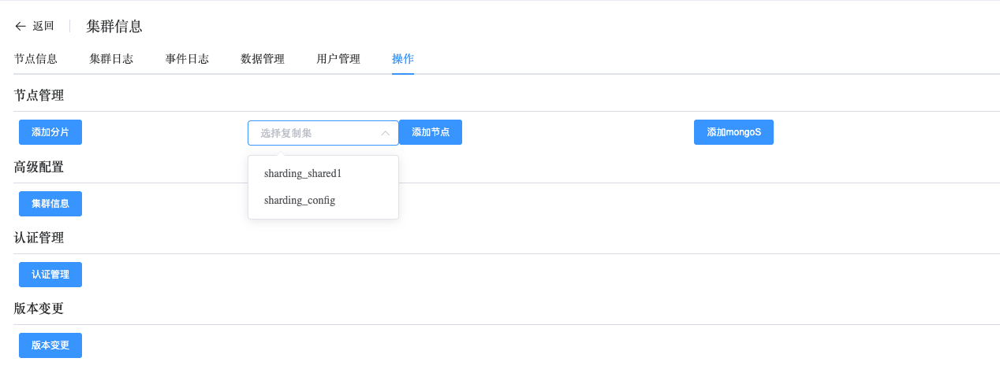
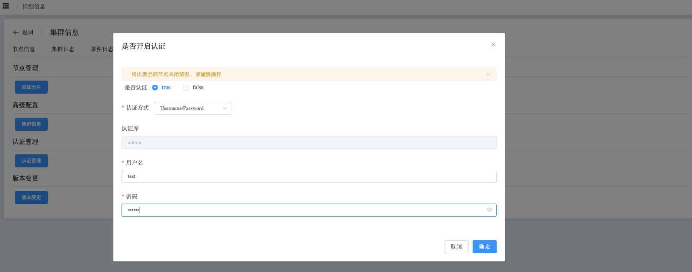
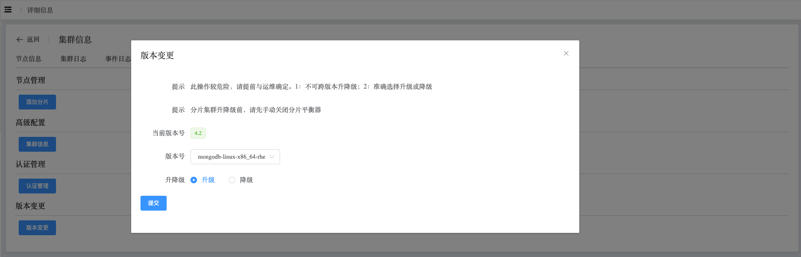

## Operation

```
The Operation section provides the following operations:
 - Node Manage
 - Cluster Info
 - Authentication
 - Modify Version
```

Cluster operations

a. Navigate to the left-side navigation bar.

b. Click on the "MongoDB" option.

c. Select the "MongoList" option.

d. On the MongoDB static information page, click on the name of the cluster with the type "Sharded Cluster".

e. On the cluster information page, select "Operation".

### Node Manage

This operation allows you to add shards to the sharded cluster, add nodes to shards, and add mongos nodes to the cluster.



### Cluster Info

View configuration information of nodes in the cluster.


### Authentication

Enable authentication. A user must be specified under the admin database.

Automatically create users, modify configuration files, and restart services.



### Modify Version

Perform version upgrade or downgrade operations on the cluster by selecting a version. This one-click operation allows you to modify the Feature Compatibility Version (FCV), change the media package, and restart services.

> **Note:**
>
> 1. For sharded cluster upgrades or downgrades, the balancer must be manually turned off.
> 2. After sharded cluster upgrades or downgrades are completed, restore the balancer to its previous state.

