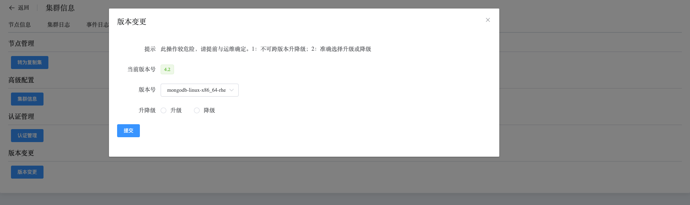

## Operation

```
The Operation section provides the following operations:
 - Standalone to ReplicaSet
 - Cluster Info
 - Authentication
 - Modify Version
```

Cluster operations

a. Navigate to the left-side navigation bar.

b. Click on the "MongoDB" option.

c. Select the "MongoList" option.

d. On the MongoDB static information page, click on the name of the cluster with the type "Standalone".

### Standalone to ReplicaSet

This operation converts a "Standalone" cluster into a "ReplicaSet" cluster. It automates the configuration and restart process, reducing user operation steps.


### Cluster Info

View cluster node configuration information.


### Authentication

Enable authentication, a user in the admin database must be specified.

This operation automates user creation, configuration file modification, and service restart.


### Modify Version

Perform version upgrade or downgrade operations on the cluster. It's a one-click operation that allows modifying FCV, changing media packages, and restarting services.

