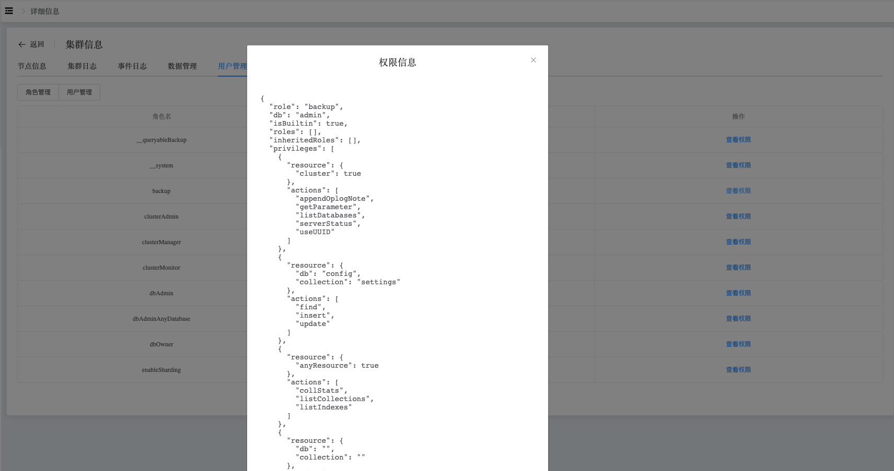

## Role And User

```
The Role And User section provides the following operations:
 - Role
 - User
```

View Role and User data

a. Navigate to the left-side navigation bar.

b. Click on the "MongoDB" option.

c. Select the "MongoList" option.

d. On the MongoDB static information page, click on the name of the cluster with the type "Standalone".

### Role

Click on the "Role Management" button to display all role information in the cluster.


Click on a role and then click the "View Permissions" button to see the specific permissions associated with that role.




### User

Click on the "User Management" button to display all users in the cluster.

