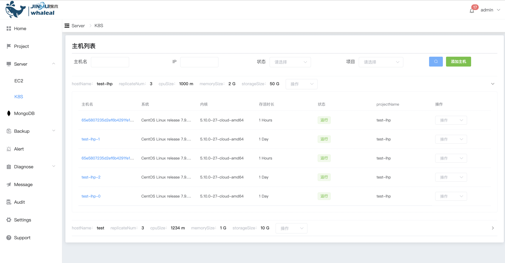
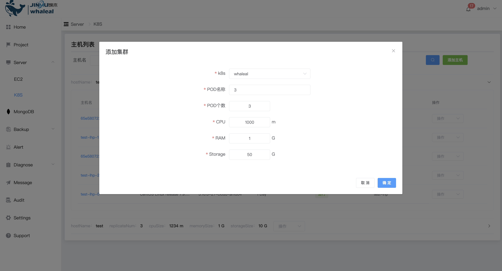

### K8S

Before adding a k8s host, please ensure that the corresponding [Kubernetes configuration files](../Settings/Kubernetesconfiguration.md)。

Add K8S

Add K8S host, select k8s, pod name, number of pods, and average resources of each pod and click OK

