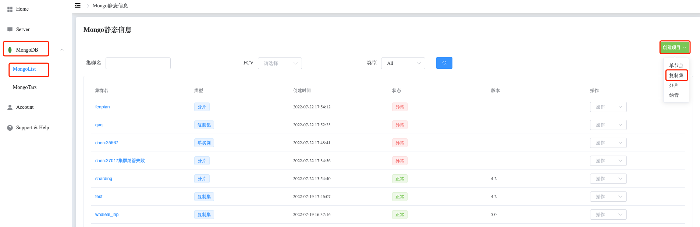
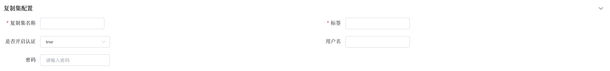
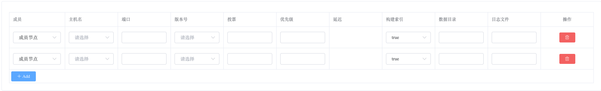
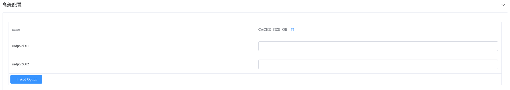

## How to Create ReplicaSet

### Create ReplicaSet

Step 1. Navigate to the Directory

a. Go to the left-side navigation bar.

b. Click on the "MongoDB" option.

c. Select the "MongoList" option. The page will display all MongoDB clusters that the user can operate.

Step 2. Create ReplicaSet

a. Click on the "Create Project" button on the right side.

b. Choose the "Replica Set" option.

Step 3. Configure ReplicaSet

a. Click the "Add Option" button.

b. Select the startup configuration options to add by clicking the "Confirm" button.

c. Set the values for the configuration options:

Replica Set Configuration:

Member Configuration:

Cluster Configuration:

Advanced Configuration:

Step 4. Create

Click the "Create" button to create the ReplicaSet.

