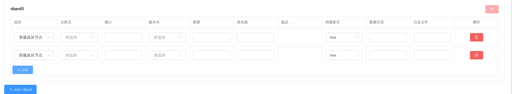
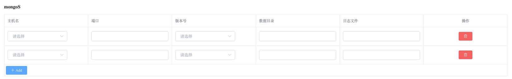
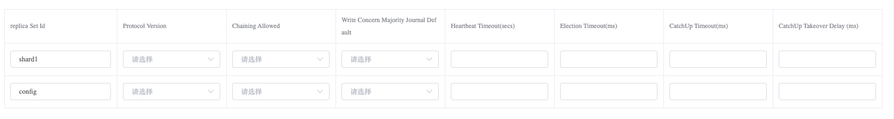
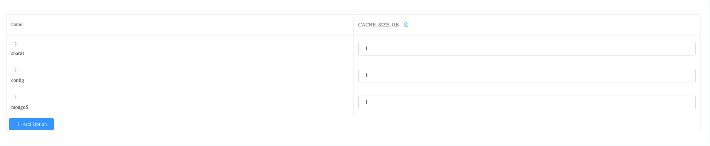

## How to Create Sharded Cluster

### Create Sharded Cluster

Step 1. Navigate to the Directory

a. Go to the left-side navigation bar.

b. Click on the "MongoDB" option.

c. Select the "MongoList" option. The page will display all MongoDB clusters that the user can operate.

Step 2. Create Sharded Cluster

a. Click on the "Create Project" button on the right side.

b. Choose the "Sharding" option.

Step 3. Configure Sharded Cluster

Sharded Cluster Configuration:

Member Configuration:

a. Click the "Add Option" button.

b. Select the startup configuration options to add by clicking the "Confirm" button.

c. Set the values for the configuration options:

Shard Settings:

Config Settings:

Mongos Settings:

Cluster Configuration:

Advanced Configuration:

Step 4. Create

Click the "Create" button to create the Sharded Cluster.

