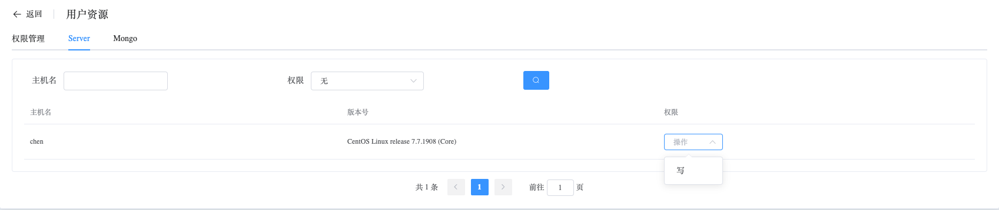

## For PMM (Persona Monitoring and Management) User

### Does Whaleal support user permission segregation?

Whaleal's administrator users can restrict resource access for platform users, controlling whether they can access Server or MongoDB resources.

### Does Whaleal support creating MongoDB clusters?

Whaleal supports creating MongoDB clusters in various configurations:

1. Create Standalone: [CreateStandalone](../02-Usage/MongoDB/CreateDeployment/CreateStandalone.md)
2. Create Replica Set Cluster: [CreateReplicaSet](../02-Usage/MongoDB/CreateDeployment/CreateReplicaSet.md)
3. Create Sharded Cluster: [CreateShardedCluster](../02-Usage/MongoDB/CreateDeployment/CreateShardedCluster.md)

### Does Whaleal support managing existing MongoDB clusters?

Whaleal supports monitoring and managing existing MongoDB clusters. You can use [ExistingMongoDBDeployment]() to add monitoring and management capabilities to an existing MongoDB cluster.

**Whaleal supports discovering all nodes in a cluster through a single node configuration and monitors them.**

### Does Whaleal support operations on MongoDB clusters?

Whaleal provides users with common operations used in usage and maintenance processes, enabling users to make changes to clusters through configuration and clicks on the platform interface.

### What MongoDB operations does Whaleal provide?

#### Diagnostic Analysis

By combining real-time diagnostic data such as Top, Op, and Explain, Whaleal helps confirm the cause of current node issues and provides solutions.

#### Alert Monitoring

By configuring alert threshold parameters, users can receive alert notifications through email, SMS, DingTalk, and other means when nodes experience abnormal conditions and increased pressure.

#### Data Management

Whaleal provides a display box to showcase data obtained from user-customized queries, making it easy and user-friendly to visualize data.

#### User Management

Displays all roles and users in the cluster, along with detailed permissions for roles and users.

#### Node Management

Users can use Whaleal to easily add nodes to Replica Set clusters and Sharded clusters/shard/config. This helps avoid potential failures due to incorrect command-line inputs.

#### Authentication Management

Users can enable cluster authentication with a single click through Whaleal. Whaleal restarts the cluster in a rolling manner, ensuring minimal service disruption.

#### Version Changes

Whaleal offers rolling upgrade and downgrade operations, enabling version changes between **adjacent versions** of clusters without affecting service usage.

#### Architecture Changes

Whaleal provides the ability to change the architecture from Standalone to Replica Set.