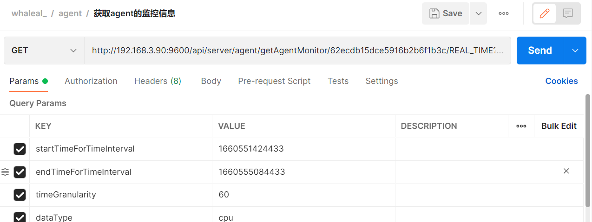
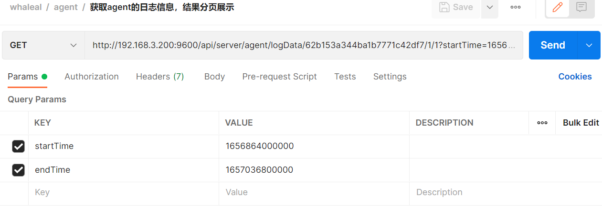
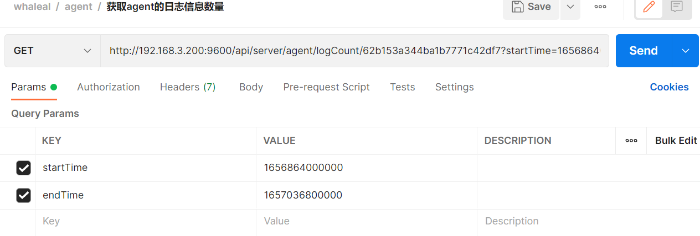
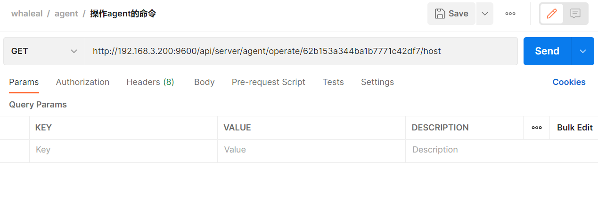
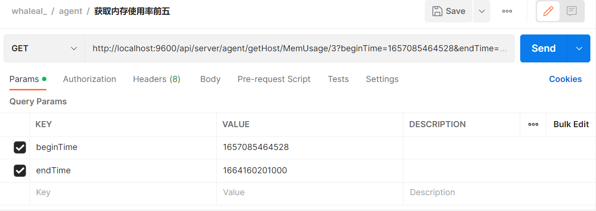
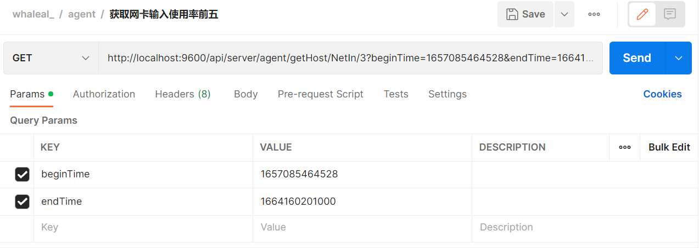
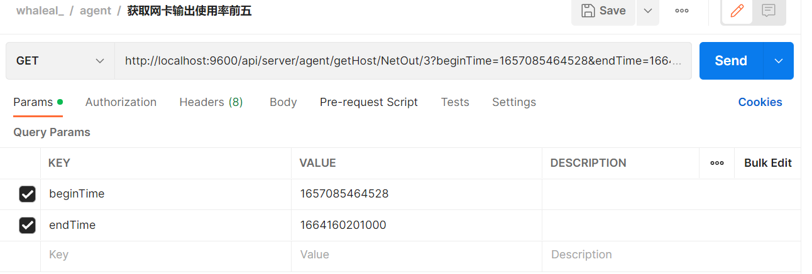

# Agent Interface

When making API calls, the `whaleal-Token` should be set in the request header, and the returned content will be in JSON format. For time-related parameters, timestamps should be used.

If you need to use `hostId`, `agentId`, or `eventId`, you can obtain them through the following methods:

```
hostId is obtained from the "Search Basic Host Information by Hostname" interface.
agentId is obtained from the "Generate agentId" interface.
eventId is found in the "Retrieve Cluster Log Information" interface for the required event ID.
```

**Default request header format, special cases require special declaration**

The `whaleal-Token` is returned when calling the "Login" interface. For subsequent API calls, include the token in the request header.
[Login API for obtaining whaleal-Token](Member.md)

| KEY                |     VALUE      |     
| -------------------|----------------------|
| Accept-Encoding        |         gzip,deflate,br |     
| Connection          |         keep-alive           |          
| Content-Type          |         application/json |    
| whaleal-token          |         "token"           |     
---


<br>

### 1  Search Basic Host Information by Hostname (Hostname and Host ID)

1.1 Request Path

GET: http://{Server-Host}:{Port}/api/server/agent/getAllAgentHostNameAndHostId

---
1.2 Request Parameters

| Name                |     Located in     |           Description         |     Required    |        Schema   |
| -------------------|----------------------|-------------------------------|-----------------|-----------   |
| hostName          |         Params           |            Hostname            |        No       |String        |

<br>


----

1.3 Response

|               |     Description    |           Schema              |  
| --------------|----------------------|---------------------------
| code        |   Status code: 1000 for success, others for exceptions |         int              |    
| id       |         Host ID         |          String|        
| name      |         Hostname         |          String|    

<br>

~~~
{
    "code": 1000,
    "data": [
        {
            "id": "62b153a344ba1b7771c42df7",
            "name": "server100"
        },
        {
            "id": "62bbfbe9a46517610435d615",
            "name": "chen"
        },
        {
            "id": "62cbbd7607bebb71b8429e5e",
            "name": "server200"
        },
        {
            "id": "62d626969026c712d786e707",
            "name": "usdp"
        }
    ]
}

~~~

---

<br>

### 2 Get Agent Statistics

2.1 Request Path

GET: http://{Server-Host}:{Port}/api/server/agent/getAgentStatistics

---
2.2 Request


---

2.3 Response

|               |     Description    |           Schema              |  
| -------------------|----------------------|---------------------------
| code        |   Status code: 1000 for success, others for exceptions |            long           |    
| activeAgentNum    |         Number of Active Agents         |            long            |    
| activeAgentCpuNum     |         Number of Active Agent CPUs         |            long            |    
| activeAgentDiskNum     |         Number of Active Agent Disks         |            long            |    
| deadAgentMemoryNum     |         Number of Dead Agent Memory         |            long            |    
| deadAgentCpuNum     |         Number of Dead Agent CPUs         |            long            |    
| activeAgentMemoryNum    |         Number of Active Agent Memory         |            long            |    
| deadAgentNum     |         Number of Dead Agents         |            long            |    
| deadAgentDiskNum    |         Number of Dead Agent Disks         |            long            |    

<br>

~~~
{
    "code": 1000,
    "data": {
        "activeAgentNum": 4,
        "activeAgentCpuNum": 88,
        "activeAgentDiskNum": 23647738,
        "deadAgentMemoryNum": 0,
        "deadAgentCpuNum": 0,
        "activeAgentMemoryNum": 273086,
        "deadAgentNum": 0,
        "deadAgentDiskNum": 0
    }
}

~~~

---

<br>

### 3 Get All Host Information

3.1 Request Path

GET: http://{Server-Host}:{Port}/api/server/agent/getAllAgentData/{{pageIndex}}/{{pageSize}}

---
3.2 Request Parameters

    status: true for normal, false for offline


| Name                |     Located in     |           Description         |     Required    |        Schema   |
| -------------------|----------------------|-------------------------------|-----------------|-----------   |
| pageIndex          |         Path           |            Page index           |        Yes       |int       |
| pageSize          |         Path         |            Page size            |        Yes      |int        |
| hostName          |         Params           |            Hostname            |        No       |String        |
| ip          |         Params           |            Host IP            |        No       |String        |
| status          |         Params           |            Host status            |        No       |boolean        |

<br>


----


### 3 Get All Host Information

3.3 Response

|               |     Description    |           Schema              |  
| --------------|----------------------|---------------------------
| code        |   Status code: 1000 for success, others for exceptions |         int|    
| data       |         Returned data         |            List           |        

<br>

~~~
{
    "code": 1000,
    "data": [
        {
            "id": "62b153a344ba1b7771c42df7",                               
            "createTime": 1658212423773,
            "updateTime": 1658459349919,
            "hostId": "62b153a344ba1b7771c42df7",
            "hostName": "server100",
            "hostNameLong": "server100",
            // Basic host information
            "ipInfo": [
                {
                    "ip": "192.168.3.100",
                    "type": "ipv4"
                }
            ],
            "memory": 128722,
            "osVersion": "CentOS Linux release 7.9.2009 (Core)",
            "cpuInfo": " Intel(R) Xeon(R) CPU E5-2670 v2 @ 2.50GHz",
            "cpuNum": 40,
            "swap": 4095,
            // Kernel information
            "kernelInfo": "3.10.0-1160.24.1.el7.x86_64",
            "totalDiskSize": 7893956,
            "run": true,
            
            // System property information
            "systemPropertyInfo": {
                "javaVersion": "11.0.9",
                "javaVendor": "Oracle Corporation",
                "javaVendorUrl": null,
                "javaHome": "/root/jdk-11.0.9",
                "javaVmSpecificationVersion": "11",
                "javaVmSpecificationVendor": null,
                "javaVmSpecificationName": "Java Virtual Machine Specification",
                "javaVmVersion": "11.0.9+7-LTS",
                "javaVmVendor": "Oracle Corporation",
                "javaVmName": "Java HotSpot(TM) 64-Bit Server VM",
                "javaSpecificationVersion": null,
                "javaSpecificationVendor": "Oracle Corporation",
                "javaSpecificationName": "Java Platform API Specification",
                "javaClassVersion": "55.0",
                "javaClassPath": "agent-collection-1.0.0.jar",
                "javaLibraryPath": "/usr/java/packages/lib:/usr/lib64:/lib64:/lib:/usr/lib",
                "javaIoTmpdir": "/tmp",
                "javaCompiler": null,
                "javaExtDirs": null,
                "fileSeparator": "/",
                "pathSeparator": ":",
                "lineSeparator": "\n",
                "userName": "root",
                "userHome": "/root",
                "userDir": "/home/jmops",
                "osname": "Linux",
                "osarch": "amd64",
                "osversion": "3.10.0-1160.24.1.el7.x86_64"
            }
        }
    ]
}
~~~

---

### 4 Get All Host Count

4.1 Request Path

GET: http://{Server-Host}:{Port}/api/server/agent/getAllAgentCount

---

4.2 Request Parameters

    status: true for normal, false for offline

| Name                |     Located in     |           Description         |     Required    |        Schema   |
| -------------------|----------------------|-------------------------------|-----------------|-----------   |
| hostName          |         Params           |            Hostname            |        No       |String        |
| ip          |         Params           |            Host IP            |        No       |String        |
| status          |         Params           |  Host status           |        No       |boolean        |

<br>


----

4.3 Response

|               |     Description    |           Schema              |  
| --------------|----------------------|---------------------------
| code        |   Status code: 1000 for success, others for exceptions |        int|    
| data       |         Count of returned hosts         |         long              |        

<br>

~~~
{
    "code": 1000,
    "data": 1
}
~~~
---

<br>

### 5 Get Static Information of a Host

5.1 Request Path

GET: http://{Server-Host}:{Port}/api/server/agent/getAgentInfo/{{hostId}}

---

5.2 Request Parameters

| Name                |     Located in     |           Description         |     Required    |        Schema   |
| -------------------|----------------------|-------------------------------|-----------------|-----------   |
| hostId         |         Path           |            Host ID           |        Yes       |String        |

<br>


----

5.3 Response

|               |     Description    |           Schema              |  
| --------------|----------------------|---------------------------
| code        |   Status code: 1000 for success, others for exceptions |          int               |    
| data       |         Returned data         |            JSON            | 

<br>

~~~
{
    "code": 1000,
    "data": {
        "id": "62bbfbe9a46517610435d615",
        "createTime": 1658286068557,
        "updateTime": 1658459546253,
        "hostId": "62bbfbe9a46517610435d615",
        "hostName": "chen",
        "hostNameLong": "chen",
        "ipInfo": [
            {
                "ip": "192.168.3.80",
                "type": "ipv4"
            }
        ],
        "memory": 7821,
        "osVersion": "CentOS Linux release 7.7.1908 (Core)",
        "cpuInfo": " Intel(R) Xeon(R) CPU L5640 @ 2.27GHz",
        "cpuNum": 4,
        "swap": 8063,
        "kernelInfo": "3.10.0-1062.el7.x86_64",
        "totalDiskSize": 213035,
        "run": true,
        "systemPropertyInfo": {
            "javaVersion": "1.8.0_172",
            "javaVendor": "Oracle Corporation",
            "javaVendorUrl": null,
            "javaHome": "/home/docker20220629BAK/java/jre",
            "javaVmSpecificationVersion": "1.8",
            "javaVmSpecificationVendor": null,
            "javaVmSpecificationName": "Java Virtual Machine Specification",
            "javaVmVersion": "25.172-b11",
            "javaVmVendor": "Oracle Corporation",
            "javaVmName": "Java HotSpot(TM) 64-Bit Server VM",
            "javaSpecificationVersion": null,
            "javaSpecificationVendor": "Oracle Corporation",
            "javaSpecificationName": "Java Platform API Specification",
            "javaClassVersion": "52.0",
            "javaClassPath": "agent-collection-1.0.0.jar",
            "javaLibraryPath": "/usr/java/packages/lib/amd64:/usr/lib64:/lib64:/lib:/usr/lib",
            "javaIoTmpdir": "/tmp",
            "javaCompiler": null,
            "javaExtDirs": "/home/docker20220629BAK/java/jre/lib/ext:/usr/java/packages/lib/ext",
            "fileSeparator": "/",
            "pathSeparator": ":",
            "lineSeparator": "\n",
            "userName": "root",
            "userHome": "/root",
            "userDir": "/root",
            "osname": "Linux",
            "osarch": "amd64",
            "osversion": "3.10.0-1062.el7.x86_64"
        }
    }
}
~~~

---

### 6 Get Monitoring Information of an Agent

6.1 Request Path

GET: http://{Server-Host}:{Port}/api/server/agent/getAgentMonitor/{{hostId}}/{{timeType}}

---

6.2 Request Parameters

    timeType: REAL_TIME, ONE_DAY, ONE_WEEK
    dataType: netInAndOut, memory, diskInAndOut, cpu

| Name                |     Located in     |           Description         |     Required    |        Schema   |
| -------------------|----------------------|-------------------------------|-----------------|-----------   |
| hostId         |         Path           |            Host ID            |        Yes       |String        |
| timeType         |         Path           |            Monitoring Type            |        Yes       |String        |
| startTimeForTimeInterval         |         Params           |      Start time of a time interval            |        Yes       |long        |
| endTimeForTimeInterval         |         Params           |            End time of a time interval    |        Yes       |long        |
| timeGranularity         |         Params           |            Time granularity            |        Yes       |long        |
| dataType         |         Params           |            Data type            |        Yes       |String        |

<br>



----

6.3 Response

|               |     Description    |           Schema              |  
| --------------|----------------------|---------------------------
| code        |   Status code: 1000 for success, others for exceptions |           int           |    
| data       |         Returned data         |        JSON           | 

<br>

~~~
{
    "code": 1000,
    "data": {
        "us": [
            2.51,
            2.29,
            2.72,
        ],
        "sy": [
            0.89,
            0.84,
            1.89,
        ],
        "id": [
            96.57,
            96.83,
            94.97,
        ]
    },
    "createTime": [
        1659512400000,
        1659512460000,
        1659512520000
    ],
    "name": "cpu",
    "message": {
        "id": "Idle CPU Rate (Percentage)",
        "us": "User CPU Usage Rate (Percentage)",
        "sy": "System CPU Usage Rate (Percentage)"
    },
    "info": {
        "id": {
            "max": "96.83",
            "min": "86.81",
            "avg": "94.29"
        },
        "us": {
            "max": "9.58",
            "min": "1.72",
            "avg": "3.00"
        },
        "sy": {
            "max": "3.25",
            "min": "0.84",
            "avg": "2.08"
        }
    }
}
~~~

---


### 7 Get Agent Log Information with Paginated Display

7.1 Request Path

GET: http://{Server-Host}:{Port}/api/server/agent/logData/{{hostId}}/{{pageIndex}}/{{pageSize}}

---

7.2 Request Parameters

    type: info, warn, trace, error, mongodb

| Name                |     Located in     |           Description         |     Required    |        Schema   |
| -------------------|----------------------|-------------------------------|-----------------|-----------   |
| hostId         |         Path           |            Host ID           |        Yes       |String        |
| pageIndex          |         Path           |            Page index            |        Yes       |int        |
| pageSize          |         Path           |            Page size            |        Yes       |int        |
| type          |         Params           |            Log type            |        No       |String        |
| startTime          |         Params           |            Start time            |        No       |long        |
| endTime          |         Params           |            End time            |        No       |long        |
| content          |         Params           |            Content            |        No       |String        |

<br>



----

7.3 Response

|               |     Description    |           Schema              |  
| --------------|----------------------|---------------------------
| code        |   Status code: 1000 for success, others for exceptions |       int       |    
| data       |         Returned data         |     List         |       

<br>

~~~
{
    "code": 1000,
    "data": [
        {
            "id": "62c418a8e945184b27fae4c6",
            "createTime": 1657018536725,
            "updateTime": 0,
            "hostId": "62b153a344ba1b7771c42df7",
            "type": "info",
            "content": " [MongodbRealTimeData.run-94] server100:20190 started monitoring"
        }
    ]
}
~~~


---

### 8 Get the Number of Agent Log Entries

8.1 Request Path

GET: http://{Server-Host}:{Port}/api/server/agent/logCount/{{hostId}}

---

8.2 Request Parameters

    type: info, warn, trace, error, mongodb

| Name                |     Located in     |           Description         |     Required    |        Schema   |
| -------------------|----------------------|-------------------------------|-----------------|-----------   |
| hostId          |         Path           |            Host ID           |        Yes       |String        |
| type          |         Params           |            Log type            |        No       |String        |
| startTime          |         Params           |            Start time            |        No       |long        |
| endTime          |         Params           |            End time            |        No       |long        |
| content          |         Params           |            Keyword            |        No       |String        |

<br>



----

8.3 Response

|               |     Description    |           Schema              |  
| --------------|----------------------|---------------------------
| code        |   Status code: 1000 for success, others for exceptions |        int               |    
| data       |         Number of log entries         |          long              |       

<br>


---


### 9 Execute Commands on Agent

9.1 Request Path

GET: http://{Server-Host}:{Port}/api/server/agent/operate/{{hostId}}/{{operateType}}

---

9.2 Request Parameters

    operateType: delete, updateAgentInfo

| Name                |     Located in     |           Description         |     Required    |        Schema   |
| -------------------|----------------------|-------------------------------|-----------------|-----------   |
| hostId          |         Path           |            Host ID            |        Yes       |String        |
| operateType          |         Path           |            Operation type            |        Yes       |String        |

<br>




----

9.3 Response

|               |     Description    |           Schema              |  
| --------------|----------------------|---------------------------
| code        |   Status code: 1000 for success, others for exceptions |           int            |    
| msg       |         Returned message         |            String            |       

<br>


---

<br>

### 10 Generate Agent ID

10.1 Request Path

GET: http://{Server-Host}:{Port}/api/server/agent/generateAgentId

---


10.2 Request


----

10.3 Response

|               |     Description    |           Schema              |  
| --------------|----------------------|---------------------------
| code        |   Status code: 1000 for success, others for exceptions |          int              |    
| data       |         Returned data: agentId         |         String                 |        

<br>


---

### 11 Download Agent File

11.1 Request Path

GET: http://{Server-Host}:{Port}/api/server/agent/downAgentFile/{{agentId}}/agent-collection-1.0.0.jar

---

11.2 Request Parameters


| Name                |     Located in     |           Description         |     Required    |        Schema   |
| -------------------|----------------------|-------------------------------|-----------------|-----------   |
| agentId          |         Path           |            Agent ID            |        Yes       |String        |

<br>


----

11.3 Response

|               |     Description    |           Schema              |  
| --------------|----------------------|---------------------------
| File       |         File in binary stream form         |       File                 |        


---

<br>

### 12 Get Agent Command Execution Records

12.1 Request Path

GET: http://{Server-Host}:{Port}/api/server/agent/getExecCommandDataList/{{hostId}}/{{pageIndex}}/{{pageSize}}

---

12.2 Request Parameters

    Status types: -1 for all, 1 for issued, 2 for executing, 3 for successful completion, 4 for exception during execution, 5 for exception completion

| Name                |     Located in     |           Description         |     Required    |        Schema   |
| -------------------|----------------------|-------------------------------|-----------------|-----------   |
| hostId          |         Path           |            Host ID            |        Yes       |String        |
| pageIndex          |         Path           |            Page index            |        Yes       |int        |
| pageSize          |         Path           |            Page size            |        Yes       |int        |
| status          |         Params           |            Status            |        No       |Int        |
| startTime          |         Params           |            Start time            |        No       |long        |
| endTime          |         Params           |            End time            |        No       |long        |
| content          |         Params           |            Content            |        No       |String        |
| result          |         Params           |            Result            |        No       |String        |
| eventId          |         Params           |            Event ID            |        No       |String        |

<br>


----

12.3 Response

|               |     Description    |           Schema              |  
| --------------|----------------------|---------------------------
| code        |   Status code: 1000 for success, others for exceptions |        int               |    
| data       |         Returned data         |             List            |        

<br>


~~~
{
    "code": 1000,
    "data": [
        {
            "id": "62c51e6ad6ea982573f41e4d",
            "createTime": 1657085546634,
            "updateTime": 1657085549086,
            "hostId": "62b153a344ba1b7771c42df7",
            "commandType": 221,
            "status": 3,
            "eventId": "62c51e6ad6ea982573f41e4c",
            "commandNote": "server100:20190获取集群角色",
            "content": "{}",
            "execResult": "已完成"
        }
    ]
}
~~~

---

<br>

### 13 Get the Number of Agent Command Execution Records

13.1 Request Path

GET: http://{Server-Host}:{Port}/api/server/agent/getExecCommandDataCount/{{hostId}}

---

13.2 Request Parameters

    Status types: -1 for all, 1 for issued, 2 for executing, 3 for successful completion, 4 for exception during execution, 5 for exception completion


| Name                |     Located in     |           Description         |     Required    |        Schema   |
| -------------------|----------------------|-------------------------------|-----------------|-----------   |
| hostId          |         Path           |            Host ID            |        Yes       |String        |
| Status          |         Params           |            Status            |        No       |int|
| startTime          |         Params           |            Start time            |        No       |long        |
| endTime          |         Params           |            End time            |        No       |long        |
| content          |         Params           |            Command type            |        No       |String        |
| result          |         Params           |            Result            |        No       |String        |
| eventId          |         Params           |            Event ID            |        No       |String        |


<br>


----

13.3 Response

|               |     Description    |           Schema              |  
| --------------|----------------------|---------------------------
| code        |   Status code: 1000 for success, others for exceptions |            int           |    
| data       |         Number of records         |            long            |        

<br>


---
### 14 Get Host CPU Usage

14.1 Request Path

GET: http://{Server-Host}:{Port}/api/server/agent/getHost/CpuUsage/{{count}}

---

14.2 Request Parameters

| Name                |     Located in     |           Description         |     Required    |        Schema   |
| -------------------|----------------------|-------------------------------|-----------------|-----------   |
| count          |         Path           |            Number of records to fetch           |        Yes       |int        |
| beginTime          |         Params           |            Start time            |        Yes       |long        |
| endTime          |         Params           |            End time            |        Yes       |long        |

<br>


----

14.3 Response


|               |     Description    |           Schema              |  
| --------------|----------------------|---------------------------
| code        |   Status code: 1000 for success, others for exceptions |           int            |    
| data       |         Returned data         |         List               |        


<br>


~~~
{
    "code": 1000,
    "data": [
        {
            "_id": "630ddf510901ea6464159609",
            "hostId": "630ddf510901ea6464159609",
            "hostName": "server190",
            "usage": 100.0
        },
        {
            "_id": "6305fa4491c2f64abf18c581",
            "hostId": "6305fa4491c2f64abf18c581",
            "hostName": "server100",
            "usage": 100.0
        },
        {
            "_id": "631837b0e8f4ff5c079e9c55",
            "hostId": "631837b0e8f4ff5c079e9c55",
            "hostName": "server14",
            "usage": 100.0
        },
        {
            "_id": "6316dbf322197b14b79a4793",
            "hostId": "6316dbf322197b14b79a4793",
            "hostName": "server84",
            "usage": 100.0
        },
        {
            "_id": "630eddeff3d9e72e3695ea48",
            "hostId": "630eddeff3d9e72e3695ea48",
            "hostName": "chen",
            "usage": 100.0
        }
    ]
}
~~~


### 15 Get Host Memory Usage

15.1 Request Path

GET: http://{Server-Host}:{Port}/api/server/agent/getHost/MemUsage/{{count}}

---

15.2 Request Parameters


| Name                |     Located in     |           Description         |     Required    |        Schema   |
| -------------------|----------------------|-------------------------------|-----------------|-----------   |
| count          |         Path           |            Number of records to fetch           |        Yes       |int        |
| beginTime          |         Params           |            Start time            |        Yes       |long        |
| endTime          |         Params           |            End time            |        Yes       |long        |

<br>



----

15.3 Response


|               |     Description    |           Schema              |  
| --------------|----------------------|---------------------------
| code        |   Status code: 1000 for success, others for exceptions |       int                |    
| data      |         Returned data         |         List               |        


<br>


~~~
{
    "code": 1000,
    "data": [
        {
            "_id": "63031ffab652427a5bb8a667",
            "hostId": "63031ffab652427a5bb8a667",
            "usage": "58.68GB",
            "hostName": "server200"
        },
        {
            "_id": "6305fa4491c2f64abf18c581",
            "hostId": "6305fa4491c2f64abf18c581",
            "usage": "44.73GB",
            "hostName": "server100"
        },
        {
            "_id": "630eddeff3d9e72e3695ea48",
            "hostId": "630eddeff3d9e72e3695ea48",
            "usage": "32.17GB",
            "hostName": "chen"
        }
    ]
}
~~~


### 16 Get Host Disk Usage

16.1 Request Path

GET: http://{Server-Host}:{Port}/api/server/agent/getHost/DiskUsage/{{count}}

---

16.2 Request Parameters

| Name                |

Located in     |           Description         |     Required    |        Schema   |
| -------------------|----------------------|-------------------------------|-----------------|-----------   |
| count          |         Path           |            Number of records to fetch           |        Yes       |int        |
| beginTime          |         Params           |            Start time            |        Yes       |long        |
| endTime          |         Params           |            End time            |        Yes       |long        |

<br>


----

16.3 Response


|               |     Description    |           Schema              |  
| --------------|----------------------|---------------------------
| code        |   Status code: 1000 for success, others for exceptions |         int              |    
| data      |         Returned data         |         List               |        


<br>


~~~
{
    "code": 1000,
    "data": [
        {
            "_id": "631837b0e8f4ff5c079e9c55",
            "hostId": "631837b0e8f4ff5c079e9c55",
            "hostName": "server14",
            "usage": 22.81
        },
        {
            "_id": "63031ffab652427a5bb8a667",
            "hostId": "63031ffab652427a5bb8a667",
            "hostName": "server200",
            "usage": 10.01
        },
        {
            "_id": "6305fa4491c2f64abf18c581",
            "hostId": "6305fa4491c2f64abf18c581",
            "hostName": "server100",
            "usage": 9.49
        }
    ]
}
~~~


### 17 Get Network Card Input Usage

17.1 Request Path

GET: http://{Server-Host}:{Port}/api/server/agent/getHost/NetIn/{{count}}

---

17.2 Request Parameters

| Name                |     Located in     |           Description         |     Required    |        Schema   |
| -------------------|----------------------|-------------------------------|-----------------|-----------   |
| count          |         Path           |            Number of records to fetch           |        Yes       |int        |
| beginTime          |         Params           |            Start time            |        Yes       |long        |
| endTime          |         Params           |            End time            |        Yes       |long        |

<br>



----

17.3 Response


|               |     Description    |           Schema              |  
| --------------|----------------------|---------------------------
| code        |   Status code: 1000 for success, others for exceptions |         int              |    
| data     |         Returned data         |         List               |        


<br>


~~~
{
    "code": 1000,
    "data": [
        {
            "_id": "63031ffab652427a5bb8a667",
            "usage": "121.42MB/s",
            "hostName": "server200"
        },
        {
            "_id": "630eddeff3d9e72e3695ea48",
            "usage": "81.28MB/s",
            "hostName": "chen"
        },
        {
            "_id": "6316dbf322197b14b79a4793",
            "usage": "78.8MB/s",
            "hostName": "server84"
        }
    ]
}
~~~


### 18 Get Network Card Output Usage

18.1 Request Path

GET: http://{Server-Host}:{Port}/api/server/agent/getHost/NetOut/{{count}}

---

18.2 Request Parameters

| Name                |     Located in     |           Description         |     Required    |        Schema   |
| -------------------|----------------------|-------------------------------|-----------------|-----------   |
| count          |         Path           |            Number of records to fetch           |        Yes       |int        |
| beginTime          |         Params           |            Start time            |        Yes       |long        |
| endTime          |        Params           |            End time            |        Yes       |long        |

<br>



----

18.3 Response


|               |     Description    |           Schema              |  
| --------------|----------------------|---------------------------
| code        |   Status code: 1000 for success, others for exceptions |        int               |    
| data     |         Returned data         |         List               |        


<br>


~~~
{
    "code": 1000,
    "data": [
        {
            "_id": "63031ffab652427a5bb8a667",
            "usage": "121.42MB/s",
            "hostName": "server200"
        },
        {
            "_id": "6322b50f0b810f7b5109403c",
            "usage": "6.39MB/s",
            "hostName": "server202"
        },
        {
            "_id": "630eddeff3d9e72e3695ea48",
            "usage": "2.61MB/s",
            "hostName": "chen"
        }
    ]
}
~~~

---
---
