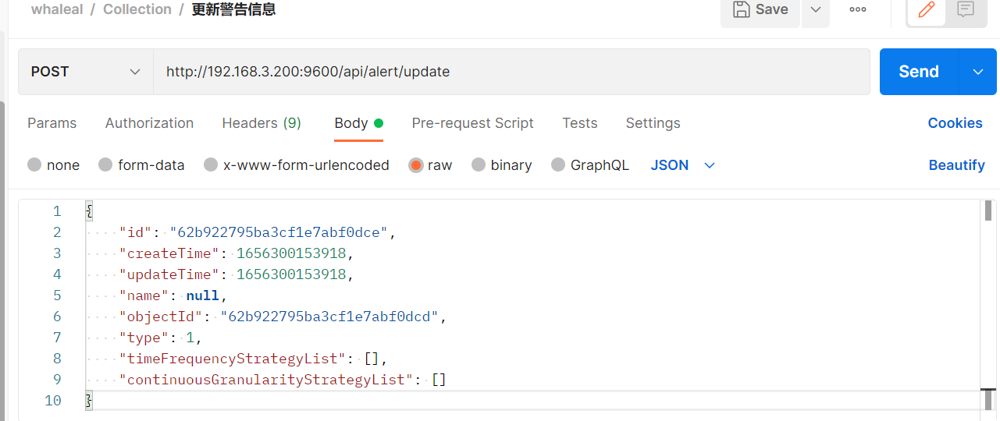
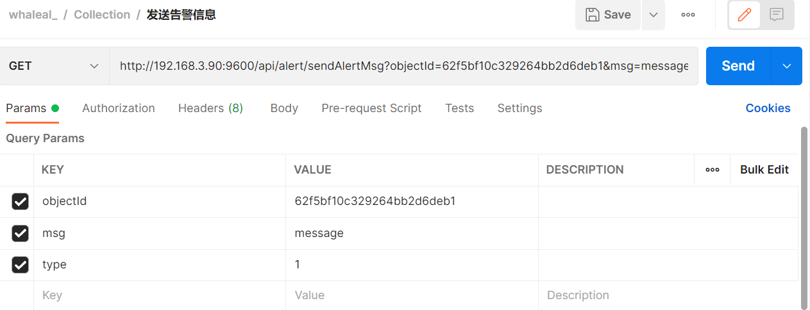

# Alert API

When calling the API, you need to set the `whaleal-Token` in the request header, and the response content will be in JSON format. All time-related parameters are expected to be in the form of timestamps.

The API requires the usage of `hostId` and `objectId` parameters.

```
hostId is obtained from the "Get Host Basic Information by Fuzzy Hostname" API.

objectId can be either the host ID or the MongoDB node ID. The MongoDB node ID can be found in the data collection of the result returned by the "Retrieve MongoDB Cluster Information Data" API under the mongo collection's "id".
```

### Default Request Header Format

| KEY                |     VALUE      |     
| -------------------|----------------------|
| Accept-Encoding        |         gzip,deflate,br |     
| Connection          |         keep-alive           |          
| Content-Type          |         application/json |    

---

###  1 Verify the Correctness of Alert Messages

1.1 Request Path

POST: http://{Server-Host}:{Port}/api/alert/judgeAlertMsg

---

1.2 Request Parameters

| Name                |     Located in     |           Description         |     Required    |        Schema   |
| -------------------|----------------------|-------------------------------|-----------------|-----------   |
|    alertMsgEntity   |      Body      |       Alert message entity     |      Yes            |    AlertMsgEntity


```
Example: Verify the correctness of an alert message. The AlertMsgEntity is as follows:
{
    "alertStrategyId": "62fa15c51bf5144438e5290f",
    "createTime": 1660556741231,
    "endTime": 1660556741231,
    "id": "62fa15c51bf5144438e5290d",
    "msg": "test_alert",
    "objectId": "62fa15c51bf5144438e5290e",
    "objectType": 1,
    "startTime": 1660556741231,
    "updateTime": 1660556741231
}
```

---

1.3 Response

|               |     Description    |           Schema              |  
| --------------|----------------------|---------------------------
| code        |   Status code: 1000 for success, others for exceptions |           int            |    
| data       |         Returned message       |                String         | 


---

###  2 Get Alert Strategies

2.1 Request Path

GET: http://{Server-Host}:{Port}/api/alert/getAlertStrategy

---

2.2 Request Parameters

    Type: 1 for agent, 2 for mongo

| Name                |     Located in     |           Description         |     Required    |        Schema   |
| -------------------|----------------------|-------------------------------|-----------------|-----------   |
|     objectId        |        Params              |           Object ID               |    Yes              |String
|     type        |         Params       |           Type of object          |           Yes       |int


---

2.3 Response

|               |     Description    |           Schema              |  
| --------------|----------------------|---------------------------
| code        |   Status code: 1000 for success, others for exceptions |        int               |    
| data       |         Returned data         |             JSON            | 


---

###  3 Get All Member Alert Strategies (Get All MongoDB Node Alert Strategies on a Single Agent)

3.1 Request Path

GET: http://{Server-Host}:{Port}/api/alert/getAllMongoMemberAlertStrategy

---

3.2 Request Parameters

| Name                |     Located in     |           Description         |     Required    |        Schema   |
| -------------------|----------------------|-------------------------------|-----------------|-----------   |
|     hostId        |        Params              |           Host ID               |    Yes              |String


---

3.3 Response

|               |     Description    |           Schema              |  
| --------------|----------------------|---------------------------
| code        |   Status code: 1000 for success, others for exceptions |         int              |    
| data       |         Returned data         |           List              | 


```
{
    "code": 1000,
    "data": [
        {
            "id": "62fa1679266fb301295fd555",
            "createTime": 1660556921496,
            "updateTime": 1660556923891,
            "name": "",
            "objectId": "62f5bf10c329264bb2d6deb1",
            "type": 2,
            "timeFrequencyStrategyList": [],
            "continuousGranularityStrategyList": [
                {
                    "type": "qps_insert",
                    "cmp": ">",
                    "value": 80.0,
                    "count": 20,
                    "alarmFrequency": 30,
                    "duration": 60
                }
            ]
        }
    ]
}
```

---

###  4 Update Alert Information

4.1 Request Path

POST: http://{Server-Host}:{Port}/api/alert/update


---

4.2 Request Parameters

| Name                |     Located in     |           Description         |     Required    |        Schema   |
| -------------------|----------------------|-------------------------------|-----------------|-----------   |
|     alertStrategyEntity        |        Body              |           Alert strategy entity              |    Yes              |alertStrategyEntity



---

4.3 Response

|               |     Description    |           Schema              |  
| --------------|----------------------|---------------------------
| code        |   Status code: 1000 for success, others for exceptions |         int              |    
| data       |         Returned data         |              JSON           | 


---

###  5 Send Alert Messages

5.1 Request Path

GET: http://{Server-Host}:{Port}/api/alert/sendAlertMsg

---

5.2 Request Parameters

    type: 1 for host, 2 for mongo

| Name                |     Located in     |           Description         |     Required    |        Schema   |
| -------------------|----------------------|-------------------------------|-----------------|-----------   |
|     objectId        |        Params              |    ID of host or mongo             |    Yes              |String
|     msg        |        Params              |           Notification message              |    Yes              |String
|     type        |        Params              |           Notification type              |    Yes              |int



---

5.3 Response

|               |     Description    |           Schema              |  
| --------------|----------------------|---------------------------
| code        |   Status code: 1000 for success, others for exceptions |         int              |    
| msg       |         Returned message      |              String           | 


---


[comment]: <> (## AlertStrategyEntity)


[comment]: <> (|       Name         |     Type             |    Description      |   )

[comment]: <> (| ------------       |----------            |---------------------|)

[comment]: <> (| name                 |   String             |         主机或mongoMember警告策略名称          |   )

[comment]: <> (| objectId             |   String             |         主机id or mongoMemberId     |   )

[comment]: <> (| type                 |   String |         1 agent 2 mongo     |   )

[comment]: <> (| timeFrequencyStrategyList         |   List\<TimeFrequencyStrategy>             |         时间区间警告策略     |   )

[comment]: <> (| continuousGranularityStrategyList         |      List\<ContinuousGranularityStrategy>          |         连续时间警告策略     |   )


[comment]: <> (---)

[comment]: <> (---)

[comment]: <> (## TimeFrequencyStrategy)


[comment]: <> (|       Name         |     Type             |    Description      |   )

[comment]: <> (| ------------       |----------            |---------------------|)

[comment]: <> (| startHour                 |   int             |         小时时间范围的起点          |   )

[comment]: <> (| endHour             |   int            |         小时时间范围的结点     |   )


[comment]: <> (---)

[comment]: <> (---)

[comment]: <> (## HostInfoMongoEntity)


[comment]: <> (|       Name         |     Type             |    Description      |   )

[comment]: <> (| ------------       |----------            |---------------------|)

[comment]: <> (| duration                 |   int             |         统计颗粒度          |   )


[comment]: <> (---)

[comment]: <> (---)
