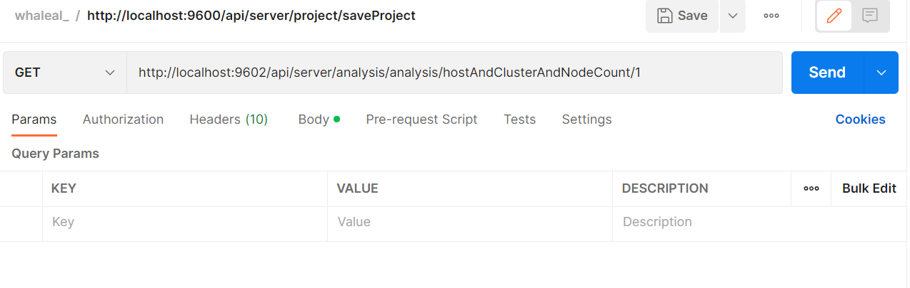

# Analysis API

When calling the API, you need to set the `whaleal-Token` in the request header, and the response content will be in JSON format. All time-related parameters are expected to be in the form of timestamps.

### Default Request Header Format

| KEY                |     VALUE      |     
| -------------------|----------------------|
| Accept-Encoding        |         gzip,deflate,br |     
| Connection          |         keep-alive           |          
| Content-Type          |         application/json |    
| whaleal-token          |         "token"           |     

---

###  1 Data Analysis

1.1 Request Path

GET: http://{Server-Host}:{Port}/api/server/analysis/analysis/{{type}}/{{count}}

---

1.2 Request Parameters

    type: hostAndClusterAndNodeCount, mongoClusterTypeNum, mongoNodeVersionTypeNum, mongoNodeStatusNum, enterpriseAndCommunityNum,
    mongoClusterQPS, mongoClusterConnUS, mongoClusterDataSize, mongoClusterStorageSize, hostCPU_US, hostDiskIO, hostNetIn,
    hostNetOut, hostAlert, mongoAlert

| Name                |     Located in     |           Description         |     Required    |        Schema   |
| -------------------|----------------------|-------------------------------|-----------------|-----------   |
| type          |         Path           |            Type            |        Yes       |String        |
| count          |         Path           |            Count            |        Yes       |int        |



---

1.3 Response

|               |     Description    |           Schema              |  
| --------------|----------------------|---------------------------
| code        |   Status code: 1000 for success, others for exceptions |            int           |    
| data       |         Returned data         |           Document             |        

```
{
    "code": 1000,
    "data": {
        "hostCount": [
            8
        ],
        "mongoClusterCount": [
            4
        ],
        "mongoNodeCount": [
            11
        ]
    },
    "createTime": [
        1664150400000
    ],
    "name": "hostAndClusterAndNodeCount",
    "message": "Comparison chart of host, cluster, and node counts"
}
```

---