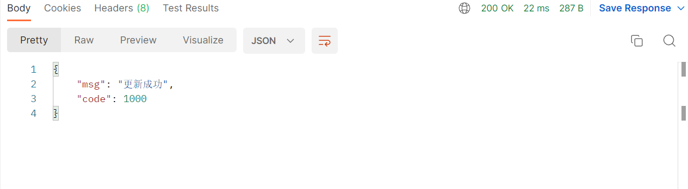
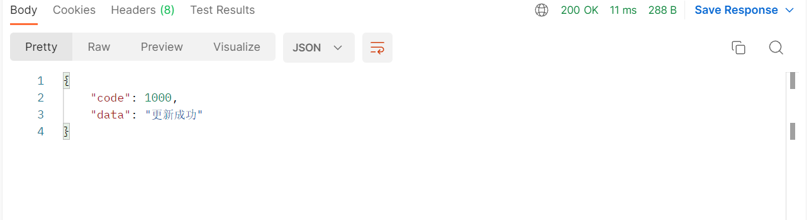
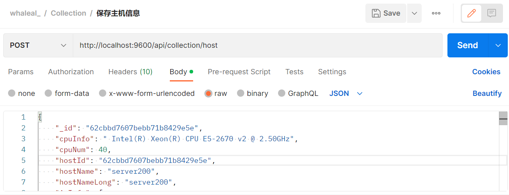
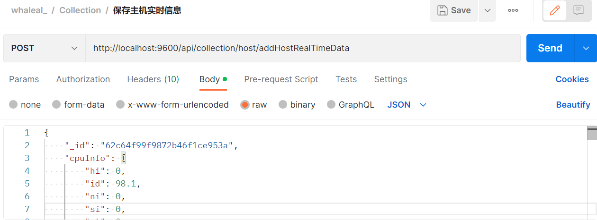
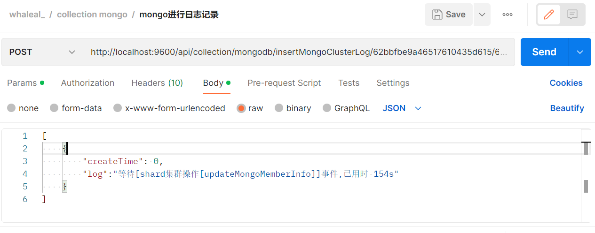
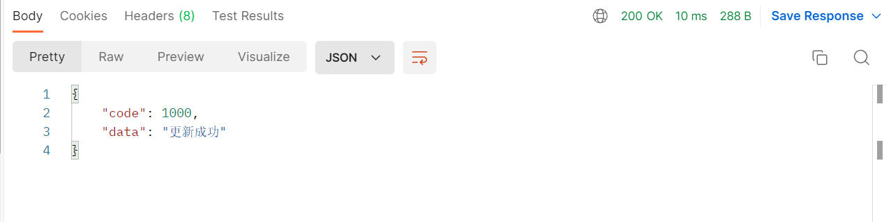
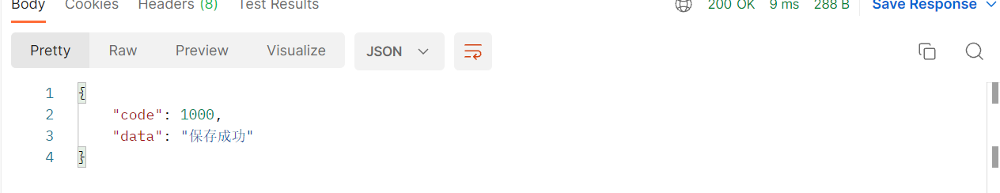
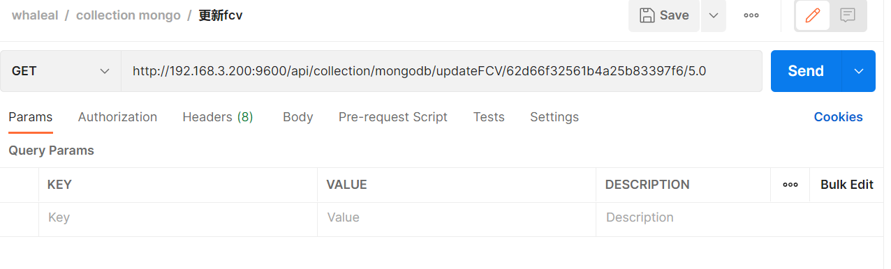
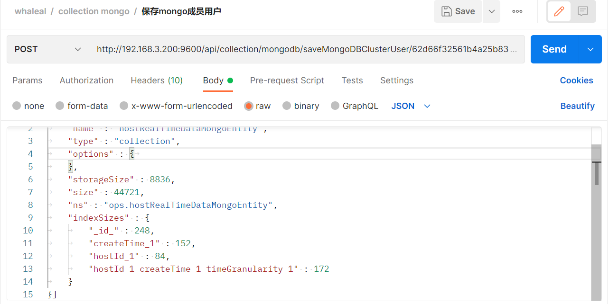
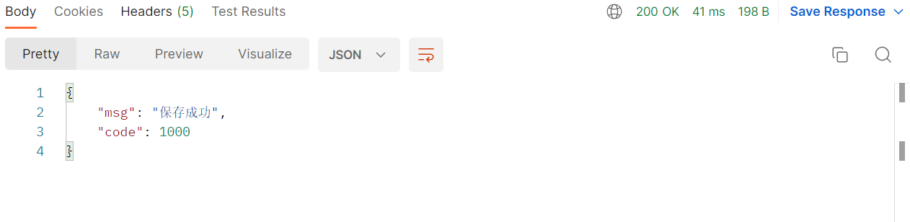

# Collection API

When calling the API, you need to set the `agentId` in the request header, and the response content will be in JSON format. All time-related parameters are expected to be in the form of timestamps.

In some cases, you will need to use `hostId`, `agentId`, `clusterId`, and `eventId` as parameters:

- `hostId` is obtained from the "Retrieve Basic Host Information by Hostname" API.
- `agentId` is obtained from the "Generate Agent ID" API.
- `eventId` is found in the "Get Cluster Log Information" API.
- `clusterId` is obtained from the "Retrieve MongoDB Cluster Information" API.

### Default Request Header Format

The `agentId` is obtained from the "Generate Agent ID" API.

| KEY                |     VALUE      |     
| -------------------|----------------------|
| Accept-Encoding        |         gzip,deflate,br |     
| Connection          |         keep-alive           |          
| Content-Type          |         application/json |    
| agentId          |         "agentId"           |     
---

<br>

###  1 Save Agent's Log Record

1.1 Request Path

POST: http://{Server-Host}:{Port}/api/collection/host/save/log

---

1.2 Request Parameters

| Name                |     Located in     |           Description         |     Required    |        Schema   |
| -------------------|----------------------|-------------------------------|-----------------|-----------   |
|      agentLogEntity      |    Body       |  Log information entity     |       Yes         |AgentLogEntity


---

1.3 Response

|               |     Description    |           Schema              |  
| --------------|----------------------|---------------------------
| code        |   Status code: 1000 for success, others for exceptions |            int           |    
| msg       |         Response message         |         String                | 


---

<br>

###  2 Update Agent's MongoDB File Information

2.1 Request Path

POST: http://{Server-Host}:{Port}/api/collection/host/updateAgentMongoFile/{{agentId}}

---

2.2 Request Parameters

| Name                |     Located in     |           Description         |     Required    |        Schema   |
| -------------------|----------------------|-------------------------------|-----------------|-----------   |
|       agentId     |      Path    |           Agent ID     |        Yes        |String
|       mongoFileList     |      Body   |           List of MongoDB files      |       Yes         |List


---
Ex. Update Agent's MongoDB File Information; where `MongoFileList` is shown below:

```json
[
    {
        "_id": "62d62a9bbfa6b71dad85b68a",
        "createTime": "1658202779363",
        "hostId": "62b153a344ba1b7771c42df7",
        "md5": "1",
        "name": "mongodb-linux-x86_64-enterprise-rhel70-4.4.14.tgz",
        "path": "/var/ops/agent/mongodb-linux-x86_64-enterprise-rhel70-4.4.14.tgz",
        "server": false,
        "shortName": "mongodb-linux-x86_64-enterprise-rhel70-4.4.14",
        "size": 133646249,
        "updateTime": "1658202779363"
    }
]
```

---

2.3 Response

|               |     Description    |           Schema              |  
| --------------|----------------------|---------------------------
| code        |   Status code: 1000 for success, others for exceptions |       int                |    
| msg       |         Response message        |           String              | 



---

<br>

###  3 Query Pending Commands for an Agent

3.1 Request Path

GET: http://{Server-Host}:{Port}/api/collection/command/getCommand/{{hostId}}

---

3.2 Request Parameters

| Name                |     Located in     |           Description         |     Required    |        Schema   |
| -------------------|----------------------|-------------------------------|-----------------|-----------   |
|      hostId      |       Path              |              Host ID           |      Yes          |  String


---

3.3 Response

|               |     Description    |           Schema              |  
| --------------|----------------------|---------------------------
| code        |   Status code: 1000 for success, others for exceptions |       int                |    
| data       |         Returned data         |         List                | 

```json
{
    "code": 1000,
    "data": [
        {
            "id": "632bfca83b74be1d9fe7ddb7",
            "createTime": 1663827112988,
            "updateTime": 1663827112988,
            "hostId": "630eddeff3d9e72e3695ea48",
            "commandType": 101,
            "status": 0,
            "eventId": null,
            "commandNote": "updateHostInfo",
            "content": "\"updateHostInfo\"",
            "execResult": null
        }
    ]
}
```

---

<br>

### 4 Update Status of Command Entity

4.1 Request Path

PUT: http://{Server-Host}:{Port}/api/collection/command/update

---

4.2 Request Parameters

| Name                |     Located in     |           Description         |     Required    |        Schema   |
| -------------------|----------------------|-------------------------------|-----------------|-----------   |
|     commandEntity       |        Body             |         Command entity  |    Yes

            |   CommandEntity


---
Ex. Update the status of the command entity; where `CommandEntity` is shown below:

```json
{
    "id": "62c54a395dc04d3d4c13be75",
    "commandNote": "server100:20190获取集群角色",
    "commandType": 221,
    "content": "{}",
    "createTime": "1657096761802",
    "execResult": "已完成",
    "hostId": "62b153a344ba1b7771c42df7",
    "status": 3,
    "updateTime": "1657096769089"
}
```

---

4.3 Response

|               |     Description    |           Schema              |  
| --------------|----------------------|---------------------------
| code        |   Status code: 1000 for success, others for exceptions |         int              |    
| data       |         Response message        |            String             | 



---

<br>

###  5 Update Agent Heartbeat Information

5.1 Request Path

GET: http://{Server-Host}:{Port}/api/collection/host/updateRunTime/{{hostId}}/{{timeStamp}}

---

5.2 Request Parameters

| Name                |     Located in     |           Description         |     Required    |        Schema   |
| -------------------|----------------------|-------------------------------|-----------------|-----------   |
|      hostId      |         Path            |        Host ID                 |       Yes          | String
|      timeStamp      |         Path            |        Timestamp              |       Yes          | String


---

5.3 Response

|               |     Description    |           Schema              |  
| --------------|----------------------|---------------------------
| code        |   Status code: 1000 for success, others for exceptions |         int              |    
| msg       |         Response message        |           String              | 


---

<br>

###  6 Save Host Information

6.1 Request Path

POST: http://{Server-Host}:{Port}/api/collection/hostInfo

---

6.2 Request Parameters

| Name                |     Located in     |           Description         |     Required    |        Schema   |
| -------------------|----------------------|-------------------------------|-----------------|-----------   |
|      hostInfoMongoEntity      |         Body            |        Host information entity                 |       Yes          | HostInfoMongoEntity



---
Ex. Save host information; where `HostInfoMongoEntity` is shown below:

```json
{
    "_id": "62cbbd7607bebb71b8429e5e",
    "cpuInfo": " Intel(R) Xeon(R) CPU E5-2670 v2 @ 2.50GHz",
    "cpuNum": 40,
    "hostId": "62cbbd7607bebb71b8429e5e",
    "hostName": "server200",
    "hostNameLong": "server200",
    "ipInfo": [
        {
            "ip": "172.17.0.1",
            "type": "ipv4"
        }
    ],
    "kernelInfo": "3.10.0-1062.el7.x86_64",
    "osVersion": "CentOS Linux release 7.7.1908 (Core)",
    "run": true,
    "systemPropertyInfo": {
        "fileSeparator": "/",
        "javaClassPath": "agent-collection-1.0.0.jar",
        "javaClassVersion": "55.0",
        "javaHome": "/root/jdk-11.0.9",
        "javaIoTmpdir": "/tmp",
        "javaLibraryPath": "/usr/java/packages/lib:/usr/lib64:/lib64:/lib:/usr/lib",
        "javaSpecificationName": "Java Platform API Specification",
        "javaSpecificationVendor": "Oracle Corporation",
        "javaVendor": "Oracle Corporation",
        "javaVersion": "11.0.9",
        "javaVmName": "Java HotSpot(TM) 64-Bit Server VM",
        "javaVmSpecificationName": "Java Virtual Machine Specification",
        "javaVmSpecificationVersion": "11",
        "javaVmVendor": "Oracle Corporation",
        "javaVmVersion": "11.0.9+7-LTS",
        "lineSeparator": "\n",
        "oSArch": "amd64",
        "oSName": "Linux",
        "oSVersion": "3.10.0-1062.el7.x86_64",
        "pathSeparator": ":",
        "userDir": "/home/jmops",
        "userHome": "/root",
        "userName": "root"
    }
}
```

---

6.3 Response

|               |     Description    |           Schema              |  
| --------------|----------------------|---------------------------
| code        |   Status code: 1000 for success, others for exceptions |        int               |    
| msg       |         Response message        |           String              | 


---

<br>

###  7 Save Real-Time Host Information

7.1 Request Path

POST: http://{Server-Host}:{Port}/api/collection/host/addHostRealTimeData

---

7.2 Request Parameters

| Name                |     Located in     |           Description         |     Required    |        Schema   |
| -------------------|----------------------|-------------------------------|-----------------|-----------   |
|      hostRealTimeDataMongoEntity      |         Body            |        Real-time host information entity                 |       Yes          | HostRealTimeDataMongoEntity



---
Ex. Save real-time host information; where `hostRealTimeDataMongoEntity` is shown below:

```json
{
    "_id": "62c64f99f9872b46f1ce953a",
    "cpuInfo": {
        "hi": 0,
        "id": 98.1,
        "ni": 0,
        "si": 0,
        "st": 0,
        "sy": 0.9,
        "us": 1,
        "wa": 0
    },
    "createTime": "1657163672000",
    "diskInAndOutInfoList": [
        {
            "avgqu_sz": 0.05,
            "avgrq_sz": 18.89,
            "await": 0.34,
            "device": "sda",
            "r_await": 13.32,
            "r_s": 0.17,
            "rkB_s": 10.82,
            "rrqm_s": 0.

06,
            "svctm": 0.05,
            "util": 0.75,
            "w_await": 0.32,
            "w_s": 144.65,
            "wkB_s": 1357.06,
            "wrqm_s": 2.03
        }
    ],
    "diskInfoList": [
        {
            "fileSystem": "devtmpfs",
            "mountedOn": "/dev",
            "size": 64349,
            "type": "devtmpfs",
            "used": 0,
            "utilization": 0
        }
    ],
    "hostId": "62b153a344ba1b7771c42df7",
    "hostName": "server100",
    "memoryInfo": {
        "memAvail": 95150,
        "memBuffCache": 26138,
        "memFree": 69641,
        "memTotal": 128722,
        "memUsed": 32942,
        "swapFree": 1958,
        "swapTotal": 4095,
        "swapUsed": 2137
    },
    "netInAndOutInfoList": [
        {
            "io": 0,
            "networkCardName": "em3:",
            "out": 0
        }
    ],
    "timeGranularity": 1,
    "updateTime": "1657163672000"
}
```

---

7.3 Response

|               |     Description    |           Schema              |  
| --------------|----------------------|---------------------------
| code        |   Status code: 1000 for success, others for exceptions |          int             |    
| data       |         Response message        |            String             | 


---

<br>

###  8 Agent Calls to Get Server Time

8.1 Request Path

GET: http://{Server-Host}:{Port}/api/collection/util/get/server/date

---

8.2 Request


---

8.3 Response

|               |     Description    |           Schema              |  
| --------------|----------------------|---------------------------
| code        |   Status code: 1000 for success, others for exceptions |          int             |    
| data       |         Timestamp        |             long           | 


---

<br>

###  9 Agent Retrieves its IP Address

9.1 Request Path

GET: http://{Server-Host}:{Port}/api/collection/util/get/agent/ip

---

9.2 Request


---

9.3 Response

|               |     Description    |           Schema              |  
| --------------|----------------------|---------------------------
| code        |   Status code: 1000 for success, others for exceptions |       int                |    
| data       |         IP address        |           String              | 


---

<br>

###  10 Logging to MongoDB

10.1 Request Path

POST: http://{Server-Host}:{Port}/api/collection/mongodb/insertMongoClusterLog/{{clusterId}}/{{eventId}}

---

10.2 Request Parameters

| Name                |     Located in     |           Description         |     Required    |        Schema   |
| -------------------|----------------------|-------------------------------|-----------------|-----------   |
|     clusterId        |      Path                |           Cluster ID               |      Yes            | String
|     eventId        |         Path             |           Event ID               |           Yes       |String
|     logList        |         Body             |         List of logs                 |             Yes     |List



---

10.3 Response

|               |     Description    |           Schema              |  
| --------------|----------------------|---------------------------
| code        |   Status code: 1000 for success, others for exceptions |         int              |    
| data       |         Response message        |          String              | 


---

<br>


---

### 11 Insert MongoDB Member Log

11.1 Request Path

POST: http://{Server-Host}:{Port}/api/collection/mongodb/insertMongoMemberLog/{{clusterId}}/{{memberInfo}}/{{eventId}}


---

11.2 Request Parameters


| Name                |     Located in     |           Description         |     Required    |        Schema   |
| -------------------|----------------------|-------------------------------|-----------------|-----------   |
|       clusterId      |       Path               |        Cluster ID                  |       Yes           |String
|       memberInfo      |         Path             |       Member Info                   |      Yes            |String
|       eventId      |       Path               |          Event ID                |       Yes           |String
|       logList      |       Body               |          Log List                |      Yes            |List

<br>


----

11.3 Response


|               |     Description    |           Schema              |  
| --------------|----------------------|---------------------------
| code        |   Status Code: 1000 for success, others for exceptions |       int                |    
| data       |         Response Message        |         String                | 

<br>


---

<br>


### 12 Update MongoDB Node Information


12.1 Request Path

POST: http://{Server-Host}:{Port}/api/collection/mongodb/updateMongoMember


---

12.2 Request Parameters


| Name                |     Located in     |           Description         |     Required    |        Schema   |
| -------------------|----------------------|-------------------------------|-----------------|-----------   |
|       mongoMember      |       Body               |        MongoDB Cluster Member     |       Yes           |MongoMember

<br>


~~~
Example: Update MongoDB node information; where MongoMember is as follows:
{
  "id": "62f76749e011b442d7c91ec6",
  "createTime": 0,
  "updateTime": 1660466332000,
  ...
  "operateVersion": 5723
}
~~~


----

12.3 Response


|               |     Description    |           Schema              |  
| --------------|----------------------|---------------------------
| code        |   Status Code: 1000 for success, others for exceptions |        int               |    
| data       |         Response Message        |          String               | 

<br>


---

<br>


### 13 Update Replica Set Information


13.1 Request Path

POST: http://{Server-Host}:{Port}/api/collection/mongodb/updateMongoRepl/{{isUpdateMemberList}}

---

13.2 Request Parameters


| Name                |     Located in     |           Description         |     Required    |        Schema   |
| -------------------|----------------------|-------------------------------|-----------------|-----------   |
|       isUpdateMemberList      |       Path               |        Update Member List  |       Yes           |boolean
|       mongoReplica      |         Body             |       MongoDB Replica Set     |      Yes            |MongoReplica

<br>


----

13.3 Response


|               |     Description    |           Schema              |  
| --------------|----------------------|---------------------------
| code        |   Status Code: 1000 for success, others for exceptions |         int              |    
| data       |         Response Message        |           String              | 

<br>





---

<br>


### 14 Update Cluster Information


14.1 Request Path

POST: http://{Server-Host}:{Port}/api/collection/mongodb/updateCluster

---

14.2 Request Parameters


| Name                |     Located in     |           Description         |     Required    |        Schema   |
| -------------------|----------------------|-------------------------------|-----------------|-----------   |
|       mongoClusterInformation      |       Body  |        MongoDB Cluster Information   |       Yes           |MongoClusterInformation

<br>


----

14.3 Response


|               |     Description    |           Schema              |  
| --------------|----------------------|---------------------------
| code        |   Status Code: 1000 for success, others for exceptions |          int             |    
| data       |         Response Message        |            String             | 

<br>


---

<br>


### 15 Save Real-Time Information of MongoDB Members


15.1 Request Path

POST: http://{Server-Host}:{Port}/api/collection/mongodb/realtime


---

15.2 Request Parameters


| Name                |     Located in     |           Description         |     Required    |        Schema   |
| -------------------|----------------------|-------------------------------|-----------------|-----------   |
|       tableName      |       Path               |        Table Name                  |       Yes           |String
|       mongodbNodeMetrics      |         Body             |       MongoDB Real-Time Data     |      Yes            |MongodbNodeMetrics

<br>


~~~
Example: Save real-time information of a MongoDB member; where MongodbNodeMetrics is as follows:
{
	"anAssert": {
		"msg": 0,
		"regular": 0,
		"user": 0,
		"warning": 0
	},
	"cacheFlow": {
		"brin": 8717624,
		"bwfr": 6421369
	}
	"createTime": "1660469450000",
	...
	"operateVersion": 8168
}
~~~


----

15.3 Response


|               |     Description    |           Schema              |  
| --------------|----------------------|---------------------------
| code        |   Status Code: 1000 for success, others for exceptions |       int                |    
| data       |         File Offset        |         long                | 

<br>


---

<br>


## Deprecated (No Longer Used)
### 16 Save Batch of Monitoring Data to Database


16.1 Request Path

POST: http://{Server-Host}:{Port}/api/collection/mongodb/realtime/save/many

---

16.2 Request Parameters


| Name                |     Located in     |           Description         |     Required    |        Schema   |
| -------------------|----------------------|-------------------------------|-----------------|-----------   |
|       mongoDBRealtimeDataEntityList      |       Body               |        List of Real-Time Data                  |       Yes           |List

<br>


----

16.3 Response


|               |     Description    |           Schema              |  
| --------------|----------------------|---------------------------
| code        |   Status Code: 1000 for success, others for exceptions |         int              |    
| data       |         Response Message        |           String              | 

<br>





---

<br>

### 17 Get MongoDB Node Information on Agent Instance


17.1 Request Path

POST http://{Server-Host}:{Port}/api/collection/mongodb/getAgentMongoMember/{{agentId}}


---

17.2 Request Parameters


| Name                |     Located in     |           Description         |     Required    |        Schema   |
| -------------------|----------------------|-------------------------------|-----------------|-----------   |
|       agentId      |       Path               |        Agent ID                  |       Yes           |String

<br>


----

17.3 Response


|               |     Description    |           Schema              |  
| --------------|----------------------|---------------------------
| code        |   Status Code: 1000 for success, others for exceptions |         int              |    
| data       |         Returned Data        |            List             | 

<br>

[comment]: <> (![img_12.png]&#40;../../images/whalealPlatformImages//agent_mongoMember_r.png&#41;)

~~~
{
    "code": 1000,
    "data": [
        {
            "id": "62d6506ec5b6206027b99052",
            "createTime": 1658212462005,
            "updateTime": 1658302192001,
            ...
            "operateVersion": 8168
        }
    ]
}
~~~


---

<br>


### 18 Save mongo.log Log

18.1 Request Path

POST: http://{Server-Host}:{Port}/api/collection/mongodb/save/mongoLog/{{mongoMemberId}}/{{fileOffset}}

---

18.2 Request Parameters


| Name                |     Located in     |           Description         |     Required    |        Schema   |
| -------------------|----------------------|-------------------------------|-----------------|-----------   |
|       mongoMemberId      |       Path               |        MongoDB member ID                  |       Yes           |String
|       fileOffset      |         Path             |       File offset     |      Yes            |long
|       logList      |         Body             |       Log list     |      Yes            |List

<br>


----

18.3 Response

|               |     Description    |           Schema              |  
| --------------|----------------------|---------------------------
| code        |   Status code: 1000 for success, others for exceptions |        int               |    
| data       |         File offset        |         long                | 

<br>


---

<br>

### 19 Save Mongo Top and Op

19.1 Request Path

POST: http://{Server-Host}:{Port}/api/collection/mongodb/save/mongoTopAndOp

---

19.2 Request Parameters


| Name                |     Located in     |           Description         |     Required    |        Schema   |
| -------------------|----------------------|-------------------------------|-----------------|-----------   |
|       documentList      |       Body               |     Document list |       Yes           |List

<br>


----

19.3 Response

|               |     Description    |           Schema              |  
| --------------|----------------------|---------------------------
| code        |   Status code: 1000 for success, others for exceptions |        int               |    
| data       |         Response message        |          String               | 

<br>


---

<br>

### 20 Update FCV

20.1 Request Path

GET: http://{Server-Host}:{Port}/api/collection/mongodb/updateFCV/{{clusterId}}/{{fcv}}

---

20.2 Request Parameters


| Name                |     Located in     |           Description         |     Required    |        Schema   |
| -------------------|----------------------|-------------------------------|-----------------|-----------   |
|       clusterId      |       Path               |        Cluster ID                  |       Yes           |String
|       fcv      |         Path             |       FCV     |      Yes            |String

<br>



----

20.3 Response

|               |     Description    |           Schema              |  
| --------------|----------------------|---------------------------
| code        |   Status code: 1000 for success, others for exceptions |         int              |    
| data       |         Response message        |           String              | 

<br>


---

<br>

### 21 Save MongoDB Collections

21.1 Request Path

POST: http://{Server-Host}:{Port}/api/collection/mongodb/saveMongoDBCollections

---

21.2 Request Parameters


| Name                |     Located in     |           Description         |     Required    |        Schema   |
| -------------------|----------------------|-------------------------------|-----------------|-----------   |
|       mongoDBCollections      |         Body             |       MongoDB actual collections     |      Yes            |MongoDBCollections

<br>


~~~
Example: Save MongoDB collections; where MongoDBCollections is as follows:
{
	"_id" : "62ea1db298c0825187aee96e",
	"clusterId" : "62ea1db298c0825187aee96e",
	"createTime" : "1659686288006",
	"dbTables" : [
		{
			"name" : "fs.files",
			"type" : "collection",
			"options" : {
				
			},
			"info" : {
				"readOnly" : false,
				"uuid" : {
					"type" : 4,
					"data" : "q/X3q+2aQVC9dGCnS4wKZA=="
				}
			},
			"idIndex" : {
				"v" : 2,
				"key" : {
					"_id" : 1
				},
				"name" : "_id_",
				"ns" : "record.fs.files"
			},
			"storageSize" : 20,
			"size" : 16,
			"ns" : "record.fs.files"
		}
	],
	"fromServerExe" : false,
	"updateTime" : 0
}

~~~


----

21.3 Response

|               |     Description    |           Schema              |  
| --------------|----------------------|---------------------------
| code        |   Status code: 1000 for success, others for exceptions |       int                |    
| data       |         Response message        |          String               | 

<br>


---

<br>

### 22 Save MongoDB Cluster User

22.1 Request Path

POST: http://{Server-Host}:{Port}/api/collection/mongodb/saveMongoDBClusterUser/{{clusterId}}

---

22.2 Request Parameters


| Name                |     Located in     |           Description         |     Required    |        Schema   |
| -------------------|----------------------|-------------------------------|-----------------|-----------   |
|       clusterId      |       Path               |        Cluster ID                  |       Yes           |String
|       list      |         Body             |       Document list     |      Yes            |List

<br>




~~~
Example: Save MongoDB cluster users; where List is as follows:
[{
	"name" : "hostRealTimeDataMongoEntity",
	"type" : "collection",
	"options" : {	
	},
	"storageSize" : 8836,
	"size" : 44721,
	"ns" : "ops.hostRealTimeDataMongoEntity",
	"indexSizes" : {
		"_id_" : 248,
		"createTime_1" : 152,
		"hostId_1" : 84,
		"hostId_1_createTime_1_timeGranularity_1" : 172
	}
}]
~~~


----

22.3 Response

|               |     Description    |           Schema              |  
| --------------

|----------------------|---------------------------
| code        |   Status code: 1000 for success, others for exceptions |        int               |    
| data       |         Response message        |             String            |

<br>


---

<br>

### 23 Save MongoDB Cluster Role

23.1 Request Path

POST: http://{Server-Host}:{Port}/api/collection/mongodb/saveMongoDBClusterRole/{{clusterId}}

---

23.2 Request Parameters


| Name                |     Located in     |           Description         |     Required    |        Schema   |
| -------------------|----------------------|-------------------------------|-----------------|-----------   |
|       clusterId      |       Path               |        Cluster ID                  |       Yes           |String
|      list      |         Body             |       Document list     |      Yes            |List


<br>


----

23.3 Response

|               |     Description    |           Schema              |  
| --------------|----------------------|---------------------------
| code        |   Status code: 1000 for success, others for exceptions |         int              |    
| data       |         Response message        |              String           | 

<br>


<br>

### 24 Save Diagnostic Data.

24.1 Request Path

POST: http://{Server-Host}:9601/api/collection/mdiag/saveMdiagLog

---

24.2 Request Parameters


| Name                |     Located in     |           Description         |     Required    |        Schema   |
| -------------------|----------------------|-------------------------------|-----------------|-----------   |
|      document      |       Body  |        Diagnostic log      |       Yes           |Document

<br>


----

24.3 Response

|               |     Description    |           Schema              |  
| --------------|----------------------|---------------------------
| code        |   Status code: 1000 for success, others for exceptions |          int             |    
| data       |         Response message        |            String             | 

<br>




---

<br>

### 24 Get Config Information.

24.1 Request Path

GET http://{Server-Host}:9601/api/collection/config/getConfig

---

24.2 Request Parameters


<br>


----

24.3 Response

|               |     Description    |           Schema              |  
| --------------|----------------------|---------------------------
| code        |   Status code: 1000 for success, others for exceptions |          int             |    
| data       |         Return data       |            ConfigEntity             | 


<br>


---
---


[comment]: <> (## AgentLogEntity)


[comment]: <> (|       Name         |     Type             |    Description      |   )

[comment]: <> (| ------------       |----------            |---------------------|)

[comment]: <> (| hostId                 |   String             |         主机id          |   )

[comment]: <> (| type             |   String             |         日志类型     |   )

[comment]: <> (| content              |   String |         内容     |   )


[comment]: <> (---)

[comment]: <> (---)

[comment]: <> (## MongoFile)


[comment]: <> (|       Name         |     Type             |    Description      |   )

[comment]: <> (| ------------       |----------            |---------------------|)

[comment]: <> (| shortName                 |   String             |         姓          |   )

[comment]: <> (| Name             |   String             |         名     |   )

[comment]: <> (| Size              |   Long |         大小     |   )

[comment]: <> (| Md5               |   String             |         文件校验     |   )

[comment]: <> (| version         |   String             |         版本     |   )

[comment]: <> (| Path           |   String             |         路径     |   )

[comment]: <> (| hostId             |   String             |         主机id     |   )


[comment]: <> (---)

[comment]: <> (---)

[comment]: <> (## commandEntity)


[comment]: <> (|       Name         |     Type             |    Description      |   )

[comment]: <> (| ------------       |----------            |---------------------|)

[comment]: <> (| hostId                 |   String             |         主机id          |   )

[comment]: <> (| commandType             |   String             |         命令类型     |   )

[comment]: <> (| status              |   Integer |    当前状态:1 下发,2 正在执行,3 正常已完成,4 异常完成,5 异常完成但是不影响后续执行     |   )

[comment]: <> (| eventId               |   String             |         所属事件组     |   )

[comment]: <> (| commandNote         |   String             |         具体命令操作注释     |   )

[comment]: <> (| content           |   String             |         命令内容     |   )

[comment]: <> (| execResult             |   String             |         执行结果     |   )


[comment]: <> (---)

[comment]: <> (---)

[comment]: <> (___)

[comment]: <> (## ipInfo)

[comment]: <> (|       Name        |     Type    |           Description       |   )

[comment]: <> (| --------------|----------------------|--------------------|)

[comment]: <> (| id        |   String |         Id              |   )

[comment]: <> (| Type        |   String |         主机名称              |   )


[comment]: <> (---  )

[comment]: <> (## HostInfoMongoEntity)


[comment]: <> (|       Name         |     Type             |    Description      |   )

[comment]: <> (| ------------       |----------            |---------------------|)

[comment]: <> (| id                 |   String             |         Id          |   )

[comment]: <> (| ipInfo             |   List<ipInfo>             |         Ip信息     |   )

[comment]: <> (| systemPropertyInfo |   systemPropertyInfo |         系统参数信息     |   )

[comment]: <> (| createTime         |   时间戳             |         创建时间     |   )

[comment]: <> (| updateTime         |   时间戳             |         更新时间     |   )

[comment]: <> (| hostName           |   String             |         主机名称     |   )

[comment]: <> (| hostId             |   String             |         主机id     |   )

[comment]: <> (| hostNameLong       |   String             |         主机长名称     |   )

[comment]: <> (| Memory             |   int             |         内存     |   )

[comment]: <> (| osVersion          |   String             |         系统版本     |   )

[comment]: <> (| cpuNum             |   int             |         Cpu数     |   )

[comment]: <> (| swap               |   int             |         交换内存     |   )

[comment]: <> (| kernelInfo         |   String             |         内核信息     |   )

[comment]: <> (| totalDiskSize      |   Int             |         总磁盘大小     |   )

[comment]: <> (| run                |   boolean             |         是否正在运行     |   )


[comment]: <> (---)

[comment]: <> (---)

[comment]: <> (## HostRealTimeDataMongoEntity)


[comment]: <> (|       Name         |     Type             |    Description      |   )

[comment]: <> (| ------------       |----------            |---------------------|)

[comment]: <> (| hostId                 |   String             |         主机id          |   )

[comment]: <> (| hostName             |   String             |         主机名称     |   )

[comment]: <> (| timeGranularity              |   int |         颗粒度值     |   )

[comment]: <> (| cpuInfo               |   CpuInfo             |         cpu使用信息     |   )

[comment]: <> (| memoryInfo         |   MemoryInfo             |         内存使用信息     |   )

[comment]: <> (| diskInfoList           |   List<DiskInfo>             |         磁盘使用信息     |   )

[comment]: <> (| diskInAndOutInfoList             |   List<DiskInAndOutInfo>             |         磁盘io信息     |   )

[comment]: <> (| netInAndOutInfoList             |   List<NetInAndOutInfo>             |         网络带宽io信息     |   )


[comment]: <> (---)

[comment]: <> (---)


[comment]: <> (## CpuInfo)


[comment]: <> (|       Name         |     Type             |    Description      |   )

[comment]: <> (| ------------       |----------            |---------------------|)

[comment]: <> (| us                 |   double             |         用户空间占用CPU百分比          |   )

[comment]: <> (| sy             |   double             |         内核空间占用CPU百分比     |   )

[comment]: <> (| ni              |   double |         用户进程空间内改变过优先级的进程占用CPU百分比     |   )

[comment]: <> (| id               |   double             |         空闲CPU百分比     |   )

[comment]: <> (| wa         |   double             |         等待输入输出的CPU时间百分比     |   )

[comment]: <> (| hi           |   double            |         硬中断占用CPU的百分比     |   )

[comment]: <> (| si             |   double             |         软中断占用CPU的百分比     |   )

[comment]: <> (| st             |   double            |         虚拟CPU等待实际CPU的时间的百分比     |   )


[comment]: <> (---)

[comment]: <> (---)


[comment]: <> (## DiskInAndOutInfo)


[comment]: <> (|       Name         |     Type             |    Description      |   )

[comment]: <> (| ------------       |----------            |---------------------|)

[comment]: <> (| memTotal                 |   long             |         物理内存总量          |   )

[comment]: <> (| memFree             |   long             |         空闲内存总量     |   )

[comment]: <> (| memUsed              |   long |         使用的物理内存总量     |   )

[comment]: <> (| memBuffCache               |   long             |         用作内核缓存的内存量     |   )

[comment]: <> (| memAvail         |   long             |         代表可用于进程下一次分配的物理内存数量     |   )

[comment]: <> (| swapTotal           |   long           |         交换区总量     |   )

[comment]: <> (| swapFree             |  long            |         空闲交换区总量     |   )

[comment]: <> (| swapUsed             |   long       |         使用的交换区总量     |   )


[comment]: <> (---)

[comment]: <> (---)


[comment]: <> (## NetInAndOutInfo)


[comment]: <> (|       Name         |     Type             |    Description      |   )

[comment]: <> (| ------------       |----------            |---------------------|)

[comment]: <> (| networkCardName                 |   String             |         网卡名          |   )

[comment]: <> (| io             |   double             |         流入流量     |   )

[comment]: <> (| out              |   double |         流出流量     |   )

[comment]: <> (---)

[comment]: <> (---)


[comment]: <> (## HostRealTimeDataMongoEntity)


[comment]: <> (|       Name         |     Type             |    Description      |   )

[comment]: <> (| ------------       |----------            |---------------------|)

[comment]: <> (| hostId                 |   String             |         主机id          |   )

[comment]: <> (| hostName             |   String             |         主机名称     |   )

[comment]: <> (| timeGranularity              |   int |         颗粒度值     |   )

[comment]: <> (| cpuInfo               |   CpuInfo             |         cpu使用信息     |   )

[comment]: <> (| memoryInfo         |   MemoryInfo             |         内存使用信息     |   )

[comment]: <> (| diskInfoList           |   List<DiskInfo>             |         磁盘使用信息     |   )

[comment]: <> (| diskInAndOutInfoList             |   List<DiskInAndOutInfo>             |         磁盘io信息     |   )

[comment]: <> (| netInAndOutInfoList             |   List<NetInAndOutInfo>             |         网络带宽io信息     |   )


[comment]: <> (---)

[comment]: <> (---)


[comment]: <> (## DiskInfo)


[comment]: <> (|       Name         |     Type             |    Description      |   )

[comment]: <> (| ------------       |----------            |---------------------|)

[comment]: <> (| fileSystem                 |   String             |         分区名          |   )

[comment]: <> (| type             |   String             |         分区类型     |   )

[comment]: <> (| size              |   long |         总大小     |   )

[comment]: <> (| used               |   long             |         使用大小     |   )

[comment]: <> (| utilization         |   double             |         使用率     |   )

[comment]: <> (| mountedOn           |   String            |         挂载位置     |   )

[comment]: <> (---)

[comment]: <> (---)


[comment]: <> (## LogInfo)


[comment]: <> (|       Name         |     Type             |    Description      |   )

[comment]: <> (| ------------       |----------            |---------------------|)

[comment]: <> (| createTime                 |   String             |         创建时间          |   )

[comment]: <> (| log             |   String             |         日志     |   )

[comment]: <> (---)

[comment]: <> (---)

[comment]: <> (## MongoMember)


[comment]: <> (|       Name         |     Type             |    Description      |   )

[comment]: <> (| ------------       |----------            |---------------------|)

[comment]: <> (| memberName                 |   String             |         主机名:端口          |   )

[comment]: <> (| hostName             |   String             |         主机名     |   )

[comment]: <> (| hostId              |   Long |         主机id     |   )

[comment]: <> (| port               |   String             |         端口     |   )

[comment]: <> (| version         |   String             |         版本     |   )

[comment]: <> (| upgradeVersion           |   String             |         升降级版本     |   )

[comment]: <> (| password           |   String             |         节点密码     |   )

[comment]: <> (| authDbName           |   String             |         认证库     |   )

[comment]: <> (| currentTimeMillis           |   long             |         当前时间戳     |   )

[comment]: <> (| dataDirectory           |   String             |         数据目录     |   )

[comment]: <> (| userName             |   String             |         节点用户名     |   )

[comment]: <> (| logFile             |   String             |         日志文件     |   )

[comment]: <> (| confPath             |   String             |         配置文件路径     |   )

[comment]: <> (| deleteDataAndLogAble             |   String             |         是否强制删除     |   )

[comment]: <> (| authAble             |   String             |         是否开启认证     |   )

[comment]: <> (| runShCmd             |   String             |         执行启动命令     |   )

[comment]: <> (| type             |   enum             |         节点类型     |   )

[comment]: <> (注 type:11 单例)

[comment]: <> (*)

[comment]: <> (* <p> 普通复制集)

[comment]: <> (* 31 普通成员节点)

[comment]: <> (* 32 隐藏节点)

[comment]: <> (* 33 仲裁节点)

[comment]: <> (* 34 隐藏延迟节点)

[comment]: <> (* 35 主节点)

[comment]: <> (* <p> config复制集)

[comment]: <> (* 41 config普通成员节点)

[comment]: <> (* 42 config隐藏节点)

[comment]: <> (* 43 config仲裁节点)

[comment]: <> (* 44 config隐藏延迟节点)

[comment]: <> (* 45 config主节点)

[comment]: <> (* <p> shard复制集)

[comment]: <> (* 51 shard普通成员节点)

[comment]: <> (* 52 shard隐藏节点)

[comment]: <> (* 53 shard仲裁节点)

[comment]: <> (* 54 shard隐藏延迟节点)

[comment]: <> (* 55 shard主节点)

[comment]: <> (* <p> mongoS)

[comment]: <> (* 61 mongoS)

[comment]: <> (---)

[comment]: <> (---)

[comment]: <> (## MongoReplica)


[comment]: <> (|       Name         |     Type             |    Description      |   )

[comment]: <> (| ------------       |----------            |---------------------|)

[comment]: <> (| replicaName                 |   String             |         集群名          |   )

[comment]: <> (| memberList             |   List<MongoMember>             |         成员列表     |   )

[comment]: <> (| type              |   enum |         大小     |   )

[comment]: <> (| clusterId               |   String             |         所属集群id     |   )

[comment]: <> (| deleteDataAndLogAble         |   boolean             |         是否强制删除已经存在的数据目录和日志文件     |   )

[comment]: <> (| status           |   String             |         状态     |   )

[comment]: <> (| operaLog             |   List<String             |         复制集操作日志     |   )

[comment]: <> (| replicationSettings             |   Map<String, Object>             |         复制集高级配置     |   )

[comment]: <> (| replicatioNotherSettings             |   Map<String, Object>             |         其他附加配置信息     |   )

[comment]: <> (| authAble             |   boolean             |         是否开启认证     |   )

[comment]: <> (| userName             |   String             |         节点用户名     |   )

[comment]: <> (| password             |   String             |         节点密码     |   )

[comment]: <> (| authDbName             |   String             |         认证库     |   )

[comment]: <> (| protocolVersion             |   long             |         协议版本     |   )

[comment]: <> (| writeConcernMajorityJournalDefault             |   boolean             |         是否默认投票     |   )

[comment]: <> (type:)

[comment]: <> (* 普通复制集 1)

[comment]: <> (* config 2)

[comment]: <> (* shard 3)


[comment]: <> (---)

[comment]: <> (---)


[comment]: <> (## MongoClusterInformation)


[comment]: <> (|       Name         |     Type             |    Description      |   )

[comment]: <> (| ------------       |----------            |---------------------|)

[comment]: <> (| clusterName                 |   String             |         集群名          |   )

[comment]: <> (| type             |   int             |         类型     |   )

[comment]: <> (| mongoMember              |   MongoMember |         单例     |   )

[comment]: <> (| mongoReplica               |   MongoReplica             |         复制集     |   )

[comment]: <> (| mongoShard         |   MongoShard             |         分片     |   )

[comment]: <> (| isCreate           |   boolean             |         默认新建的集群信息     |   )

[comment]: <> (| status             |   String             |         集群状态     |   )

[comment]: <> (| fcv             |   String             |         fcv     |   )

[comment]: <> (| tag             |   String             |         标签     |   )

[comment]: <> (status：)

[comment]: <> (* 集群状态)

[comment]: <> (* 正常)

[comment]: <> (* 异常)

[comment]: <> (* 关机)

[comment]: <> (* 脱离纳管)

[comment]: <> (type:)

[comment]: <> (* 1 单例)

[comment]: <> (* 2 复制集)

[comment]: <> (* 3 分片)


[comment]: <> (## MongoDBCollections)


[comment]: <> (|       Name         |     Type             |    Description      |   )

[comment]: <> (| ------------       |----------            |---------------------|)

[comment]: <> (| isFromServerExe                 |   boolean             |         是否来自服务端exe          |   )

[comment]: <> (| dbTables             |   List\<MongoMember>             |         document集合     |   )

[comment]: <> (| clusterId               |   String             |         所属集群id     |   )


[comment]: <> (---)

[comment]: <> (---)


[comment]: <> (## MongodbNodeMetrics)


[comment]: <> (|       Name         |     Type             |    Description      |   )

[comment]: <> (| ------------       |----------            |---------------------|)

[comment]: <> (| hostId                 |   String             |         主机id          |   )

[comment]: <> (| hostName             |   String             |         主机名称     |   )

[comment]: <> (| port              |   String |         端口号     |   )

[comment]: <> (| nodeId               |   String             |         节点id     |   )

[comment]: <> (| timeGranularity         |   int             |         颗粒度     |   )
