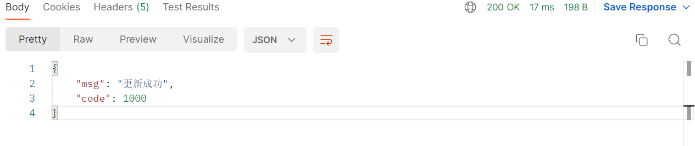
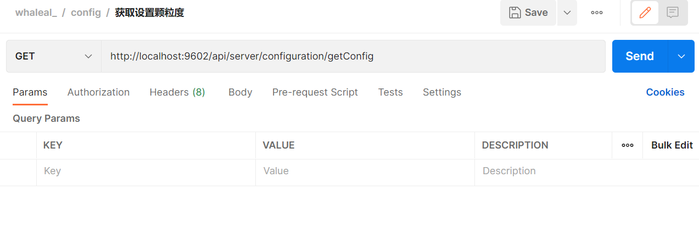

# Configuration Interface

To make API calls, you need to set the `whaleal-Token` in the request header and provide the necessary parameters in the request. The response content will be in JSON format, and special entity classes will be provided in a table at the end. For parameters involving time, use timestamps.

### Default Request Header Format, Special Cases Noted

The `whaleal-Token` is obtained from the login API call and should be included in the request header for subsequent API calls.

[Retrieve whaleal-Token from Login API](Member.md)

| KEY                |     VALUE      |     
| -------------------|----------------------|
| Accept-Encoding        |         gzip,deflate,br |     
| Connection          |         keep-alive           |          
| Content-Type          |         application/json |    
| whaleal-token          |         "token"           |     


### 1. Get SMTP Settings

1.1 Request Path

GET: http://{Server-Host}:{Port}/api/server/configuration/getSmtp

1.2 Request


1.3 Response

|               |     Description    |           Schema              |  
| --------------|----------------------|---------------------------
| code        |   Status code: 1000 for success, other codes for errors |            int           |    
| data       |         Returned data         |           SmtpEntity             |        


### 2. Update SMTP Settings

2.1 Request Path

POST: http://{Server-Host}:{Port}/api/server/configuration/updateSmtp

2.2 Request Parameters:

| Name                |     Located in     |           Description         |     Required    |        Schema   |
| -------------------|----------------------|-------------------------------|-----------------|-----------   |
| smtpEntity          |         Body           |            SMTP entity            |        Yes       | SmtpEntity |

Example SMTP Entity:

```json
{
    "id": "630864e29c477153b441b426",
    "createTime": 0,
    "updateTime": 0,
    "port": "465",
    "host": "smtp.qiye.163.com",
    "from": "notifications@jinmuinfo.com",
    "title": "whaleal",
    "userName": "notifications@jinmuinfo.com",
    "password": "89k235Xwma9caArk",
    "default_encoding": "utf-8",
    "propertiesMailSmtpSSLEnable": true,
    "propertiesMailSmtpSSLRequired": true,
    "propertiesMailSmtpPort": null
}
```

2.3 Response

|               |     Description    |           Schema              |  
| --------------|----------------------|---------------------------
| code        |   Status code: 1000 for success, other codes for errors |            int           |    
| msg       |         Returned message       |           String             |        



### 3. Get Granularity Settings

3.1 Request Path

GET: http://{Server-Host}:{Port}/api/server/configuration/getConfig

3.2 Request



3.3 Response

|               |     Description    |           Schema              |  
| --------------|----------------------|---------------------------
| code        |   Status code: 1000 for success, other codes for errors |            int           |    
| data       |         Returned data      |           ConfigEntity             |        

Example ConfigEntity:

```json
{
    "code": 1000,
    "data": {
        "id": "whaleal",
        "createTime": 0,
        "updateTime": 0,
        "hostAcquisitionFrequency": 2,
        "mongoAcquisitionFrequency": 2,
        "logSaveTime": 3600
    }
}
```

### 4. Update Granularity Settings

4.1 Request Path

POST: http://{Server-Host}:{Port}/api/server/configuration/updateConfig

4.2 Request Parameters:

| Name                |     Located in     |           Description         |     Required    |        Schema   |
| -------------------|----------------------|-------------------------------|-----------------|-----------   |
| configEntity          |         Body           |            Configuration entity            |        Yes       | ConfigEntity        |

Example Configuration Entity:

```json
{
    "hostAcquisitionFrequency": 2,
    "mongoAcquisitionFrequency": 2,
    "logSaveTime": 3600
}
```


4.3 Response

|               |     Description    |           Schema              |  
| --------------|----------------------|---------------------------
| code        |   Status code: 1000 for success, other codes for errors |            int           |    
| msg       |         Returned message       |           String             |        

