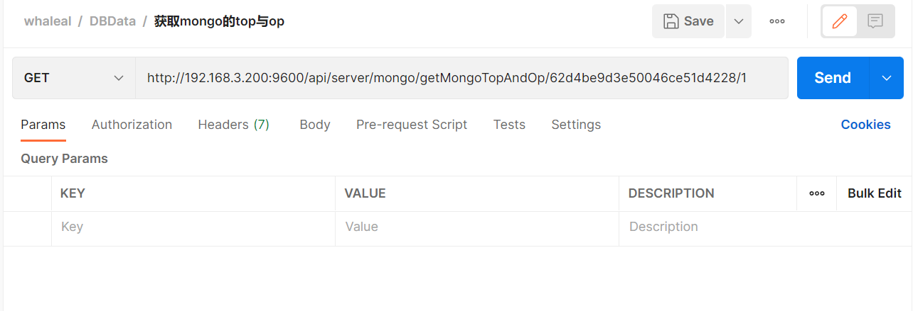
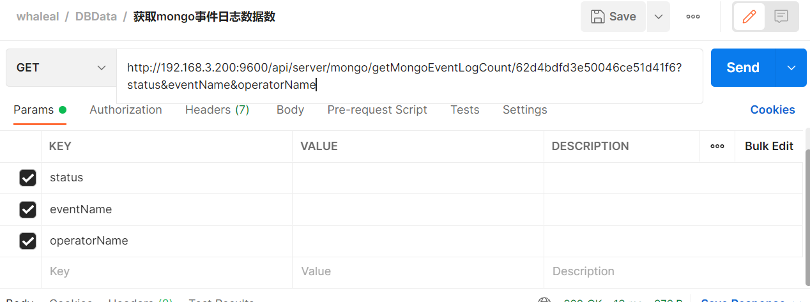
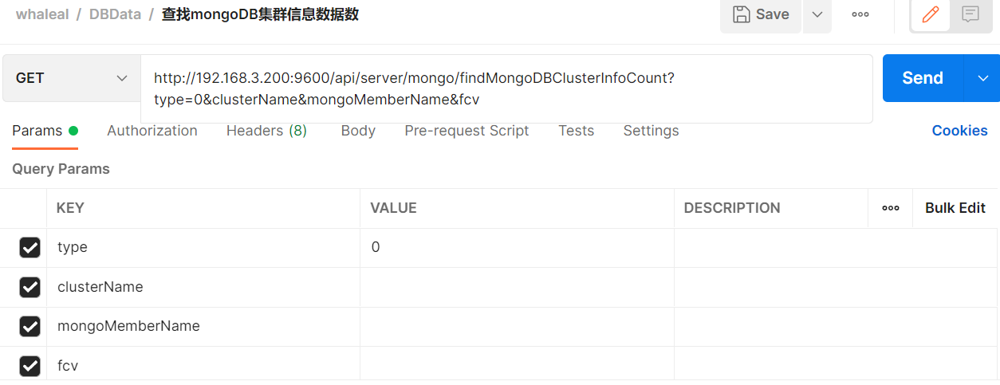
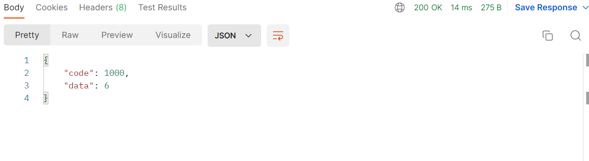
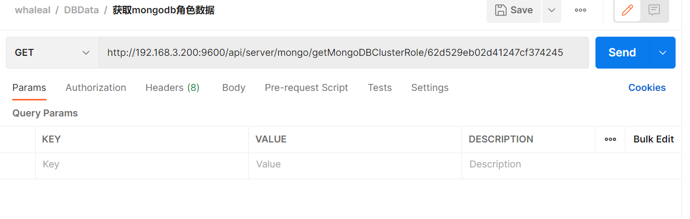
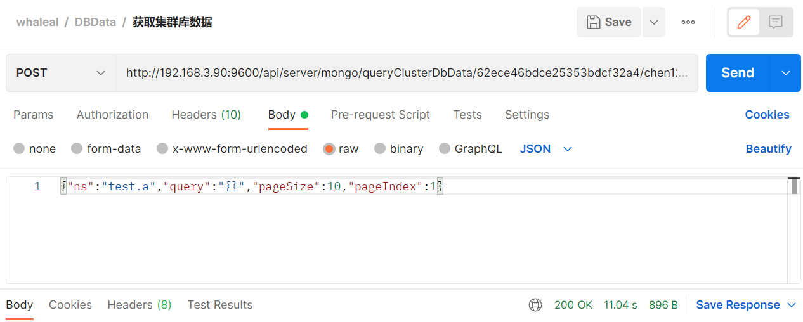
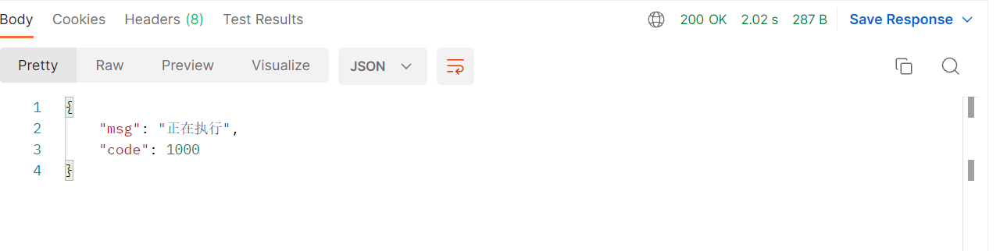
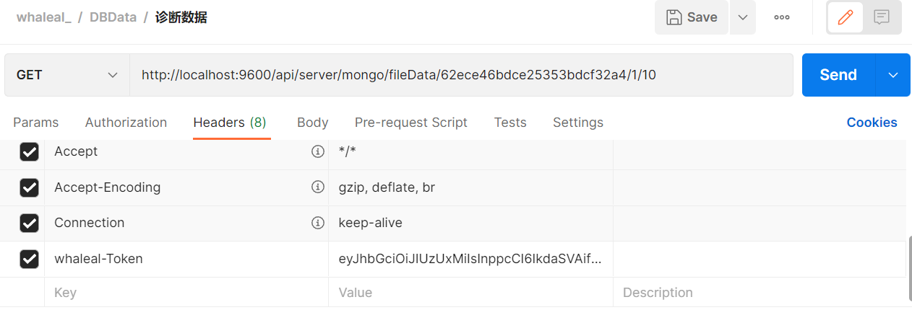
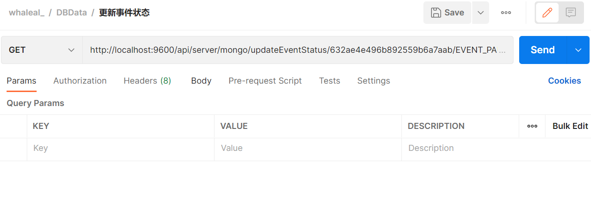
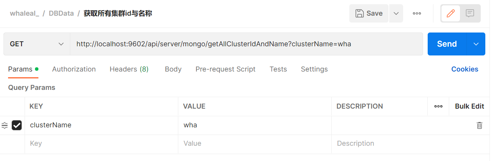

# MongoDBData接口


---

When making API calls, it is necessary to set the `whaleal-Token` in the request header and provide the required parameters to initiate the request. The response content will be in JSON format, and special entity classes for the response will be provided in the entity class table at the end. For parameters related to time, use timestamp format.

For some API calls, you need to use `nodeId`, `mongoMemberId`, `clusterId`, and `eventId`:

- `nodeId` is the same as `mongoMemberId`, found in the `data` collection of the result set returned by the "Retrieve MongoDB Cluster Information Data" API.
- `eventId` can be found in the "Retrieve Cluster Log Information" API for the desired event.
- `clusterId` is present in the result set returned by the "Retrieve MongoDB Cluster Information Data" API.

### Default Request Header Format, Special Cases Require Special Declaration

The `whaleal-Token` is returned when calling the login API. It should be placed in the request header when making subsequent API calls.
[Call the Login API to Obtain whaleal-Token](Member.md)

| KEY                |     VALUE      |
| -------------------|----------------------|
| Accept-Encoding        |         gzip, deflate, br |
| Connection          |         keep-alive           |
| Content-Type          |         application/json |
| whaleal-token          |         "token"           |
---
---


###  1 Retrieve MongoDB Cluster Information

## Deprecated 已弃用

1.1 Request Path


GET: http://{Server-Host}:{Port}/api/server/mongo/monitor/project/data/{{clusterName}}/{{projectType}}

---

1.2 Request Parameters


| Name                |     Located in     |           Description         |     Required    |        Schema   |
| -------------------|----------------------|-------------------------------|-----------------|-----------   |
| clusterName          |         Path           |            Cluster Name            |        Yes       |String
| projectType          |         Path           |            Type            |        Yes       |String


----

<br>


###  2 Retrieve Top Five Cluster Sizes


2.1 Request Path

GET: http://{Server-Host}:{Port}/api/server/mongo/monitor/cluster/size/top/five

---

2.2 Request Parameters


| Name                |     Located in     |           Description         |     Required    |        Schema   |
| -------------------|----------------------|-------------------------------|-----------------|-----------   |
| beginTime          |         Params           |            Start Time            |        Yes       |long
| endTime          |         Params           |            End Time            |        Yes       |long

<br>


----

2.3 Response


|               |     Description    |           Schema              |  
| --------------|----------------------|---------------------------
| code        |   Status Code: 1000 for success, others for errors |             int          |    
| data       |         Response Data         |         List                |        

<br>

[comment]: <> (![img.png]&#40;../../images/whalealPlatformImages/cluster_size_top_five_r.png&#41;)

~~~
{
    "code": 1000,
    "data": [
        {
            "_id": "62d666c50f57845ee4c76090",
            "clusterSize": 0,
            "size": "0.00KB",
            "clusterName": "test_repl"
        },
        {
            "_id": "62d65068561b4a25b8339740",
            "clusterSize": 0,
            "size": "0.00KB",
            "clusterName": "shard"
        }
    ]
}

~~~

---

<br>


###  3 Retrieve Top Five Collection Sizes


3.1 Request Path

GET: http://{Server-Host}:{Port}/api/server/mongo/monitor/collection/size/top/five

---

3.2 Request Parameters


| Name                |     Located in     |           Description         |     Required    |        Schema   |
| -------------------|----------------------|-------------------------------|-----------------|-----------   |
| beginTime          |         Params           |            Start Time            |        Yes       |long
| endTime          |         Params           |            End Time            |        Yes       |long

<br>


----

3.3 Response


|               |     Description    |           Schema              |  
| --------------|----------------------|---------------------------
| code        |   Status Code: 1000 for success, others for errors |         int              |    
| data       |         Response Data         |        List                |        

<br>


[comment]: <> (![img_1.png]&#40;../../images/whalealPlatformImages/collection_size_top_five_r.png&#41;)

~~~
{
    "code": 1000,
    "data": [
        {
            "_id": "62d67d21239d00094230b08f",
            "clusterId": "62d67d21239d00094230b08f",
            "createTime": 1658394516783,
            "dbTables": {
                "name": "fs.chunks",
                "type": "collection",
                "options": {},
                "info": {
                    "readOnly": false,
                    "uuid": {
                        "type": 4,
                        "data": "8MfjmDBFR5q9BYztGFDJQQ=="
                    }
                },
                "idIndex": {
                    "v": 2,
                    "key": {
                        "_id": 1
                    },
                    "name": "_id_",
                    "ns": "test.testColl"
                },
                "storageSize": 20,
                "size": 0,
                "ns": "test.testColl"
            },
            "fromServerExe": false,
            "updateTime": 0,
            "clusterName": "shard",
            "dbName": "test",
            "collectionName": "testColl",
            "size": "0.00KB"
        }
    ]
}
~~~

---

<br>


###  4 Retrieve Top Five QPS


4.1 Request Path

GET: http://{Server-Host}:{Port}/api/server/mongo/monitor/QPS/size/top/five

---

4.2 Request Parameters


| Name                |     Located in     |           Description         |     Required    |        Schema   |
| -------------------|----------------------|-------------------------------|-----------------|-----------   |
| beginTime          |         Params           |            Start Time            |        Yes       |long
| endTime          |         Params           |            End Time            |        Yes       |long


<br>


----

4.3 Response


|               |     Description    |           Schema              |  
| --------------|----------------------|---------------------------
| code        |   Status Code: 1000 for success, others for errors |            int           |    
| data       |         Response Data         |          List              |        


<br>

[comment]: <> (![img_2.png]&#40;../../images/whalealPlatformImages/QPS_size_top_five_r.png&#41;)

~~~
{
    "code": 1000,
    "data": [
        {
            "_id": {
                "hostId": "62cbbd7607bebb71b8429e5e",
                "port": "47018"
            },
            "host": "server200",
            "port": "47018",
            "QPS": 5520,
            "instance": "server200:47018"
        }
    ]
}
~~~

---

<br>


###  5 Retrieve Top Five Connection Instances


5.1 Request Path

GET: http://{Server-Host}:{Port}/api/server/mongo/monitor/connection/instance/top/five

---

5.2 Request Parameters


| Name                |     Located in     |           Description         |     Required    |        Schema   |
| -------------------|----------------------|-------------------------------|-----------------|-----------   |
| beginTime          |         Params           |            Start Time            |        Yes       |long
| endTime          |         Params           |            End Time            |        Yes       |long

<br>


----

5.3 Response


|               |     Description    |           Schema              |  
| --------------|----------------------|---------------------------
| code        |   Status Code: 1000 for success, others for errors |      int                 |    
| data       |         Response Data         |        List                |        

<br>

[comment]: <> (![img_3.png]&#40;../../images/whalealPlatformImages/connection_size_top_five_r.png&#41;)

~~~
{
    "code": 1000,
    "data": [
        {
            "_id": {
                "hostId": "62cbbd7607bebb71b8429e5e",
                "port": "47018"
            },
            "host": "server200",
            "port": "47018",
            "Conn": 76,
            "instance": "server200:47018"
        }
    ]
}
~~~

---

<br>


###  6 Retrieve Top Five Slow Queries


6.1 Request Path

GET: http://{Server-Host}:{Port}/api/server/mongo/monitor/slowest/instance/top/five

---

6.2 Request Parameters


| Name                |     Located in     |           Description         |     Required    |        Schema   |
| -------------------|----------------------|-------------------------------|-----------------|-----------   |
| beginTime          |         Params           |            Start Time            |        Yes       |long
| endTime          |         Params           |            End Time            |        Yes       |long

<br>


----

6.3 Response


|               |     Description    |           Schema              |  
| --------------|----------------------|---------------------------
| code        |   Status Code: 1000 for success, others for errors |          int             |    
| data       |         Response Data         |           List             |        

<br>

[comment]: <> (![img_4.png]&#40;../../images/whalealPlatformImages/slowest_size_top_five_r.png&#41;)

~~~
{
    "code": 1000,
    "data": [
        {
            "_id": "62d66d3cc5b6206027b993b0",
            "slow count": 8,
            "instance": "server200:47018"
        }
    ]
}
~~~

---

<br>


###  7 Retrieve Node Real-time Monitoring Information


7.1 Request Path

GET: http://{Server-Host}:{Port}/api/server/mongo/monitor/data/{{nodeId}}/{{timeType}}

---

7.2 Request Parameters

    timeType: REAL_TIME, ONE_DAY, ONE_WEEK
    dataType: qps, conn, pageFaults, memory, net, anAssert, cacheFlow, cacheUsage, latency, tickets, targetQ, scanAndOrder, collectionScan, documentOp, lockCondition, databaseLock, collectionLock, transactionCondition, deletedDocument

| Name                |     Located in     |           Description         |     Required    |        Schema   |
| -------------------|----------------------|-------------------------------|-----------------|-----------   |
| nodeId          |         Path           |            Node ID            |        Yes       |String
| timeType          |         Path           |            Query Time Type            |        Yes       |String
| timeGranularity          |         Params           |            Time Granularity            |        No       |long
| startTimeForTimeInterval          |         Params           |            Start Time Interval            |        No       |long
| endTimeForTimeInterval          |         Params           |            End Time Interval            |        No       |long
| dataType          |         Params           |            Data Type            |        Yes       |long

<br>


----

7.3 Response


|               |     Description    |           Schema              |  
| --------------|----------------------|---------------------------
| code        |   Status Code: 1000 for success, others for errors |            int           |    
| data       |         Response Data         |            List            |        


<br>


[comment]: <> (![img_5.png]&#40;../../images/whalealPlatformImages/monitor_data_r.png&#41;)

~~~
 {
    "code": 1000,
    "data": {
        "delete": [
            0.0,
            0.0,
            0.0
        ],
        "insert": [
            8.0,
            15.0,
            2.0
        ],
        "query": [
            0.0,
            0.0,
            0.0
        ],
        "cmd": [
            6.0,
            5.0,
            3.0
        ],
        "getMore": [
            1.0,
            2.0,
            2.0
        ],
        "update": [
            0.0,
            0.0,
            0.0
        ]
    },
    "createTime": [
        1659511920000,
        1659511980000,
        1659512040000
    ],
    "name": "qps",
    "message": {
        "insert": "The average rate of inserts performed per second over the selected sample period",
        "delete": "The average rate of deletes performed per second over the selected sample period",
        "update": "The average rate of updates performed per second over the selected sample period",
        "query": "The average rate of queries performed per second over the selected sample period",
        "command": "The average rate of commands performed per second over the selected sample period",
        "getMore": "The average rate of getMores performed per second on any cursor over the selected sample period. On a primary, this number can be high even if the query count is low as the secondaries \"getMore\" from the primary often as part of replication."
    },
    "info": {
        "delete": {
            "max": 10,
            "min": 0,
            "avg": "0.35"
        },
        "insert": {
            "max": 32,
            "min": 0,
            "avg": "8.75"
        },
        "query": {
            "max": 0,
            "min": 0,
            "avg": "0.01"
        },
        "cmd": {
            "max": 10,
            "min": 1,
            "avg": "4.42"
        },
        "getMore": {
            "max": 2,
            "min": 0,
            "avg": "0.93"
        },
        "update": {
            "max": 0,
            "min": 0,
            "avg": "0.05"
        }
    }
}
~~~

---

<br>


---

### 8 Query Cluster Information by ID

8.1 Request Path

GET: http://{Server-Host}:{Port}/api/server/mongo/getMongoCluster/{{clusterId}}

---

8.2 Request Parameters


| Name                |     Located in     |           Description         |     Required    |        Schema   |
| -------------------|----------------------|-------------------------------|-----------------|-----------   |
| clusterId          |         Path           |            Cluster ID         |        Yes       |String

<br>


----

8.3 Response

|               |     Description    |           Schema              |  
| --------------|----------------------|---------------------------
| code        |   Status: 1000 for success, other values for exceptions |           int            |    
| data       |         Response Data         |          JSON              |        

~~~
{
    "code": 1000,
    "data": {
        "id": "62d67d21239d00094230b08f",
        "createTime": 1658223967052,
        "updateTime": 1658223967052,
        "clusterName": "test",
        "type": 2,
        "mongoMember": null,
        "mongoReplica": {
            "id": "62d67d21239d00094230b08f",
            "createTime": 0,
            "updateTime": 0,
            "replicaName": "test",
            "memberList": [
              // Node information
              ...
            ],
            "type": 1,     //1: Single node, 2: Replica set, 3: Sharded
            "clusterId": "62d67d21239d00094230b08f",
            "deleteDataAndLogAble": false,
            "status": "Running",
            "operaLog": [],
            "replicationSettings": {},
            "replicationOtherSettings": {
                "securityKeyFileValue":
            },
            "authAble": true,
            "userName": "root",
            "password": "123456",
            "authDbName": "admin",
            "protocolVersion": 1,
            "writeConcernMajorityJournalDefault": false
        },
        "mongoShard": null,
        "status": "Normal",
        "fcv": "4.2",
        "tag": "ys",
        "create": true
    }
}
~~~

---

### 9 Get Cluster Log Information

9.1 Request Path

GET: http://{Server-Host}:{Port}/api/server/mongo/getMongoClusterLogData/{{clusterId}}/{{pageIndex}}/{{pageSize}}

---

9.2 Request Parameters

| Name                |     Located in     |           Description         |     Required    |        Schema   |
| -------------------|----------------------|-------------------------------|-----------------|-----------   |
| clusterId          |         Path           |            Cluster ID         |        Yes       |String
| pageIndex          |         Path           |            Page Index         |        Yes       |int
| pageSize          |         Path           |            Page Size          |        Yes       |String
| memberName          |         Params           |            Node Name          |        Yes       |String
| logContent          |         Params           |            Log Content          |        Yes       |String
| startTime         |         Params           |            Start Time          |        No       |long
| endTime         |         Params           |            End Time          |        No       |long

<br>


----

9.3 Response

|               |     Description    |           Schema              |  
| --------------|----------------------|---------------------------
| code        |   Status: 1000 for success, other values for exceptions |           int            |    
| data       |         Response Data         |             List           |        

~~~
{
    "code": 1000,
    "data": [
        {
            "id": "62d4f0363e50046ce51d44f3",
            "createTime": 1658122294338,
            "updateTime": 1658122294338,
            "memberName": "cluster",
            "clusterId": "62d4bdfd3e50046ce51d41f6",
            "eventId": null,
            "logInfoList": [
                {
                    "createTime": 1658122294338,
                    "log": "rz Cluster operation [updateMongoMemberInfo] successful"
                }
            ]
        }
    ]
}
~~~

---

### 10 Get Mongo Cluster Log Count

10.1 Request Path

GET: http://{Server-Host}:{Port}/api/server/mongo/getMongoClusterLogCount/{{clusterId}}

---

10.2 Request Parameters

| Name                |     Located in     |           Description         |     Required    |        Schema   |
| -------------------|----------------------|-------------------------------|-----------------|-----------   |
| clusterId          |         Path           |            Cluster ID         |        Yes       |String
| memberName          |         Params           |            Node Name          |        Yes       |String
| logContent          |         Params           |            Log Content          |        Yes       |String
| startTime          |         Params           |            Start Time          |        No       |long
| endTime          |         Params           |            End Time          |        No       |long

<br>


----

10.3 Response

|               |     Description    |           Schema              |  
| --------------|----------------------|---------------------------
| code        |   Status: 1000 for success, other values for exceptions |           int|    
| data       |         Response Count         |           long             |        


---

### 11 Query MongoD Log Information

11.1 Request Path

GET: http://{Server-Host}:{Port}/api/server/mongo/getMongoDLogData/{{mongoMemberId}}/{{pageIndex}}/{{pageSize}}

---

11.2 Request Parameters

Type: If empty, query all. Possible values: SHARDING, STORAGE, RECOVERY, CONTROL

| Name                |     Located in     |           Description         |     Required    |        Schema   |
| -------------------|----------------------|-------------------------------|-----------------|-----------   |
| mongoMemberId          |         Path           |            Mongo node ID            |        Yes       |String
| pageIndex          |         Path           |            Page Index            |        Yes       |int
| pageSize          |         Path           |            Page Size            |        Yes       |int
| type          |         Params           |            Type            |        No       |String
| startTime          |         Params           |            Start Time            |        No       |long
| endTime          |         Params           |            End Time            |        No       |long
| content          |         Params           |            Content            |        No       |String

<br>


----

11.3 Response

|               |     Description    |           Schema              |  
| --------------|----------------------|---------------------------
| code        |   Status: 1000 for success, other values for exceptions |         int              |    
| data       |         Response Data         |          MongoMember              |        

~~~
{
    "code": 1000,
    "data": [
        {
            "id": "62d5037fbb551e67507f9a32",
            "createTime": 0,
            "updateTime": 0,
            "log": {
                "t": "2022-07-18T06:53:49.151+00:00",
                "s": "I",
                "c": "NETWORK",
                "id": "[conn3161]",
                "msg": "end connection 192.168.3.80:58778 (5 connections now open)"
            },
            "nodeId": "62d4be9d3e50046ce51d4228",
            "fileOffset": 0
        }
    ]
}
~~~

---

### 12 Query MongoD Log Count

12.1 Request Path

GET: http://{Server-Host}:{Port}/api/server/mongo/getMongoDLogCount/{{mongoMemberId}}

---

12.2 Request Parameters

Type: If empty, query all. Possible values: STORAGE, RECOVERY, CONTROL

| Name                |     Located in     |           Description         |     Required    |        Schema   |
| -------------------|----------------------|-------------------------------|-----------------|-----------   |
| mongoMemberId          |         Path           |            Mongo node ID            |        Yes       |String
| type          |         Params           |            Type            |        Yes       |String
| startTime          |         Params           |            Start Time            |        Yes       |String
| endTime          |         Params           |            End Time            |        No       |String
| content          |         Params           |            Search Content            |        No       |String

<br>


---

12.3 Response

|               |     Description    |           Schema              |  
| --------------|----------------------|---------------------------
| code        |   Status: 1000 for success, other values for exceptions |        int               |    
| data       |         Response Count         |          long              |        


---

### 13 Get Mongo Top and Op

13.1 Request Path

GET: http://{Server-Host}:{Port}/api/server/mongo/getMongoTopAndOp/{{mongoMemberId}}/{{type}}

---

13.2 Request Parameters

Type: 1 for top, 2 for op

| Name                |     Located in     |           Description         |     Required    |        Schema   |
| -------------------|----------------------|-------------------------------|-----------------|-----------   |
| mongoMemberId          |         Path           |            Mongo node ID            |        Yes       |String
| type          |         Path           |            Type            |        Yes       |int

<br>



---

13.3 Response

|               |     Description    |           Schema              |  
| --------------|----------------------|---------------------------
| code        |   Status: 1000 for success, other values for exceptions |        int|    
| data       |         Response Data         |           List             |        


---

### 14 Update Cluster Name

14.1 Request Path

GET: http://{Server-Host}:{Port}/api/server/mongo/updateClusterName/{{clusterId}}/{{newClusterName}}

---

14.2 Request Parameters

| Name                |     Located in     |           Description         |     Required    |        Schema   |
| -------------------|----------------------|-------------------------------|-----------------|-----------   |
| clusterId          |         Path           |            Cluster ID            |        Yes       |String
| newClusterName          |         Path           |            New Name           |        Yes       |String

<br>


---

14.3 Response

|               |     Description    |           Schema              |  
| --------------|----------------------|---------------------------
| code        |   Status: 1000 for success, other values for exceptions |        int               |    
| msg       |         Response Message         |            String            |        


---

### 15 Get Mongo Statistics

15.1 Request Path

GET: http://{Server-Host}:{Port}/api/server/mongo/getMongoStatistics

---

15.2 Request


---

15.3 Response

|               |     Description    |           Schema              |  
| --------------|----------------------|---------------------------
| code        |   Status: 1000 for success, other values for exceptions |         int              |    
| data       |         Response Data         |          JSON              |      


---

### 16 Query Mongo Event by Event ID

16.1 Request Path

Get: http://{Server-Host}:{Port}/api/server/mongo/findMongoEventLogByEventId/{{eventId}}

---

16.2 Request Parameters

| Name                |     Located in     |           Description         |     Required    |        Schema   |
| -------------------|----------------------|-------------------------------|-----------------|-----------   |
| eventId          |         Path           |            Event ID            |        Yes       |String

<br>


---

16.3 Response

|               |     Description    |           Schema              |  
| --------------|----------------------|---------------------------
| code        |   Status: 1000 for success, other values for exceptions |         int              |    
| data       |         Response Data         |          List              |       

~~~
{
    "code": 1000,
    "data": [
        {
            "createTime": 1658131316409,
            "log": "chen:45463 Operation [openQPS] successful"
        },
        {
            "createTime": 1658131317418,
            "log": "Event group ended"
        }
    ]
}
~~~

---

### 17 Get Mongo Event Log Data

17.1 Request Path

GET: http://{Server-Host}:{Port}/api/server/mongo/getMongoEventLogData/{{clusterId}}/{{pageIndex}}/{{pageSize}}

---

17.2 Request Parameters

Status: 'Initialized', 'Running', 'Paused', 'Ended', 'Exception Ended', 'Aborted'

| Name                |     Located in     |           Description         |

     Required    |        Schema   |
| -------------------|----------------------|-------------------------------|-----------------|-----------   |
| clusterId          |         Path           |            Cluster ID            |        Yes       |String
| pageSize          |         Path           |           Page Size            |        Yes       |int
| pageIndex          |         Path           |          Page Index             |        Yes       |int
| status          |         Params           |          Status            |        No       |String
| eventName          |         Params           |       Event Name                |        No       |String
| operatorName          |         Params           |       Operator                |        No       |String

<br>


---

17.3 Response

|               |     Description    |           Schema              |  
| --------------|----------------------|---------------------------
| code        |   Status: 1000 for success, other values for exceptions |        int               |    
| data       |         Response Data         |      List                  |      


~~~
{
    "code": 1000,
    "data": [
        {
            "id": "62d5281602d41247cf3741d0",
            "createTime": 1658136598663,
            "updateTime": 1658136704891,
            "clusterId": "62d4bdfd3e50046ce51d41f6",
            "eventName": "Cluster operation: delete",
            "operatorId": "62b2d434e0869c777c439867",
            "operatorName": "lhp1234",
            "status": "Ended",
            "logList": null
        }
    ]
}
~~~

---

### 18 Get Mongo Event Log Count

18.1 Request Path

GET: http://{Server-Host}:{Port}/api/server/mongo/getMongoEventLogCount/{{clusterId}}

---

18.2 Request Parameters

Status: 'Initialized', 'Running', 'Paused', 'Ended', 'Exception Ended', 'Aborted'

| Name                |     Located in     |           Description         |     Required    |        Schema   |
| -------------------|----------------------|-------------------------------|-----------------|-----------   |
| clusterId          |         Path           |            Cluster ID            |        Yes       |String
| eventName          |         Params           |          Event Name             |        No       |String
| status          |         Params           |         Status             |        No       |String
| operatorName          |         params           |       Operator                 |        No       |String

<br>



---

18.3 Response

|               |     Description    |           Schema              |  
| --------------|----------------------|---------------------------
| code        |   Status: 1000 for success, other values for exceptions |        int              |    
| data       |         Response Count         |           long             |        


---


---

### 19 Retrieve MongoDB Cluster Information Data


**19.1 Request Path**

GET: http://{Server-Host}:{Port}/api/server/mongo/findMongoDBClusterInfoData/{{pageIndex}}/{{pageSize}}

---

**19.2 Request Parameters**

type: 1 for single node, 2 for replica set, 3 for sharded

| Name           | Located in | Description       | Required | Schema |
| -------------- | ---------- | ----------------- | -------- | ------ |
| pageIndex      | Path       | Page index        | Yes      | int    |
| pageSize       | Path       | Page size         | Yes      | int    |
| type           | Params     | Cluster type      | No       | int    |
| clusterName    | Params     | Cluster name      | No       | String |
| mongoMemberName| Params     | Mongo member name | No       | String |
| fcv            | Params     | FCV               | No       | String |


---

**19.3 Response**

| Name | Description                 | Schema |
| ---- | --------------------------- | ------ |
| code | Status: 1000 for success    | int    |
| data | Returned data               | List   |

```
{
    "code": 1000,
    "data": [
        {
            "id": "62fa2017fe07726988b761fa",
            "createTime": 1660559406829,
            ...
            "configurationOptions": {
                ...
                "net_bindIp": "0.0.0.0",
                "net_port": "36398"
            },
            "operateVersion": 3916
        },
        ...
    ]
}
```

---

### 20 Retrieve MongoDB Cluster Information Data Count


**20.1 Request Path**

GET: http://{Server-Host}:{Port}/api/server/mongo/findMongoDBClusterInfoCount

---

**20.2 Request Parameters**

type: 1 for single node, 2 for replica set, 3 for sharded

| Name           | Located in | Description       | Required | Schema |
| -------------- | ---------- | ----------------- | -------- | ------ |
| fcv            | Params     | FCV               | Yes      | String |
| clusterName    | Params     | Cluster name      | No       | String |
| type           | Params     | Cluster type      | No       | int    |
| mongoMemberName| Params     | Mongo member name | No       | String |



---

**20.3 Response**

| Name | Description                 | Schema |
| ---- | --------------------------- | ------ |
| code | Status: 1000 for success    | int    |
| data | Returned count              | long   |



---

### 21 Get MongoDB Collections


**21.1 Request Path**

GET: http://{Server-Host}:{Port}/api/server/mongo/getMongoDBCollections/{{clusterId}}/{{eventId}}

---

**21.2 Request Parameters**

| Name      | Located in | Description | Required | Schema |
| --------- | ---------- | ----------- | -------- | ------ |
| clusterId | Path       | Cluster ID  | Yes      | String |
| eventId   | Path       | Event ID    | Yes      | String |


---

**21.3 Response**

| Name | Description        | Schema |
| ---- | ------------------ | ------ |
| code | Status: 1000       | int    |
| data | Returned data list | List   |

```
{
    "code": 1000,
    "data": [
        {
            "name": "coll",
            "type": "collection",
            "options": {},
            ...
            "size": 335,
            "ns": "cc.coll"
        },
        ...
    ]
}
```

---

### 22 Get MongoDB Cluster Users


**22.1 Request Path**

GET: http://{Server-Host}:{Port}/api/server/mongo/getMongoDBClusterUser/{{clusterId}}

---

**22.2 Request Parameters**

| Name      | Located in | Description | Required | Schema |
| --------- | ---------- | ----------- | -------- | ------ |
| clusterId | Path       | Cluster ID  | Yes      | String |


---

**22.3 Response**

| Name | Description        | Schema |
| ---- | ------------------ | ------ |
| code | Status: 1000       | int    |
| data | Returned data list | List   |

```
{
    "code": 1000,
    "data": [
        {
            "_id": "admin.16581342589211",
            "userId": {
                "type": 4,
                "data": "LMMiWU2KT5GVoDCbkt3B4g=="
            },
            ...
            "roles": [
                {
                    "role": "root",
                    "db": "admin"
                }
            ]
        },
        ...
    ]
}
```

---

### 23 Get MongoDB Cluster Roles


**23.1 Request Path**

GET: http://{Server-Host}:{Port}/api/server/mongo/getMongoDBClusterRole/{{clusterId}}

---

**23.2 Request Parameters**

| Name      | Located in | Description | Required | Schema |
| --------- | ---------- | ----------- | -------- | ------ |
| clusterId | Path       | Cluster ID  | Yes      | String |



---

**23.3 Response**

| Name | Description        | Schema |
| ---- | ------------------ | ------ |
| code | Status: 1000       | int    |
| data | Returned data list | List   |

```
{
    "code": 1000,
    "data": [
        {
            "role": "__queryableBackup",
            "db": "admin",
            ...
            "privileges": [
                {
                    "resource": {
                        "db": "config",
                        "collection": "settings"
                    },
                    "actions": [
                        "find"
                    ]
                }
            ]
        },
        ...
    ]
}
```

---

### 24 Execute an Explain Plan


**24.1 Request Path**

POST: http://{Server-Host}:{Port}/api/server/mongo/exeExplainPlan/{{clusterId}}/{{mongoMemberId}}

---

**24.2 Request Parameters**

| Name         | Located in | Description  | Required | Schema |
| ------------ | ---------- | ------------ | -------- | ------ |
| clusterId    | Path       | Cluster ID   | Yes      | String |
| mongoMemberId| Path       | Mongo member ID | Yes   | String |
| document     | Body       | Request data | Yes      | Map    |


---

**24.3 Response**

| Name | Description        | Schema

|
| ---- | ------------------ | ------ |
| code | Status: 1000       | int    |
| data | Returned data      | JSON   |


```
{
    "code": 1000,
    "data": {
        "explain": {
            ...
            "executionStats": {
                ...
                "executionStages": {
                    ...
                    "isEOF": 1
                },
                "allPlansExecution": []
            },
            ...
        },
        ...
    }
}
```


---

### 25 Get All MongoDB Configuration Parameters


**25.1 Request Path**

GET: http://{Server-Host}:{Port}/api/server/mongo/getMongoDBProcessArgument

---

**25.2 Request**

No specific request details provided.

---

**25.3 Response**

| Name | Description                 | Schema |
| ---- | --------------------------- | ------ |
| code | Status: 1000 for success    | int    |
| data | Returned data list          | List   |

```
{
    "code": 1000,
    "data": [
        {
            "id": "62faf2bcd0810e3aeace6dae",
            "createTime": 0,
            "updateTime": 0,
            "maxVersion": null,
            "minVersion": null,
            "name": "SYSTEM_LOG_VERBOSITY",
            "options": [
                {
                    "label": "1 (v)",
                    "value": "1"
                },
                ...
            ],
            "path": "systemLog.verbosity",
            "processTypes": "ALL",
            "shortName": "verbosity",
            "type": "INTEGER",
            "credential": false
        },
        ...
    ]
}
```

---

### 26 Get MongoDB Collections


**26.1 Request Path**

GET: http://{Server-Host}:{Port}/api/server/mongo/getMongoDBCollections/{{clusterId}}/{{eventId}}

---

**26.2 Request Parameters**

| Name      | Located in | Description | Required | Schema |
| --------- | ---------- | ----------- | -------- | ------ |
| clusterId | Path       | Cluster ID  | Yes      | String |
| eventId   | Path       | Event ID    | Yes      | String |


---

**26.3 Response**

| Name | Description        | Schema |
| ---- | ------------------ | ------ |
| code | Status: 1000       | int    |
| data | Returned data list | List   |

```
{
    "code": 1000,
    "data": [
        {
            "name": "test",
            "sub": [
                {
                    "name": "a",
                    "type": "collection",
                    ...
                    "ns": "test.a"
                }
            ]
        },
        ...
    ]
}
```

---

### 27 Query Cluster Database Data


**27.1 Request Path**

POST: http://{Server-Host}:{Port}/api/server/mongo/queryClusterDbData/{{clusterId}}/{{eventId}}

---

**27.2 Request Parameters**

| Name      | Located in | Description   | Required | Schema |
| --------- | ---------- | ------------- | -------- | ------ |
| clusterId | Path       | Cluster ID    | Yes      | String |
| eventId   | Path       | Event ID      | Yes      | String |
| map       | Body       | Query criteria| Yes      | Map    |

Example of the query criteria:

```json
{
    "ns": "test.a",
    "query": "{}",
    "pageSize": 10,
    "pageIndex": 1
}
```



---

**27.3 Response**

| Name | Description        | Schema |
| ---- | ------------------ | ------ |
| code | Status: 1000       | int    |
| data | Returned data list | List   |

```
{
    "code": 1000,
    "data": [
        {
            "_id": {
                "date": 1659684764000,
                "timestamp": 1659684764
            },
            "a": 1.0
        },
        ...
    ]
}
```

---

### 28 Create Index


**28.1 Request Path**

POST: http://{Server-Host}:{Port}/api/server/mongo/createIndex/{{clusterId}}/{{eventId}}

---

**28.2 Request Parameters**

| Name      | Located in | Description | Required | Schema |
| --------- | ---------- | ----------- | -------- | ------ |
| clusterId | Path       | Cluster ID  | Yes      | String |
| eventId   | Path       | Event ID    | Yes      | String |
| map       | Body       | Index config| Yes      | Map    |

Example of index configuration:

```json
{
    "indexName": "chen",
    "ns": "test.coll",
    "index": "{a:1}",
    "buildIndexInTheBackground": false,
    ...
}
```


---

**28.3 Response**

| Name | Description        | Schema |
| ---- | ------------------ | ------ |
| code | Status: 1000       | int    |
| msg  | Returned message   | String |



---

### 29 Diagnostic Data


**29.1 Request Path**

GET: http://{Server-Host}:{Port}/api/server/mongo/mdiagData/{{clusterId}}/{{pageIndex}}/{{pageSize}}

---

**29.2 Request Parameters**

| Name      | Located in | Description | Required | Schema |
| --------- | ---------- | ----------- | -------- | ------ |
| clusterId | Path       | Cluster ID  | Yes      | String |
| pageIndex | Path       | Page index  | Yes      | int    |
| pageSize  | Path       | Page size   | Yes      | int    |



---

**29.3 Response**

| Name | Description        | Schema |
| ---- | ------------------ | ------ |
| code | Status: 1000       | int    |
| data | Returned data list | List   |

```
{
    "code": 1000,
    "data": [
        {
            "_id": "62ecf7a2a3a6e138ea1f00b0",
            "filename": "mdiag_server100_1659696513419.gz",
            ...
            "id": "62ecf7a2a3a6e138ea1f00b0"
        },
        ...
    ]
}
```

---

### 30 Get Diagnostic Count


**30.1 Request Path**

GET: http://{Server-Host}:{Port}/api/server/mongo/mdiagCount/{{clusterId}}

---

**30.2 Request Parameters**

| Name      | Located in | Description | Required | Schema |
| --------- | ---------- | ----------- | -------- | ------ |
| clusterId | Path       | Cluster ID  | Yes      | String |


---

**30.3 Response**

| Name | Description        | Schema |
| ---- | ------------------ | ------ |
| code | Status: 1000       | int    |
| data | Returned count     | long   |


---

### 31 Update Event Status


**31.1 Request Path**

GET: http://{Server-Host}:{Port}/api/server/mongo/updateEventStatus/{{eventId}}/{{status}}

---

**31

.2 Request Parameters**

| Name      | Located in | Description | Required | Schema |
| --------- | ---------- | ----------- | -------- | ------ |
| eventId   | Path       | Event ID    | Yes      | String |
| status    | Path       | Status      | Yes      | String |



---

**31.3 Response**

| Name | Description        | Schema |
| ---- | ------------------ | ------ |
| code | Status: 1000       | int    |
| msg  | Returned message   | String |


---

### 32 Get Mdiag Log


**32.1 Request Path**

GET: http://{Server-Host}:{Port}/api/server/mongo/getMdiagLog/{{clusterId}}/{{eventId}}

---

**32.2 Request Parameters**

| Name      | Located in | Description | Required | Schema |
| --------- | ---------- | ----------- | -------- | ------ |
| eventId   | Path       | Event ID    | Yes      | String |
| clusterId | Path       | Cluster ID  | Yes      | String |


---

**32.3 Response**

| Name | Description        | Schema |
| ---- | ------------------ | ------ |
| code | Status: 1000       | int    |
| data | Returned data list | List   |

---

### 33 Get All Cluster IDs and Names


**33.1 Request Path**

GET: http://{Server-Host}:{Port}/api/server/mongo/getAllClusterIdAndName

---

**33.2 Request Parameters**

| Name        | Located in | Description | Required | Schema |
| ----------- | ---------- | ----------- | -------- | ------ |
| clusterName | Params     | Cluster name| No       | String |



---

**33.3 Response**

| Name | Description        | Schema |
| ---- | ------------------ | ------ |
| code | Status: 1000       | int    |
| data | Returned data list | List   |


---


--- 
---

<br>

[comment]: <> (31更改事件状态)

[comment]: <> (GET: http://localhost:9602/api/server/mongo/updateEventStatus/{{eventId}}/{{status}})

[comment]: <> (## MongoMember)


[comment]: <> (|       Name         |     Type             |    Description      |   )

[comment]: <> (| ------------       |----------            |---------------------|)

[comment]: <> (| memberName                 |   String             |         主机名:端口          |   )

[comment]: <> (| hostName             |   String             |         主机名     |   )

[comment]: <> (| hostId              |   Long |         主机id     |   )

[comment]: <> (| port               |   String             |         端口     |   )

[comment]: <> (| version         |   String             |         版本     |   )

[comment]: <> (| upgradeVersion           |   String             |         升降级版本     |   )

[comment]: <> (| password           |   String             |         节点密码     |   )

[comment]: <> (| authDbName           |   String             |         认证库     |   )

[comment]: <> (| currentTimeMillis           |   long             |         当前时间戳     |   )

[comment]: <> (| dataDirectory           |   String             |         数据目录     |   )

[comment]: <> (| userName             |   String             |         节点用户名     |   )

[comment]: <> (| logFile             |   String             |         日志文件     |   )

[comment]: <> (| confPath             |   String             |         配置文件路径     |   )

[comment]: <> (| deleteDataAndLogAble             |   String             |         是否强制删除     |   )

[comment]: <> (| authAble             |   String             |         是否开启认证     |   )

[comment]: <> (| runShCmd             |   String             |         执行启动命令     |   )

[comment]: <> (| type             |   enum             |         节点类型     |   )

[comment]: <> (注 type:11 单例)

[comment]: <> (*)

[comment]: <> (* <p> 普通复制集)

[comment]: <> (* 31 普通成员节点)

[comment]: <> (* 32 隐藏节点)

[comment]: <> (* 33 仲裁节点)

[comment]: <> (* 34 隐藏延迟节点)

[comment]: <> (* 35 主节点)

[comment]: <> (* <p> config复制集)

[comment]: <> (* 41 config普通成员节点)

[comment]: <> (* 42 config隐藏节点)

[comment]: <> (* 43 config仲裁节点)

[comment]: <> (* 44 config隐藏延迟节点)

[comment]: <> (* 45 config主节点)

[comment]: <> (* <p> shard复制集)

[comment]: <> (* 51 shard普通成员节点)

[comment]: <> (* 52 shard隐藏节点)

[comment]: <> (* 53 shard仲裁节点)

[comment]: <> (* 54 shard隐藏延迟节点)

[comment]: <> (* 55 shard主节点)

[comment]: <> (* <p> mongoS)

[comment]: <> (* 61 mongoS)

[comment]: <> (---)

[comment]: <> (---)