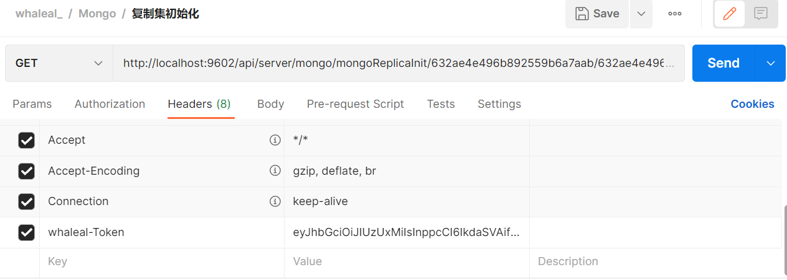
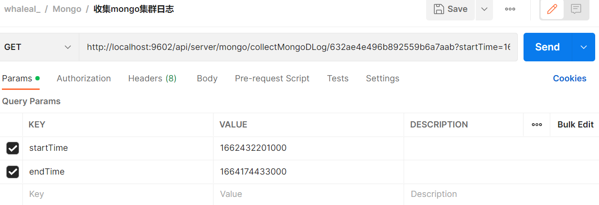

# MongoOperate接口

Certainly, here's the translated version of the information you provided, while keeping the format and not modifying file paths:

```
API calls require setting the 'whaleal-Token' in the request header. Fill in the parameters to initiate the request, and the returned content will be in JSON format. Special entity classes for return will be provided at the end. Parameters related to time should be passed in timestamp format.

For some API calls, you need to use the following parameters:
- 'eventId': Obtain this from the 'Get Cluster Log Information' API call. It represents the ID of the desired event.

- 'mongoMemberId': Retrieve this from the 'Find MongoDB Cluster Information Data' API call. It can be found within the 'mongoMember' collection in the returned result.

- 'replicateId': Similar to 'clusterId', acquire it from the result of the 'Find MongoDB Cluster Information Data' API call. It is located within the 'replicate' collection.

- 'clusterId': This parameter can be found in the result of the 'Find MongoDB Cluster Information Data' API call.

Please note that the parameter values representing time should be passed as timestamps. A timestamp represents the number of milliseconds since January 1, 1970 (UTC), also known as the Unix epoch.

Next, you will find the translated entity class table at the end.
```


### Default Request Header Format, Special Cases with Special Declarations

The `whaleal-Token` is obtained from the login API call and should be included in the request header for subsequent API calls.

[API call to retrieve whaleal-Token from Login](Member.md)

| KEY                |     VALUE      |     
| -------------------|----------------------|
| Accept-Encoding        |         gzip,deflate,br |     
| Connection          |         keep-alive           |          
| Content-Type          |         application/json |    
| whaleal-token          |         "token"           |     


<br>

## Deprecated (No Longer in Use)
###  1 Create MongoDB Standalone

1.1 Request Path

POST: http://{Server-Host}:{Port}/api/server/mongo/createMongoStandalone/{{isNewCluster}}/{{clusterId}}/{{replicateId}}

---

1.2 Request Parameters


| Name                |     Located in     |           Description         |     Required    |        Schema   |
| -------------------|----------------------|-------------------------------|-----------------|-----------   |
| isNewCluster          |         Path           |            Whether it's a new cluster            |        Yes       |boolean
| clusterId          |         Path           |            Cluster ID            |        Yes       |String
| replicateId          |         Path           |            Replication ID            |        Yes       |String
| mongoMember          |         Body           |            Entity object            |        Yes       | MongoMember
| tag          |         Params           |            Tag            |        No       | String

<br>


<br>

~~~
Example - Create MongoDB Standalone; where MongoMember is as follows:
{
    "hostName": "chen",
    "hostId": "62bbfbe9a46517610435d615",
    "port": "25567",
    "dataDirectory": "/home/chen/data25567",
    "logFile": "/home/chen/log25567.log",
    "version": "mongodb-linux-x86_64-rhel70-4.2.21",
    "deleteDataAndLogAble": "false",
    "authAble": "false",
    "userName": "",
    "password": "",
    "configurationOptions": {
        "storage.wiredTiger.engineConfig.cacheSizeGB": "0.3"
    }
}
~~~

----

1.3 Response

|               |     Description    |           Schema              |  
| --------------|----------------------|---------------------------
| code        |   Status code: 1000 for success, others for exceptions |       int                |    
| msg       |         Response message         |             String           |        
| eventId       |         Event ID         |         String               |        
| data       |         Response data         |          JSON              |        

<br>

[comment]: <> (![img_1.png]&#40;../Images/createMongoStandalone_r.png&#41;)

~~~
{
    "msg": "In Progress",
    "eventId": "62ce9a7ded494511782ff392",
    "code": 1000,
    "data": {
        "id": null,
        "createTime": 0,
        "updateTime": 0,
        "memberName": "null:27017",
        "hostName": null,
        "hostId": null,
        "port": "27017",
        "version": null,
        "upgradeVersion": null,
        "userName": null,
        "password": null,
        "authDbName": "admin",
        "currentTimeMillis": 1657707133455,
        "dataDirectory": "/var/ops/mongodb1657707133455/data/",
        "logFile": "/var/ops/mongodb1657707133455/log/log.log",
        "confPath": "/var/ops/mongodb1657707133455/mongo.conf",
        "deleteDataAndLogAble": false,
        "authAble": false,
        "runShCmd": null,
        "type": 11,
        "status": "No State",
        "monitorServerStatus": false,
        "monitorTopAndOp": false,
        "collectMongoLog": false,
        "mongoLogFileOffset": 0,
        "operaLogTemp": [],
        "votes": 1,
        "priority": 1.0,
        "delay": 0,
        "buildIndexes": true,
        "procId": "",
        "clusterId": "62ce9a7ded494511782ff393",
        "replId": null,
        "clusterName": null,
        "tags": {},
        "configurationOptions": {},
        "operateVersion": 0
    }
}
~~~
---

<br>


###  2 Convert Single Node to Replica Set

2.1 Request Path

GET: http://{Server-Host}:{Port}/api/server/mongo/standaloneToReplicate/{{clusterId}}/{{replName}}

---

2.2 Request Parameters


| Name                |     Located in     |           Description         |     Required    |        Schema   |
| -------------------|----------------------|-------------------------------|-----------------|-----------   |
| clusterId          |         Path           |            Cluster ID            |        Yes       |String        |
| replName          |         Path           |            Replication name            |        Yes       |String        |


<br>


----

2.3 Response


|               |     Description    |           Schema              |  
| --------------|----------------------|---------------------------
| code        |   Status code: 1000 for success, others for exceptions |            int           |    
| msg       |         Response message         |           String             |        

<br>


---


<br>


###  3 Create MongoDB Replica Set


3.1 Request Path

POST: http://{Server-Host}:{Port}/api/server/mongo/createMongoReplica

---

3.2 Request Parameters


| Name                |     Located in     |           Description         |     Required    |        Schema   |
| -------------------|----------------------|-------------------------------|-----------------|-----------   |
| mongoReplica          |         Body           |            Entity object            |        Yes       |  MongoReplica      |
| tag          |         Params           |            Tag            |        No       |String        |

<br>


~~~
Example - Create MongoDB Replica Set; where MongoReplica is as follows:
{
    "userName": "",
    "password": "",
    "type": 1,
    "clusterId": "",
    "replicaName": "qaq",
    "deleteDataAndLogAble": false,
    "status": "",
    "authAble": "false",
    "operaLog": [],
    "memberList": [
        {
            "type": 31,
            "hostName": "chen",
            "hostId": "62bbfbe9a46517610435d615",
            "port": "25025",
            "version": "mongodb-linux-x86_64-rhel70-4.2.21",
            "votes": "1",
            "priority": "1",
            "delay": "",
            "buildIndexes": true,
            "dataDirectory": "/home/chen/data25025",
            "logFile": "/home/chen/log25025.log",
            "configurationOptions": {
                "storage.wiredTiger.engineConfig.cacheSizeGB": "0.3"
            }
        }
    ],
    "replicationSettings": {
        "protocolVersion": null,
        "chainingAllowed": null,
        "writeConcernMajorityJournalDefault": null,
        "heartbeatTimeoutSecs": null,
        "electionTimeoutMillis": null,
        "catchUpTimeoutMillis": null,
        "catchUpTakeoverDelayMillis": null,
        "getLastErrorDefaults": null,
        "forceReconfigure": null
    }
}
~~~

----

3.3 Response


|               |     Description    |           Schema              |  
| --------------|----------------------|---------------------------
| code        |   Status code: 1000 for success, others for exceptions |            int           |    
| data       |         Response data         |         JSON               |        
| msg       |         Response message         |         String               |        
| eventId       |         Event ID         |          String              |        

<br>

[comment]: <> (![img_4.png]&#40;../../images/whalealPlatformImages/createMongoReplica_r.png&#41;)

~~~
{
    "msg": "In Progress",
    "eventId": "62da7357239d00094230b51a",
    "code": 1000,
    "data": {
        "id": null,
        "createTime": 0,
        "updateTime": 0,
        "replicaName": null,
        "memberList": [],
        "type": 1,
        "clusterId": "62cf7903ed494511782ff4f9",
        "deleteDataAndLogAble": false,
        "status": null,
        "operaLog": [],
        "replicationSettings": {},
        "replicationOtherSettings": {},
        "authAble": false,
        "userName": null,
        "password": null,
        "authDbName": "admin",
        "protocolVersion": 1,
        "writeConcernMajorityJournalDefault": false
    }
}
~~~
---

<br>


###  4 Create MongoDB Sharded Cluster


4.1 Request Path

POST: http://{Server-Host}:{Port}/api/server/mongo/createMongoSharded

---

4.2 Request Parameters


| Name                |     Located in     |           Description         |     Required    |        Schema   |
| -------------------|----------------------|-------------------------------|-----------------|-----------   |
| mongoShard          |         Body           |            Entity object            |        Yes       |MongoShard        |
| tag          |         Params           |            File name            |        No       |String        |

<br>


~~~
Example - Create MongoDB Sharded Cluster; where MongoShard is as follows:

{
    "clusterName": "fenpian",
    "deleteDataAndLogAble": "false",
    "authAble": "false",
    "userName": "",
    "password": "",
    "shardingMap": {
        "shard1": {
            "memberList": [
                {
                    "type": 1,
                    "hostName": "chen",
                    "hostId": "62bbfbe9a46517610435d615",
                    "port": "44567",
                    "version": "mongodb-linux-x86_64-rhel70-4.2.21",
                    "votes": "1",
                    "priority": "1",
                    "delay": "",
                    "buildIndexes": "true",
                    "dataDirectory": "/home/chen/data44567",
                    "logFile": "/home/chen/log44567.log",
                    "configurationOptions": {
                        "storage.wiredTiger.engineConfig.cacheSizeGB": "0.3"
                    }
                }
            ],
            "replicationSettings": {
                "replicaSetId": "shard1",
                "protocolVersion": null,
                "chainingAllowed": null,
                "writeConcernMajorityJournalDefault": null,
                "heartbeatTimeoutSecs": null,
                "electionTimeoutMillis": null,
                "catchUpTimeoutMillis": null,
                "catchUpTakeoverDelayMillis": null,
                "getLastErrorDefaults": null,
                "forceReconfigure": null
            }
        }
    },
    "config

": {
        "memberList": [
            {
                "type": 1,
                "hostName": "server100",
                "hostId": "62b153a344ba1b7771c42df7",
                "port": "44567",
                "version": "mongodb-linux-x86_64-rhel70-4.2.21",
                "votes": "1",
                "priority": "1",
                "delay": "",
                "buildIndexes": "true",
                "dataDirectory": "/home/chen/data44567",
                "logFile": "/home/chen/log44567.log",
                "configurationOptions": {
                    "storage.wiredTiger.engineConfig.cacheSizeGB": "0.3"
                }
            }
        ],
        "replicationSettings": {
            "replicaSetId": "config",
            "protocolVersion": "",
            "chainingAllowed": "",
            "writeConcernMajorityJournalDefault": "",
            "heartbeatTimeoutSecs": "",
            "electionTimeoutMillis": "",
            "catchUpTimeoutMillis": "",
            "catchUpTakeoverDelayMillis": "",
            "getLastErrorDefaults": "",
            "forceReconfigure": ""
        }
    },
    "mongoS": [
        {
            "logFile": "/home/chen/log44567.log",
            "dataDirectory": "/home/chen/data44567",
            "hostName": "server200",
            "version": "mongodb-linux-x86_64-rhel70-4.2.21",
            "port": "44567",
            "configurationOptions": {
                "storage.wiredTiger.engineConfig.cacheSizeGB": "0.3"
            },
            "hostId": "62cbbd7607bebb71b8429e5e"
        }
    ]
}
~~~

----

4.3 Response


|               |     Description    |           Schema              |  
| --------------|----------------------|---------------------------
| code        |   Status code: 1000 for success, others for exceptions |      int                 |    
| msg       |         Response message         |         String               |        
| eventId       |         Event ID         |      String                  |        
| data       |         Response data         |      JSON                  |        


<br>

[comment]: <> (![img_6.png]&#40;../../images/whalealPlatformImages/createMongoSharded_r.png&#41;)


~~~
{
    "msg": "In Progress",
    "eventId": "62da73c4239d00094230b51c",
    "code": 1000,
    "data": {
        "id": null,
        "createTime": 0,
        "updateTime": 0,
        "clusterName": null,
        "clusterId": "62cf8e51ed494511782ff6c8",
        "config": null,
        "mongoS": [],
        "shardingMap": {},
        "operaLog": [],
        "deleteDataAndLogAble": false,
        "authAble": false,
        "userName": null,
        "password": null,
        "authDbName": "admin",
        "status": null
    }
}
~~~
---

<br>


###  5 Operate on Auth-Enabled Cluster


5.1 Request Path

POST: http://{Server-Host}:{Port}/api/server/mongo/operateClusterAbleAuth/{{clusterId}}

---

5.2 Request Parameters


| Name                |     Located in     |           Description         |     Required    |        Schema   |
| -------------------|----------------------|-------------------------------|-----------------|-----------   |
| clusterId          |         Path           |            File name            |        Yes       |String        |
| map          |         Body           |           Parameters            |        Yes       |Map        |


<br>


~~~
Example - Operate on Auth-Enabled Cluster; where map is as follows:
{
    "authAble": "true",    // Set to "false" when other parameters are not needed
    "userName": "123",
    "password": "123"
}
~~~


----

5.3 Response


|               |     Description    |           Schema              |  
| --------------|----------------------|---------------------------
| code        |   Status code: 1000 for success, others for exceptions |          int             |    
| msg       |         Response message         |            String            |        
| eventId       |         Event ID         |        String                |        


<br>


---

<br>


### 6 Add Shard

6.1 Request Path

POST: http://{Server-Host}:{Port}/api/server/mongo/addShard/{{clusterId}}

---

6.2 Request Parameters

| Name           | Located in | Description     | Required | Schema       |
| -------------- | ---------- | --------------- | -------- | ------------ |
| clusterId      | Path       | Cluster ID      | Yes      | String       |
| mongoReplica   | Body       | MongoDB Replica | Yes      | MongoReplica |

<br>

~~~
Example of adding a shard; where MongoReplica is as follows:

{
    "type": 3,
    "clusterId": "",
    "replicaName": "qwe",
    "authAble": "true",
    "userName": "",
    "password": "",
    "deleteDataAndLogAble": false,
    "status": "",
    "operaLog": [],
    "memberList": [
        {
            "type": 51,
            "hostName": "chen",
            "hostId": "62bbfbe9a46517610435d615",
            "port": "44453",
            "version": "mongodb-linux-x86_64-rhel70-4.2.21",
            "votes": "1",
            "priority": "1",
            "delay": "",
            "buildIndexes": true,
            "dataDirectory": "/home/chen/data44453",
            "logFile": "/home/chen/log44453.log",
            "configurationOptions": {
                "storage.wiredTiger.engineConfig.cacheSizeGB": "0.3"
            }
        }
    ]
}
~~~

----

6.3 Response Result

|            | Description                    | Schema |
| ---------- | ------------------------------ | ------ |
| code       | Status: 1000 for success, others for exceptions | int    |
| msg        | Response message               | String |

### 7 Manage Cluster Information

7.1 Request Path

POST: http://{Server-Host}:{Port}/api/server/mongo/mongoManaged

---

7.2 Request Parameters

| Name          | Located in | Description     | Required | Schema     |
| ------------- | ---------- | --------------- | -------- | ---------- |
| mongoMember   | Body       | MongoDB Member  | Yes      | MongoMember |

---

7.3 Response Result

|            | Description                    | Schema |
| ---------- | ------------------------------ | ------ |
| code       | Status: 1000 for success, others for exceptions | int    |
| msg        | Response message               | String |
| data       | Response data                  | JSON   |

### 8 Upgrade/Downgrade

8.1 Request Path

GET: http://{Server-Host}:{Port}/api/server/mongo/upgrade/{{clusterId}}/{{version}}/{{type}}

---

8.2 Request Parameters

type: 1 for upgrade, -1 for downgrade

| Name        | Located in | Description     | Required | Schema |
| ----------- | ---------- | --------------- | -------- | ------ |
| clusterId   | Path       | Cluster ID      | Yes      | String |
| version     | Path       | Version         | Yes      | String |
| type        | Path       | Cluster type    | Yes      | String |

---

8.3 Response Result

|            | Description                    | Schema |
| ---------- | ------------------------------ | ------ |
| code       | Status: 1000 for success, others for exceptions | int    |
| msg        | Response message               | String |

### 9 Perform Operations on Nodes

9.1 Request Path

GET: http://{Server-Host}:{Port}/api/server/mongo/operate/{{clusterId}}/{{mongoMemberId}}/{{operateType}}

---

9.2 Request Parameters

operateType: updateMongoMemberInfo, startUp, shuntDown, restart, delete, canalQPS, openQPS, canalTopAndOP, openTopAndOP, canalCollectMongoLog, openColletMongoLog, becomePrimary, removeMember

| Name          | Located in | Description     | Required | Schema |
| ------------- | ---------- | --------------- | -------- | ------ |
| clusterId     | Path       | Cluster ID      | Yes      | String |
| mongoMemberId | Path       | MongoDB Member ID | Yes    | String |
| operateType   | Path       | Operation Type  | Yes      | String |

---

9.3 Response Result

|            | Description                    | Schema |
| ---------- | ------------------------------ | ------ |
| code       | Status: 1000 for success, others for exceptions | int    |
| msg        | Response message               | String |

### 10 Perform Operations on Clusters

10.1 Request Path

GET: http://{Server-Host}:{Port}/api/server/mongo/operate/{{clusterId}}/{{operateType}}

---

10.2 Request Parameters

operateType: updateMongoMemberInfo, startUp, shuntDown, restart, delete, mdiag

| Name        | Located in | Description     | Required | Schema |
| ----------- | ---------- | --------------- | -------- | ------ |
| clusterId   | Path       | Cluster ID      | Yes      | String |
| operateType | Path       | Operation Type  | Yes      | String |

---

10.3 Response Result

|            | Description                    | Schema |
| ---------- | ------------------------------ | ------ |
| code       | Status: 1000 for success, others for exceptions | int    |
| msg        | Response message               | String |

### 11 Update Cluster Information

11.1 Request Path

POST: http://{Server-Host}:{Port}/api/server/mongo/updateClusterInfo

---

11.2 Request Parameters

| Name                | Located in | Description     | Required | Schema |
| ------------------- | ---------- | --------------- | -------- | ------ |
| mongoClusterInformation | Body    | Mongo Cluster Information | Yes | JSON  |

---

11.3 Response Result

|            | Description                    | Schema |
| ---------- | ------------------------------ | ------ |
| code       | Status: 1000 for success, others for exceptions | int    |
| msg        | Response message               | String |

### 12 Create Single Node

12.1 Request Path

POST: http://{Server-Host}:{Port}/api/server/mongo/createMongoStandalone

---

12.2 Request Parameters

| Name        | Located in | Description     | Required | Schema |
| ----------- | ---------- | --------------- | -------- | ------ |
| mongoMember | Body       | MongoDB Member  | Yes      | JSON   |
| tag         | Params     | Tag             | No       | String |

---

12.3 Response Result

|            | Description                    | Schema |
| ---------- | ------------------------------ | ------ |
| code       | Status: 1000 for success, others for exceptions | int    |
| msg        | Response message               | String |
| eventId    | Event ID                       | String |
| data       | Response data                  | JSON   |

### 13 Add Node to Replica Set

13.1 Request Path

POST: http://{Server-Host}:{Port}/api/server/mongo/replAddMember/{{clusterId}}/{{replicateId}}

---

13.2 Request Parameters

| Name         | Located in | Description     | Required | Schema |
| ------------ | ---------- | --------------- |

-------- | ------ |
| mongoMember  | Body       | MongoDB Member  | Yes      | JSON   |
| clusterId    | Path       | Cluster ID      | Yes      | String |
| replicateId  | Path       | Replica ID      | Yes      | String |

---

13.3 Response Result

|            | Description                    | Schema |
| ---------- | ------------------------------ | ------ |
| code       | Status: 1000 for success, others for exceptions | int    |
| msg        | Response message               | String |
| eventId    | Event ID                       | String |
| data       | Response data                  | JSON   |

### 14 Add Mongos

14.1 Request Path

POST: http://{Server-Host}:{Port}/api/server/mongo/addMongoS/{{clusterId}}

---

14.2 Request Parameters

| Name        | Located in | Description     | Required | Schema |
| ----------- | ---------- | --------------- | -------- | ------ |
| mongoMember | Body       | MongoDB Member  | Yes      | JSON   |
| clusterId   | Path       | Cluster ID      | Yes      | String |

---

14.3 Response Result

|            | Description                    | Schema |
| ---------- | ------------------------------ | ------ |
| code       | Status: 1000 for success, others for exceptions | int    |
| msg        | Response message               | String |
| eventId    | Event ID                       | String |
| data       | Response data                  | JSON   |

### 15 Update Cluster Name

15.1 Request Path

GET: http://{Server-Host}:{Port}/api/server/mongo/updateClusterName/{{clusterId}}/{{newClusterName}}

---

15.2 Request Parameters

| Name          | Located in | Description     | Required | Schema |
| ------------- | ---------- | --------------- | -------- | ------ |
| clusterId     | Path       | Cluster ID      | Yes      | String |
| newClusterName| Path       | New Name        | Yes      | String |

---

15.3 Response Result

|            | Description                    | Schema |
| ---------- | ------------------------------ | ------ |
| code       | Status: 1000 for success, others for exceptions | int    |
| msg        | Response message               | String |


### 16 Execute a Plan

16.1 Request Path

POST: http://{Server-Host}:{Port}/api/server/mongo/exeExplainPlan/{{clusterId}}/{{mongoMemberId}}

---

16.2 Request Parameters

| Name           | Located in | Description     | Required | Schema |
| -------------- | ---------- | --------------- | -------- | ------ |
| clusterId      | Path       | Cluster ID      | Yes      | String |
| mongoMemberId  | Path       | MongoDB Member ID | Yes    | String |
| document       | Body       | Request Parameters | Yes   | Map    |


---

16.3 Response Result

|            | Description                    | Schema |
| ---------- | ------------------------------ | ------ |
| code       | Status: 1000 for success, others for exceptions | int    |
| data       | Response data                  | JSON   |


### 17 Replica Set Initialization

17.1 Request Path

POST: http://{Server-Host}:{Port}/api/server/mongo/mongoReplicaInit/{{clusterId}}/{{replicateId}}

---

17.2 Request Parameters

| Name           | Located in | Description     | Required | Schema |
| -------------- | ---------- | --------------- | -------- | ------ |
| clusterId      | Path       | Cluster ID      | Yes      | String |
| replicateId    | Path       | Replica ID      | Yes      | String |



---

17.3 Response Result

|            | Description                    | Schema |
| ---------- | ------------------------------ | ------ |
| code       | Status: 1000 for success, others for exceptions | int    |
| data       | Response data                  | JSON   |


### 18 Collect MongoDB Cluster Logs

18.1 Request Path

POST: http://{Server-Host}:{Port}/api/server/mongo/collectMongoDLog/{{clusterId}}

---

18.2 Request Parameters

| Name           | Located in | Description     | Required | Schema |
| -------------- | ---------- | --------------- | -------- | ------ |
| clusterId      | Path       | Cluster ID      | Yes      | String |
| startTime      | Params     | Start Time      | Yes      | long   |
| endTime        | Params     | End Time        | Yes      | long   |



---

18.3 Response Result

|            | Description                    | Schema |
| ---------- | ------------------------------ | ------ |
| code       | Status: 1000 for success, others for exceptions | int    |
| msg        | Response message               | String |


### 19 Remove Node

19.1 Request Path

POST: http://{Server-Host}:{Port}/api/server/mongo/removeShard/{{clusterId}}/{{shardReplId}}

---

19.2 Request Parameters

| Name           | Located in | Description     | Required | Schema |
| -------------- | ---------- | --------------- | -------- | ------ |
| clusterId      | Path       | Cluster ID      | Yes      | String |
| shardReplId    | Path       | Shard Replica ID | Yes     | String |


---

19.3 Response Result

|            | Description                    | Schema |
| ---------- | ------------------------------ | ------ |
| code       | Status: 1000 for success, others for exceptions | int    |
| msg        | Response message               | String |


### 19 Create User

19.1 Request Path

POST: http://{Server-Host}:{Port}/api/server/mongo/createMongoUser/{{clusterId}}

---

19.2 Request Parameters

| Name           | Located in | Description     | Required | Schema |
| -------------- | ---------- | --------------- | -------- | ------ |
| clusterId      | Path       | Cluster ID      | Yes      | String |
| map            | Body       | User Information | Yes      | Map    |


---

19.3 Response Result

|            | Description                    | Schema |
| ---------- | ------------------------------ | ------ |
| code       | Status: 1000 for success, others for exceptions | int    |
| msg        | Response message               | String |


[comment]: <> (## MongoMember)


[comment]: <> (|       Name         |     Type             |    Description      |   )

[comment]: <> (| ------------       |----------            |---------------------|)

[comment]: <> (| memberName                 |   String             |         主机名:端口          |   )

[comment]: <> (| hostName             |   String             |         主机名     |   )

[comment]: <> (| hostId              |   Long |         主机id     |   )

[comment]: <> (| port               |   String             |         端口     |   )

[comment]: <> (| version         |   String             |         版本     |   )

[comment]: <> (| upgradeVersion           |   String             |         升降级版本     |   )

[comment]: <> (| password           |   String             |         节点密码     |   )

[comment]: <> (| authDbName           |   String             |         认证库     |   )

[comment]: <> (| currentTimeMillis           |   long             |         当前时间戳     |   )

[comment]: <> (| dataDirectory           |   String             |         数据目录     |   )

[comment]: <> (| userName             |   String             |         节点用户名     |   )

[comment]: <> (| logFile             |   String             |         日志文件     |   )

[comment]: <> (| confPath             |   String             |         配置文件路径     |   )

[comment]: <> (| deleteDataAndLogAble             |   String             |         是否强制删除     |   )

[comment]: <> (| authAble             |   String             |         是否开启认证     |   )

[comment]: <> (| runShCmd             |   String             |         执行启动命令     |   )

[comment]: <> (| type             |   int             |         节点类型     |   )

[comment]: <> (注 type:11 单例)

[comment]: <> (* )

[comment]: <> (* <p> 普通复制集)

[comment]: <> (* 31 普通成员节点)

[comment]: <> (* 32 隐藏节点)

[comment]: <> (* 33 仲裁节点)

[comment]: <> (* 34 隐藏延迟节点)

[comment]: <> (* 35 主节点)

[comment]: <> (* <p> config复制集)

[comment]: <> (* 41 config普通成员节点)

[comment]: <> (* 42 config隐藏节点)

[comment]: <> (* 43 config仲裁节点)

[comment]: <> (* 44 config隐藏延迟节点)

[comment]: <> (* 45 config主节点)

[comment]: <> (* <p> shard复制集)

[comment]: <> (* 51 shard普通成员节点)

[comment]: <> (* 52 shard隐藏节点)

[comment]: <> (* 53 shard仲裁节点)

[comment]: <> (* 54 shard隐藏延迟节点)

[comment]: <> (* 55 shard主节点)

[comment]: <> (* <p> mongoS)

[comment]: <> (* 61 mongoS)

[comment]: <> (---)

[comment]: <> (---)


[comment]: <> (## MongoReplica)


[comment]: <> (|       Name         |     Type             |    Description      |   )

[comment]: <> (| ------------       |----------            |---------------------|)

[comment]: <> (| replicaName                 |   String             |         集群名          |   )

[comment]: <> (| memberList             |   List<MongoMember>             |         成员列表     |   )

[comment]: <> (| type              |   enum |         大小     |   )

[comment]: <> (| clusterId               |   String             |         所属集群id     |   )

[comment]: <> (| deleteDataAndLogAble         |   boolean             |         是否强制删除已经存在的数据目录和日志文件     |   )

[comment]: <> (| status           |   String             |         状态     |   )

[comment]: <> (| operaLog             |   List<String             |         复制集操作日志     |   )

[comment]: <> (| replicationSettings             |   Map<String, Object>             |         复制集高级配置     |   )

[comment]: <> (| replicationOtherSettings             |   Map<String, Object>             |         其他附加配置信息     |   )

[comment]: <> (| authAble             |   boolean             |         是否开启认证     |   )

[comment]: <> (| userName             |   String             |         节点用户名     |   )

[comment]: <> (| password             |   String             |         节点密码     |   )

[comment]: <> (| authDbName             |   String             |         认证库     |   )

[comment]: <> (| protocolVersion             |   long             |         协议版本     |   )

[comment]: <> (| writeConcernMajorityJournalDefault             |   boolean             |         是否默认投票     |   )

[comment]: <> (type:)

[comment]: <> (* 普通复制集 1)

[comment]: <> (* config 2)

[comment]: <> (* shard 3)


[comment]: <> (---)

[comment]: <> (---)

[comment]: <> (## MongoShard)


[comment]: <> (|       Name         |     Type             |    Description      |   )

[comment]: <> (| ------------       |----------            |---------------------|)

[comment]: <> (| clusterName                 |   String             |         集群名          |   )

[comment]: <> (| clusterId             |   String             |         所属集群id     |   )

[comment]: <> (| config              |   MongoReplica |         config复制集     |   )

[comment]: <> (| mongoS               |   List<MongoMember>             |         mongoS列表     |   )

[comment]: <> (| shardingMap         |   Map<String, MongoReplica>             |         shard集合     |   )

[comment]: <> (| operaLog           |   List<String>             |         分片操作日志     |   )

[comment]: <> (| deleteDataAndLogAble             |   boolean             |         是否强制删除     |   )

[comment]: <> (| authAble             |   boolean             |         是否开启认证     |   )

[comment]: <> (| userName             |   String             |         节点用户名     |   )

[comment]: <> (| password             |   String             |         节点密码     |   )

[comment]: <> (| authDbName             |   String             |         认证库     |   )

[comment]: <> (| status             |   String             |         状态     |   )


[comment]: <> (---)

[comment]: <> (---)


[comment]: <> (## MongoClusterInformation)


[comment]: <> (|       Name         |     Type             |    Description      |   )

[comment]: <> (| ------------       |----------            |---------------------|)

[comment]: <> (| clusterName                 |   String             |         集群名          |   )

[comment]: <> (| type             |   int             |         类型     |   )

[comment]: <> (| mongoMember              |   MongoMember |         单例     |   )

[comment]: <> (| mongoReplica               |   MongoReplica             |         复制集     |   )

[comment]: <> (| mongoShard         |   MongoShard             |         分片     |   )

[comment]: <> (| isCreate           |   boolean             |         默认新建的集群信息     |   )

[comment]: <> (| status             |   String             |         集群状态     |   )

[comment]: <> (| fcv             |   String             |         fcv     |   )

[comment]: <> (| tag             |   String             |         标签     |   )

[comment]: <> ( status：)

[comment]: <> (* 集群状态)

[comment]: <> (* 正常)

[comment]: <> (* 异常)

[comment]: <> (* 关机)

[comment]: <> (* 脱离纳管)

[comment]: <> (type:)

[comment]: <> (* 1 单例)

[comment]: <> (* 2 复制集)

[comment]: <> (* 3 分片)


