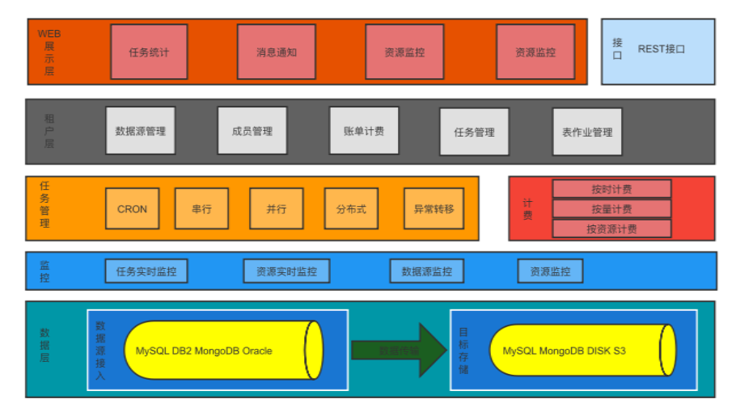
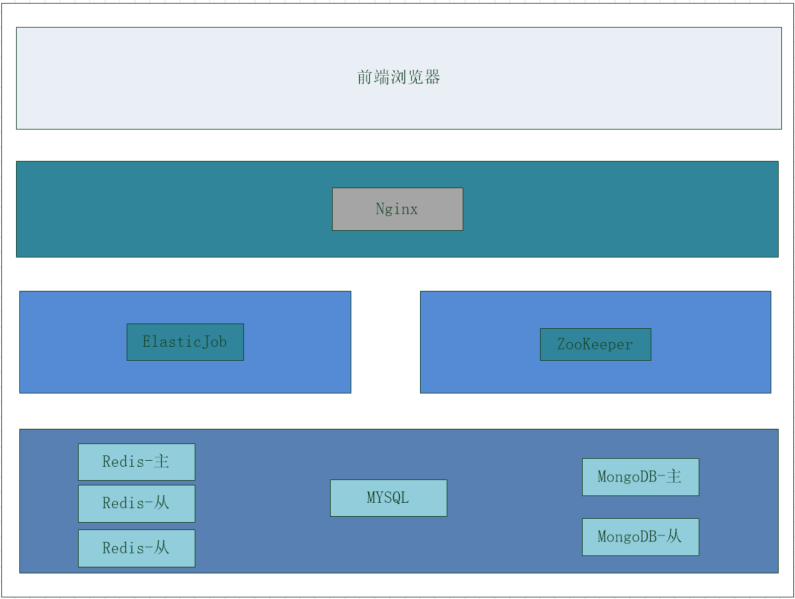

# Whaleal-data简介

归档平台是一款针对数据的归档软件，归档类型分为冷、热、S3，其中热数据归档支持MYSQL、Oracle、DB2、MongoDB同步数据到MongoDB，MYSQL数据同步到MYSQL。冷数据归档支持MongoDB归档至磁盘文件。S3归档支持MongoDB Gridfs类型上传至目标S3。首页显示任务执行统计、归档容量统计、表作业统计、业务接入数、归档总容量及用户操作。平台可自主配置数据源及目标源在表作业中选择某源端同步至某目标端。表作业配置完成后可在任务配置处配置多个表作业在一个任务中。任务创建完成后在任务调度处可开启作业、禁用作业、立即执行、下线作业，立即执行后可在任务监控处查看对应的任务执行情况。管理员用户可查看各种操作详情等。

### 平台架构图

### 	软件结构图

