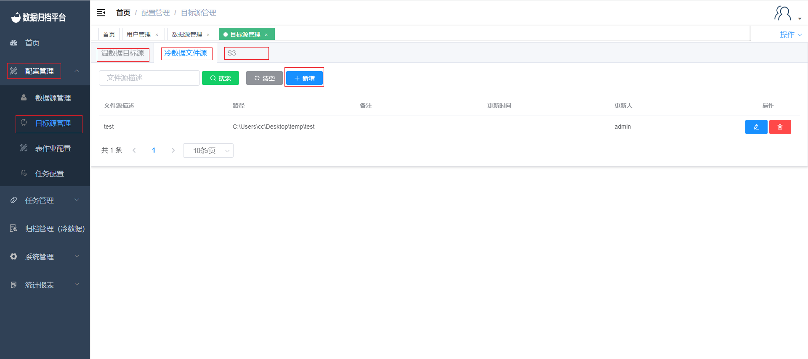
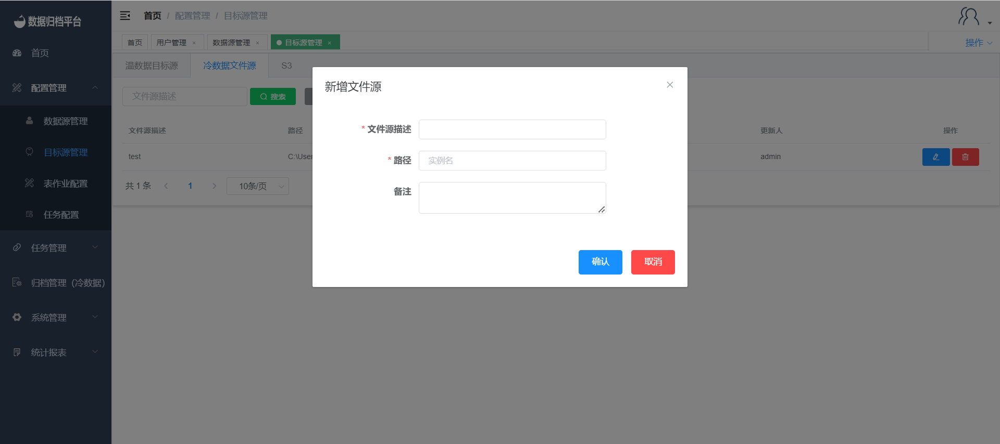
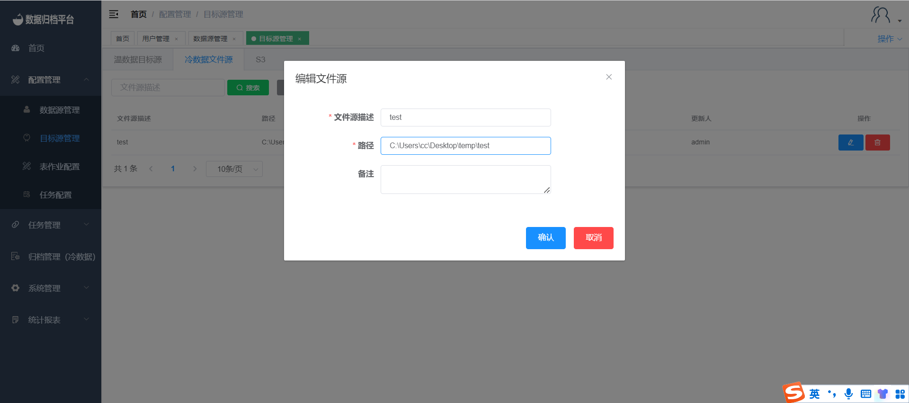
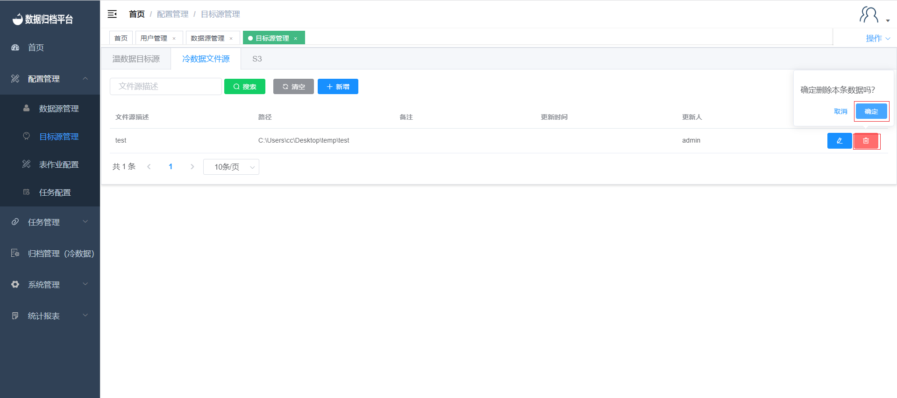

#### 		目标源管理

##### 			新增温/冷/S3数据目标源

​	目标源新增，点击配置管理下的目标源配置即可查看平台内所有目标源信息。若想添加温数据目标源点击上方的"温数据目标源"，若想添加冷数据目标源点击"冷数据文件源"，同理S3类型目标源添加需点击"S3"。之后点击新增按钮弹出新增页面冷数据与S3操作与数据源新增类似，测试完成后点击确认即可保存，冷数据文件源填写完成后点击确认即可保存。

##### 			修改温/冷/S3数据目标源

​	修改目标源点击蓝色按钮跳出编辑页面，温数据目标源与S3操作与数据源修改相同，冷数据文件源修改路径后点击确定即可。

##### 			删除温/冷/S3数据目标源

​	修改目标源点击红色按钮后弹出提示框，若确定删除点击确认即可，若不想删除点击取消即可。

##### 			绑定温/冷/S3数据目标源用户

​	绑定目标源操作与绑定数据源相同，若要绑定目标源点击目标源后勾选目标源，文件源与S3同理。之后点击保存后此用户已有此源的权限。

