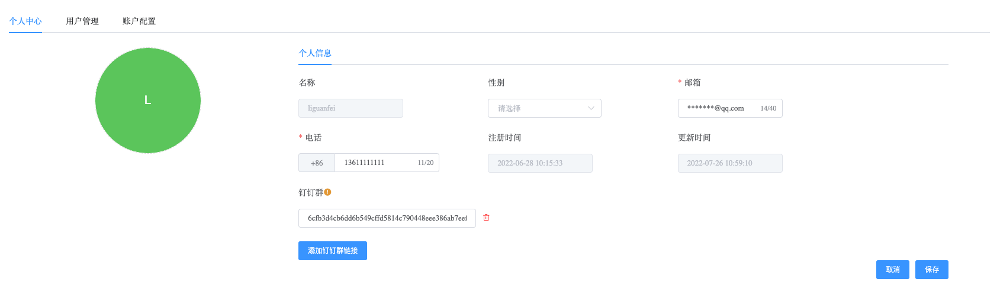
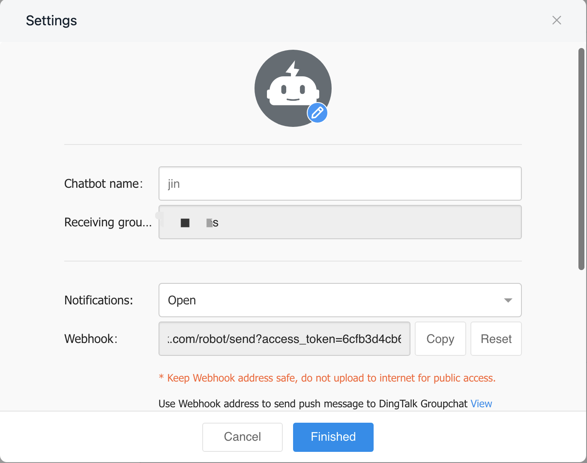

## Account Center

```
Account Center 可以配置以下内容：
 - Email
 - Phone Number
 - Dingding URL
```

a. 进入页面左侧导航栏

b. 点击 Account 选项按钮，选择 个人中心 选项

c. 点击 编辑资料 选项按钮，进行个人信息修改




### Email

在编辑资料中修改个人信息中 邮箱地址，在 Whaleal 中配置告警后，告警通知会同步发送至个人邮箱。


### Phone Number

在编辑资料中修改个人信息中 电话，在 Whaleal 中配置告警后，告警通知会以短信的形式同步发送至个人手机。


### Dingding URL

在钉钉群组中可以添加机器人，添加完成后，会提供Webhook URL，将地址中 access_token 值配置到 Whaleal 个人中心页面，告警通知会同步发送至钉钉群组。

