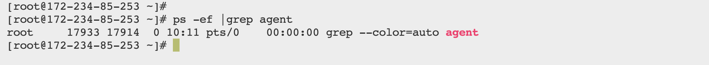
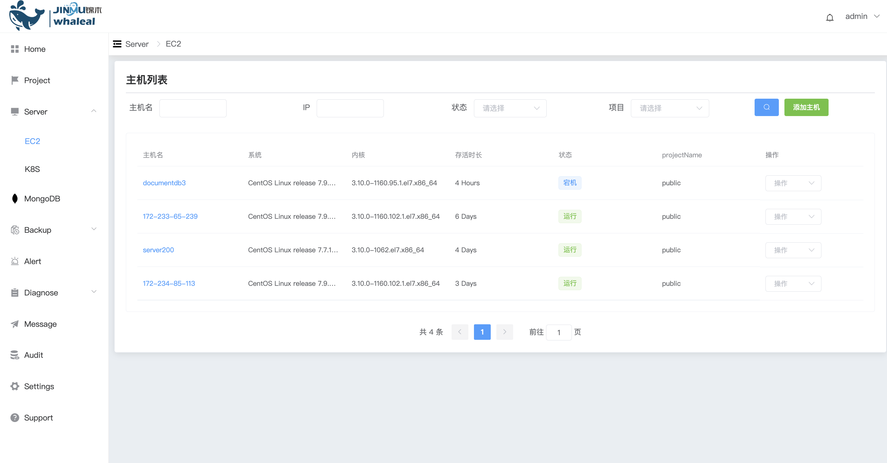

## Remove Host


```
Add Host 分为以下两部分操作内容：
 - Prerequisites
 - Procedure
```

对主机在平台进行移除，该操作只是不将主机在平台上进行纳管

### Prerequisites

在移除主机之前检查平台上是否还有关于该主机的任务没有完成。


### Procedure


Step-1. 进入导航目录

a.点击Server导航栏进入主机页面

b.右侧操作点击脱离纳管（或直接使用命令行将agent进程kill掉,谨慎操作）


Step-2. 脱离完成检查主机agent进程是否关闭


a.脱离纳管后该主机的agent进程将会被关闭，Whaleal平台主机列表将不显示此主机。同时该主机相关的MONGODB节点的状态同步改为“主机脱离纳管”




b.agent进程被kill掉后，主机被强制脱离纳管，在平台页面将不显示此主机。


