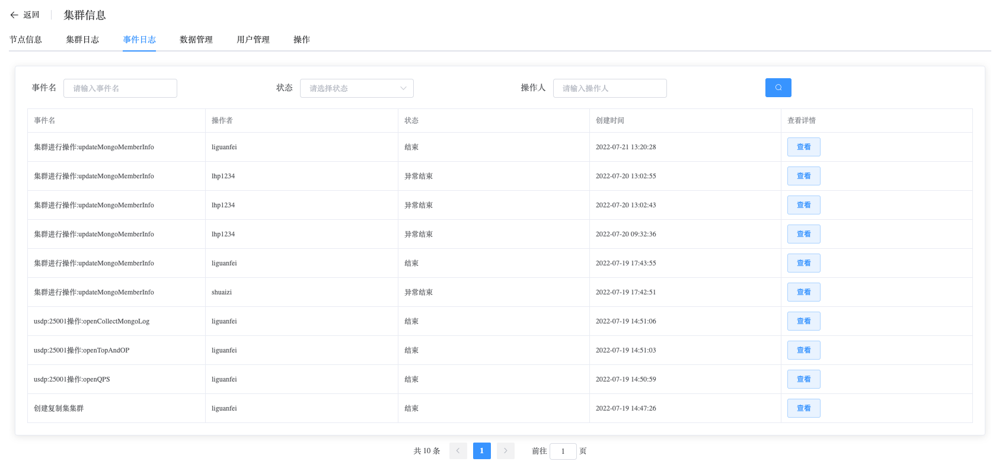
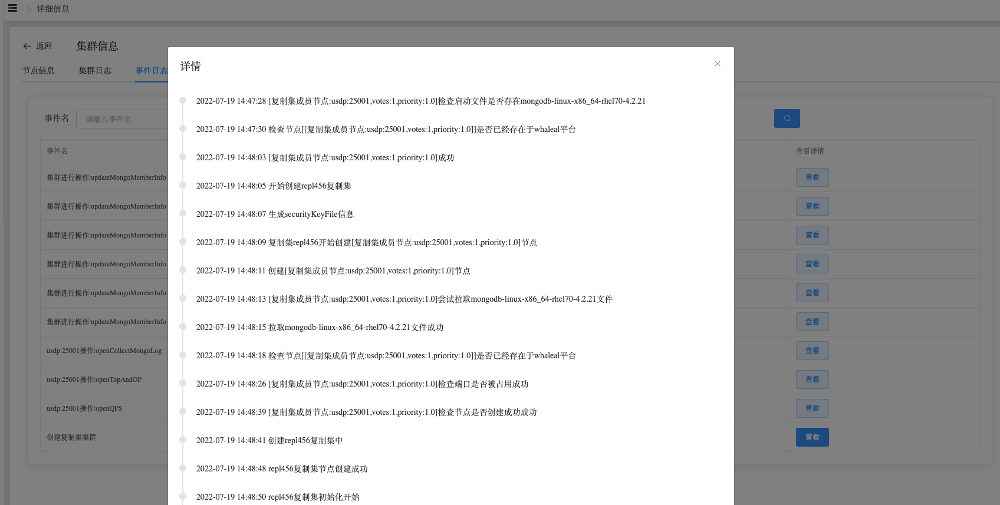

## Event Logs

```
Event Logs 可以执行以下操作：
 - Event Logs
```

### Event Logs

查看 Event Logs 数据

a. 进入页面左侧导航栏

b. 点击 MongoDB 选项按钮，选择 MongoList 选项

c. 在 MongoDB 静态信息页面，点击类型为 “复制集” 的集群名

d. 在集群信息页面，选择事件日志

事件日志记录用户对集群的所有操作，并记录操作执行进度与结果。




通过点击 “查看” 按钮，查看事件具体详情信息。



