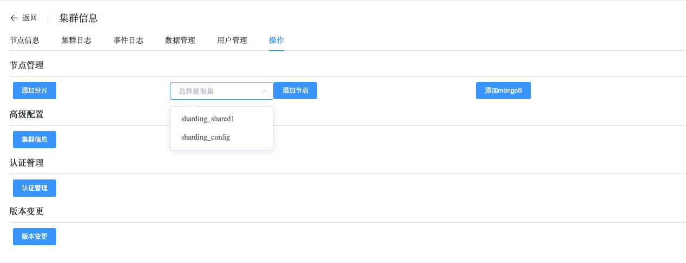
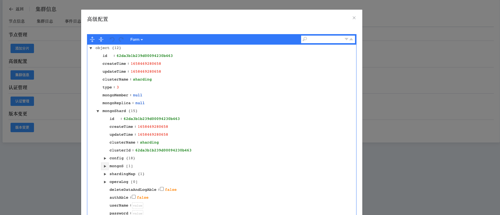
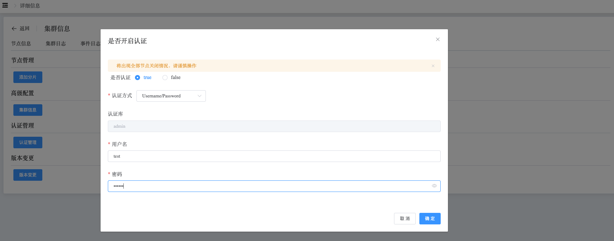
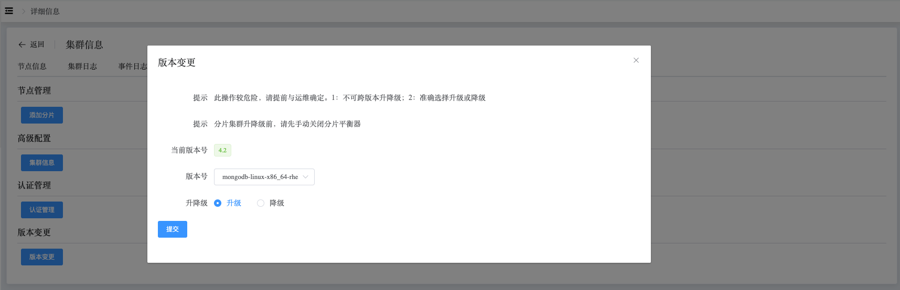

## Operation

```
Operation 可以执行以下操作：
 - Node Manage
 - Cluster Info
 - Authentication
 - Modify Version
```

集群操作

a. 进入页面左侧导航栏

b. 点击 MongoDB 选项按钮，选择 MongoList 选项

c. 在 MongoDB 静态信息页面，点击类型为 “分片” 的集群名

d. 在集群信息页面，选择操作

### Node Manage

此操作可以向分片集群中添加分片、向shard中添加节点、向集群中添加mongos节点。



### Cluster Info

查看集群中节点配置信息



### Authentication

开启认证，必须指定一个用户在admin库下

自动化创建用户、修改配置文件、重启服务操作。



### Modify Version

通过选择版本，对集群版本进行升降级操作，一键操作，修改FCV、更换介质包、重启服务。

> **注意：**
>
> 1. 分片集群升级、降级，必须手动关闭平衡器
> 2. 分片集群升级、降级完成后，重新恢复平衡器状态

