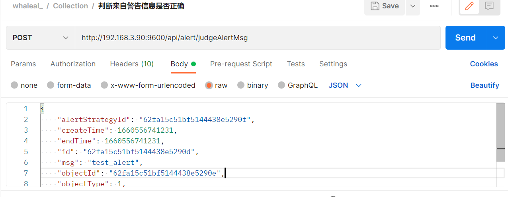
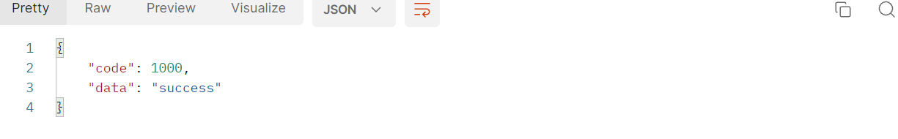
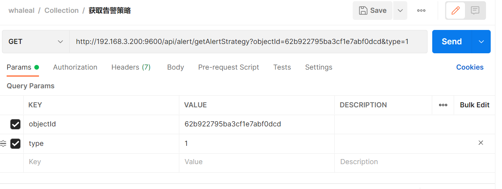
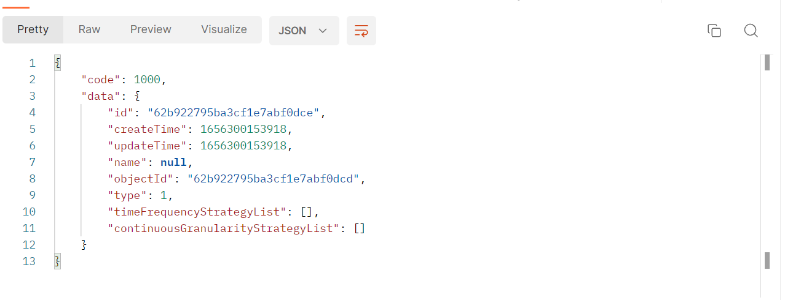
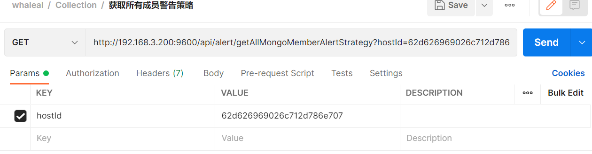
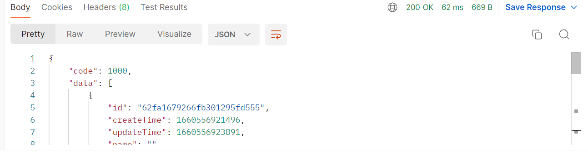
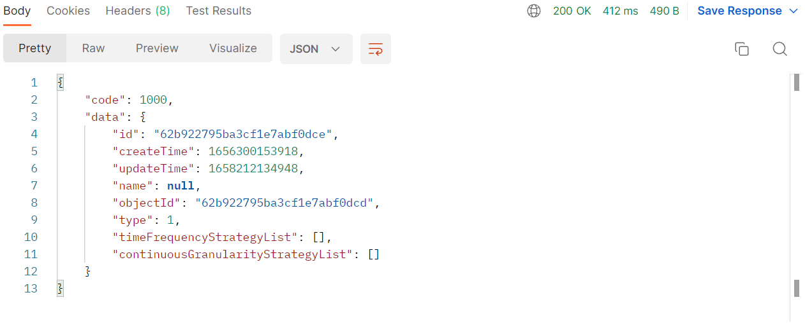
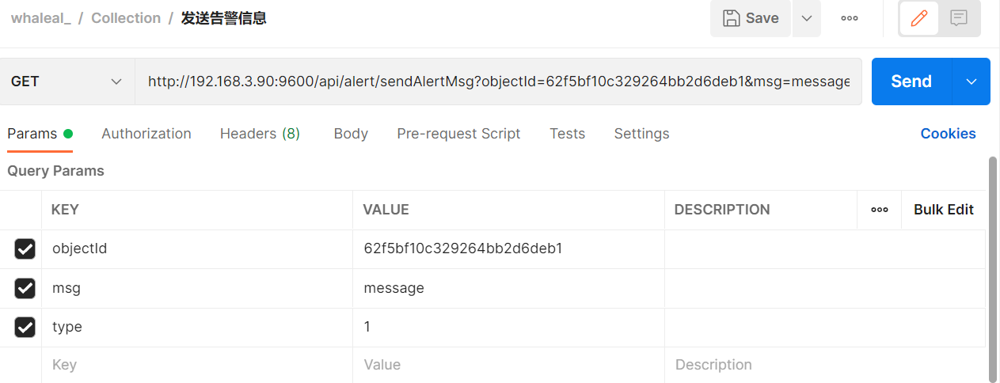
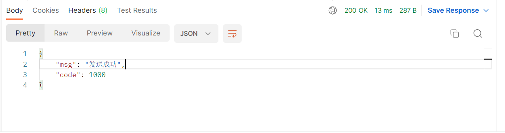

# Alert接口
接口调用时须在请求头中设置whaleal-Token,返回内容为 JSON 格式的信息。
其参数为时间类型都以时间戳形式传递。

接口调用时需用到hostId、objectId
~~~
hostId 在“根据主机名模糊查询主机基本信息”接口处获取。

objectId 为主机id或mongo节点id，mongo节点id在“查找mongoDB集群信息数据”接口返回结果集中data集合的中mongo集合的“id”。
~~~

### 请求头默认格式，特殊情况特殊声明

| KEY                |     VALUE      |     
| -------------------|----------------------|
| Accept-Encoding        |         gzip,deflate,br |     
| Connection          |         keep-alive           |          
| Content-Type          |         application/json |    
---

 

###  1 判断来自警告信息是否正确

1.1 请求路径

POST: http://{Server-Host}:{端口}/api/alert/judgeAlertMsg

---

1.2 请求参数

| Name                |     Located in     |           Description         |     Required    |        Schema   |
| -------------------|----------------------|-------------------------------|-----------------|-----------   |
|    alertMsgEntity   |      Body      |       告警信息实体对象     |      Yes            |    AlertMsgEntity

 

~~~
EX. 判断来自警告信息是否正确;其中AlertMsgEntity 如下所示：
{
    "alertStrategyId": "62fa15c51bf5144438e5290f",
    "createTime": 1660556741231,
    "endTime": 1660556741231,
    "id": "62fa15c51bf5144438e5290d",
    "msg": "test_alert",
    "objectId": "62fa15c51bf5144438e5290e",
    "objectType": 1,
    "startTime": 1660556741231,
    "updateTime": 1660556741231
}
~~~

----

1.3 返回结果

|               |     Description    |           Schema              |  
| --------------|----------------------|---------------------------
| code        |   状态符:1000成功,其余异常 |           int            |    
| data       |         返回消息       |                String         | 

 

---

 

###  2 获取告警策略

2.1 请求路径

GET: http://{Server-Host}:{端口}/api/alert/getAlertStrategy

---

2.2 请求参数

    类型:1 agent,2 mongo

| Name                |     Located in     |           Description         |     Required    |        Schema   |
| -------------------|----------------------|-------------------------------|-----------------|-----------   |
|     objectId        |        Params              |           对象id               |    Yes              |String
|     type        |         Params       |    类型    |           Yes       |int

 

----

2.3 返回结果

|               |     Description    |           Schema              |  
| --------------|----------------------|---------------------------
| code        |   状态符:1000成功,其余异常 |        int               |    
| data       |         返回数据        |             JSON            | 

 

---

 

###  3 获取所有成员警告策略(获取一台agent上所有mongodb节点告警策略)

3.1 请求路径

GET: http://{Server-Host}:{端口}/api/alert/getAllMongoMemberAlertStrategy

---

3.2 请求参数

| Name                |     Located in     |           Description         |     Required    |        Schema   |
| -------------------|----------------------|-------------------------------|-----------------|-----------   |
|     hostId        |        Params              |           主机id               |    Yes              |String

 

----

3.3 返回结果

|               |     Description    |           Schema              |  
| --------------|----------------------|---------------------------
| code        |   状态符:1000成功,其余异常 |         int              |    
| data       |         返回数据        |           List              | 

 

~~~
{
    "code": 1000,
    "data": [
        {
            "id": "62fa1679266fb301295fd555",
            "createTime": 1660556921496,
            "updateTime": 1660556923891,
            "name": "",
            "objectId": "62f5bf10c329264bb2d6deb1",
            "type": 2,
            "timeFrequencyStrategyList": [],
            "continuousGranularityStrategyList": [
                {
                    "type": "qps_insert",
                    "cmp": ">",
                    "value": 80.0,
                    "count": 20,
                    "alarmFrequency": 30,
                    "duration": 60
                }
            ]
        }
    ]
}
~~~

---

 

###  4 更新警告信息

4.1 请求路径

POST: http://{Server-Host}:{端口}/api/alert/update

---

4.2 请求参数

| Name                |     Located in     |           Description         |     Required    |        Schema   |
| -------------------|----------------------|-------------------------------|-----------------|-----------   |
|     alertStrategyEntity        |        Body              |           告警策略实体对象              |    Yes              |alertStrategyEntity

 

----

4.3 返回结果

|               |     Description    |           Schema              |  
| --------------|----------------------|---------------------------
| code        |   状态符:1000成功,其余异常 |         int              |    
| data       |         返回数据        |              JSON           | 

 

---

 

###  5 发送告警信息

5.1 请求路径

GET: http://{Server-Host}:{端口}/api/alert/sendAlertMsg

---

5.2 请求参数

    type: 1 host,2 mongo

| Name                |     Located in     |           Description         |     Required    |        Schema   |
| -------------------|----------------------|-------------------------------|-----------------|-----------   |
|     objectId        |        Params              |    host或mongo的id             |    Yes              |String
|     msg        |        Params              |           通知消息              |    Yes              |String
|     type        |        Params              |           通知类型              |    Yes              |int

 

----

5.3 返回结果

|               |     Description    |           Schema              |  
| --------------|----------------------|---------------------------
| code        |   状态符:1000成功,其余异常 |         int              |    
| msg       |         返回消息      |              String           | 

 

---

 

[comment]: <> (## AlertStrategyEntity)

[comment]: <> (|       Name         |     Type             |    Description      |   )

[comment]: <> (| ------------       |----------            |---------------------|)

[comment]: <> (| name                 |   String             |         主机或mongoMember警告策略名称          |   )

[comment]: <> (| objectId             |   String             |         主机id or mongoMemberId     |   )

[comment]: <> (| type                 |   String |         1 agent 2 mongo     |   )

[comment]: <> (| timeFrequencyStrategyList         |   List\<TimeFrequencyStrategy>             |         时间区间警告策略     |   )

[comment]: <> (| continuousGranularityStrategyList         |      List\<ContinuousGranularityStrategy>          |         连续时间警告策略     |   )

[comment]: <> (---)

[comment]: <> (---)

[comment]: <> (## TimeFrequencyStrategy)

[comment]: <> (|       Name         |     Type             |    Description      |   )

[comment]: <> (| ------------       |----------            |---------------------|)

[comment]: <> (| startHour                 |   int             |         小时时间范围的起点          |   )

[comment]: <> (| endHour             |   int            |         小时时间范围的结点     |   )

[comment]: <> (---)

[comment]: <> (---)

[comment]: <> (## HostInfoMongoEntity)

[comment]: <> (|       Name         |     Type             |    Description      |   )

[comment]: <> (| ------------       |----------            |---------------------|)

[comment]: <> (| duration                 |   int             |         统计颗粒度          |   )

[comment]: <> (---)

[comment]: <> (---)
