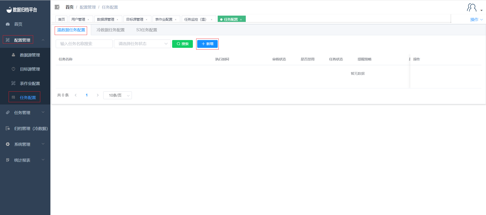
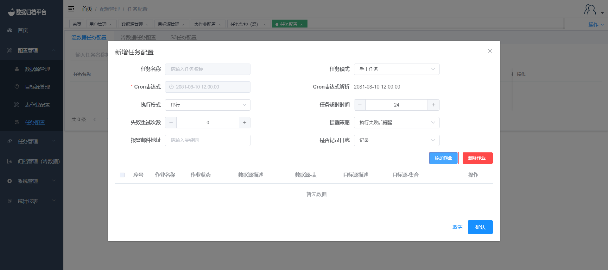
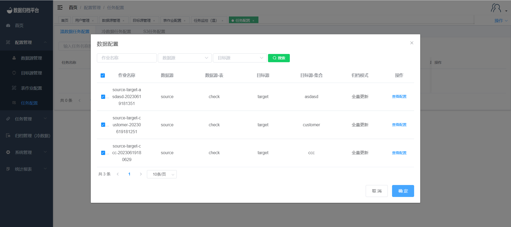
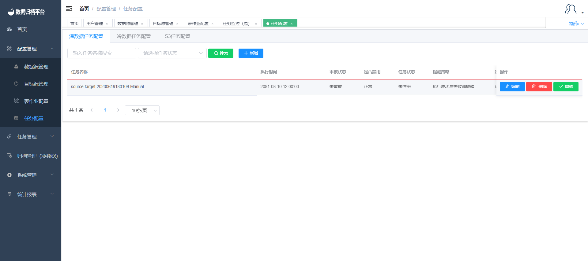
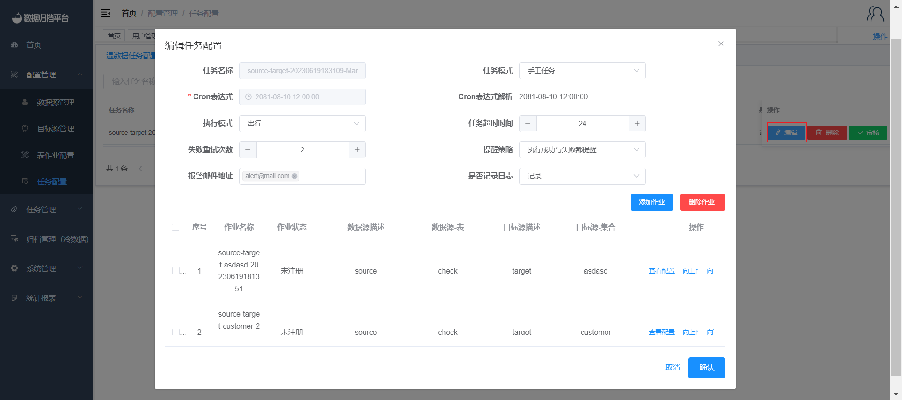

#### 		任务配置

##### 			新增温/冷/S3任务

​	点击配置管理下的任务配置，点击温数据任务配置可查看平台内所有温数据归档任务信息，点击冷数据任务配置可查看平台内所有冷数据归档任务信息，点击S3任务配置可查看平台内所有S3归档任务信息。之后在需添加的任务类型配置处点击新增按钮弹出第二张图所示表格。点击添加作业后弹出已配置完成的表作业配置可在任务配置处配置多个表作业在一个任务中如第三张图所示点击确定后将表作业关联至任务配置。任务可分为手工任务、循环任务、单次任务，单次任务可使用Cron表达式设置执行时间，循环任务则必须设置Cron表达式设置循环执行时间。由于一个任务可以有多个表作业，所以在任务配置处可配置执行模式是串行或并行。在任务配置处可配置任务超时时间，也可配置失败重试次数，及任务失败或成功后的提示信息发送邮件至邮箱。配置完成如第四张图后点击确认即可。配置完成后需管理用户进行审核。

##### 			编辑温/冷/S3任务

​	点击编辑按钮后弹出第一张图所示表格，在审核完成前此任务配置可编辑可删除，但管理用户审核过后不可编辑并不可删除。任务编辑后点击确认即可。

##### 			删除温/冷/S3任务

​	在管理用户审核完成前可编辑可删除，点击红色删除按钮后弹出提示框，若确认删除点击删除即可，若不想删除点击取消即可。

​	

##### 			搜索温/冷/S3任务

​	在搜索按钮前有两个条件框，填写完成后点击搜索可过滤出符合条件的任务配置。

