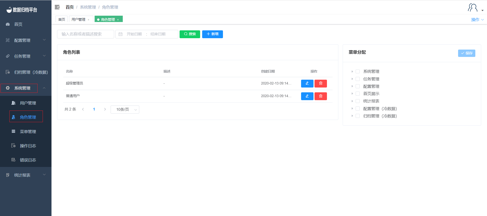
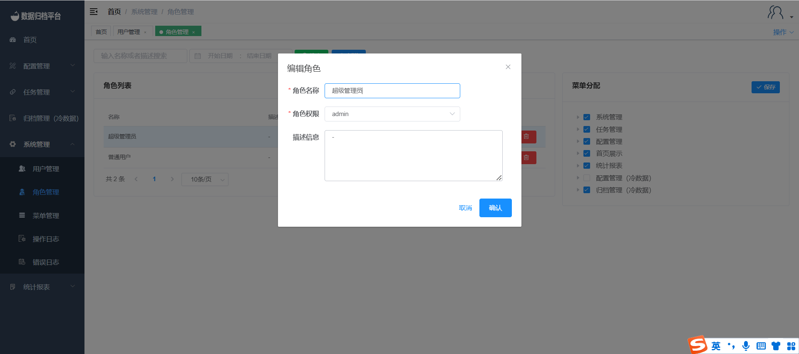
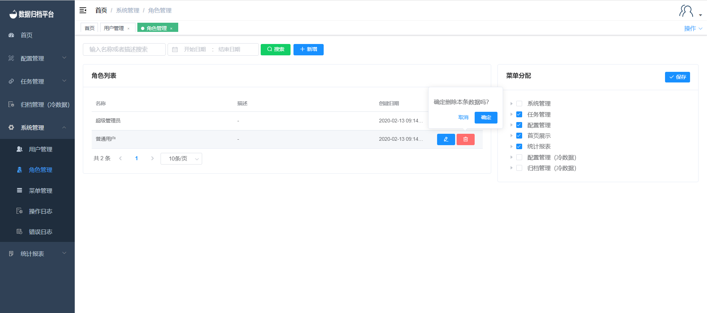
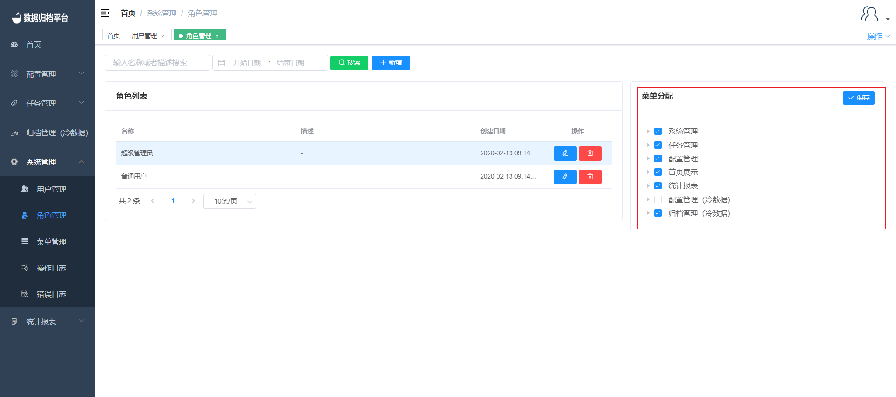

#### 		角色管理

​	点击系统管理菜单下的角色管理，此页面只有管理员用户可见，页面可以查看平台中所有角色权限分类信息。

##### 				搜索

​	上方绿色按钮为搜索按钮，左侧两个条件框填写后点击搜索可过滤出所需的角色列表。

##### 				新增

​	蓝色为新增按钮，点击“新增”按钮弹出如图界面，填写角色名称，角色权限即可新增角色信息。

##### 				修改

​	点击角色右侧的蓝色铅笔图案按钮，弹出编辑角色框，可自行修改角色的名称及权限或添加描述，完成后点击保存即可。

##### 				删除

​	右侧红色按钮为删除按钮，点击删除按钮后弹出提示是否确认删除，若确认删除点击确认即可，若不删除点击取消按钮。

##### 				菜单分配

​	点击用户后右侧出现该角色所绑定的菜单，根据角色实际可操作的权限及菜单进行勾选分配并保存数据即可绑定此角色所能操作的菜单。

