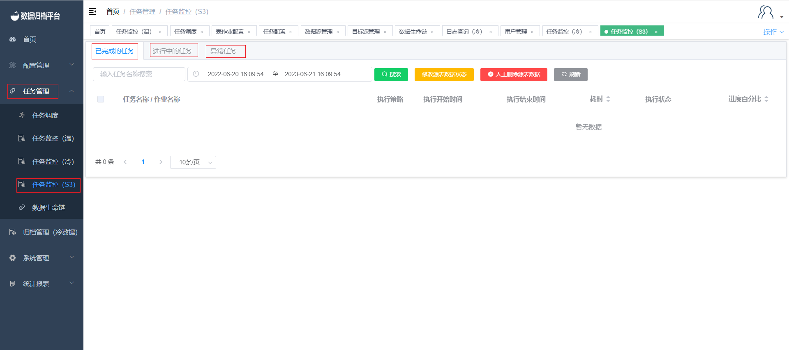
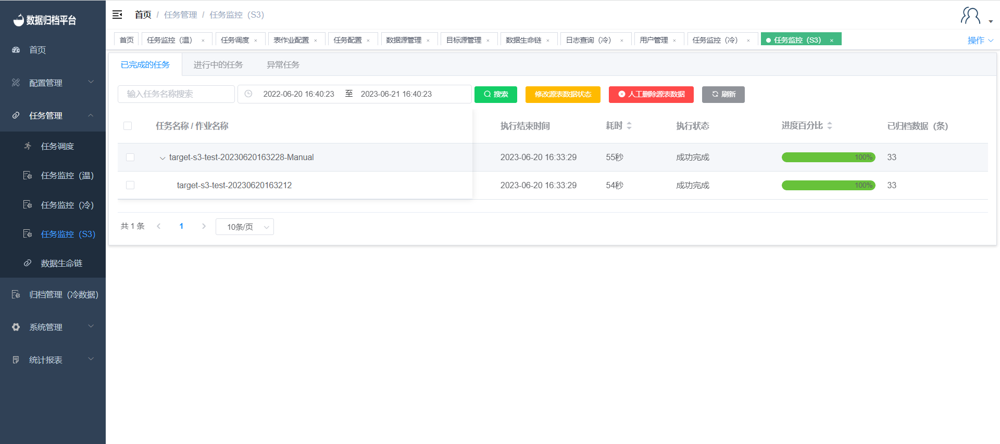
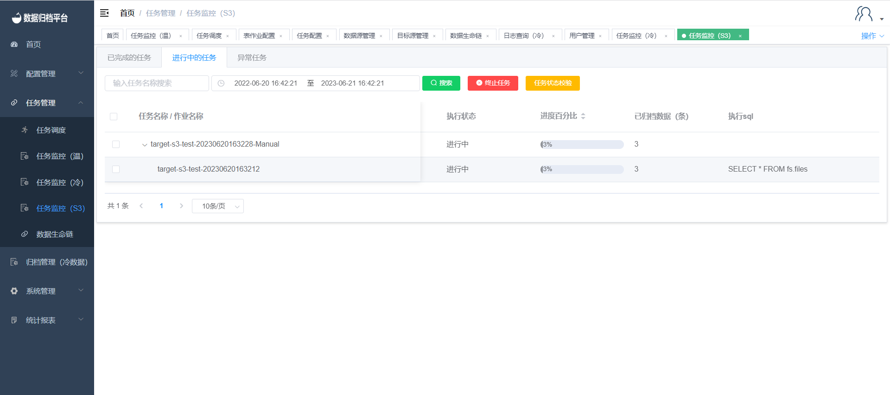
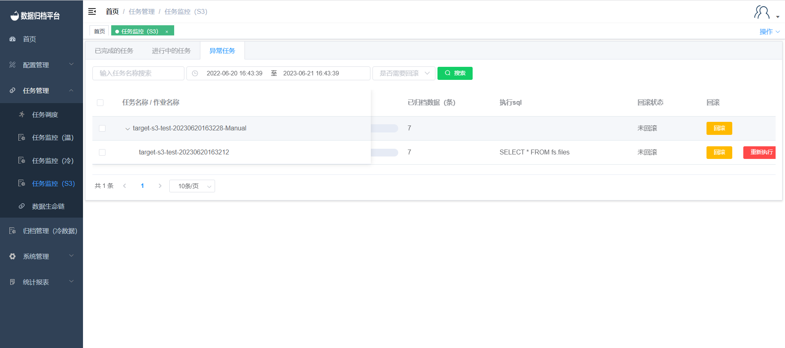

#### 		任务监控（S3）

​	点击任务管理下的任务监控（S3），该页面展示了针对S3作业的任务执行状态信息，其中有已完成的任务、进行中的任务、异常任务，每个搜索按钮前都有条件框，可在任务较多不便观察某任务时进行过滤展示。

##### 			作业状态

##### 					已完成任务

​	点击已完成的任务，此页面展示了正常完成的任务的一些信息，其中有对应任务的执行策略、执行开始时间、执行结束时间、耗时、执行状态、进度百分比、已归档条数、源表数据状态、执行sql。并且在上方有四个按钮，搜索、修改源表数据状态、人工删除源表数据、刷新。

**搜索**

​	上方绿色按钮为搜索按钮，前方的条件框输出条件后点击搜索可展示过滤后的已完成任务。

**修改原表数据状态**

​	同步完成后若已手动删除源表数据，可点击黄色按钮修改源表数据为已处理。

**人工删除源表数据**

​	红色按钮为人工删除源表数据，若表作业配置中没有配置自动删除，若想在同步完成后删除源端表可手动去数据库删除，或选择完任务后点击人工删除源表数据按钮进行删除。

**刷新**

​	任务的进度百分比为3s更新一次，因此进度条展示可能不是实时的，点击刷新按钮可更新任务进度百分比的进度条及一些任务的状态。

##### 					进行中任务

​	点击进行中的任务，此页面展示了正在执行归档的任务信息，其任务信息有执行策略、执行开始时间、执行结束时间、耗时、执行状态、进度百分比、已归档条数、执行sql，上方有三个按钮搜索、终止任务、任务状态校验。

**搜索**

​	绿色按钮为搜索按钮，左侧有条件框可按需填写，填写完成过滤条件后点击搜索按钮，将展示所有符合条件的进行中的任务。

**终止任务**

​	红色按钮为终止任务，选择完任务后点击终止任务可将任务直接终止，之后此任务将出现在异常任务中，若正常完成则出现在已完成的任务中。

**任务状态校验**

​	一个任务可包含多个表作业，当一个表作业完成后执行下个表作业，完成后若任务状态迟迟没有更新则可选择任务后点击任务状态校验更新任务状态。

##### 					异常任务

​	点击异常任务，此页面展示了异常任务信息，其异常任务信息包含执行策略、执行开始时间、执行结束时间、耗时、执行状态、异常报错、进度百分比、已归档数据条数、执行sql、回滚状态。此页面包含三个按钮即搜索、回滚、重新执行。

**搜索**

​	上方绿色按钮为搜索按钮，左侧有条件框填写条件后点击搜索可过滤出所需的异常任务。

**回滚**

​	异常任务页面中每个异常任务后方都有回滚按钮，可点击子任务的回滚按钮将其同步的异常数据回滚掉，若点击父任务的回滚按钮则将此父任务下的子任务全部回滚掉。

**重新执行**

​	异常任务的子任务后方有重新执行按钮，点击重新执行后将自动生成一个父任务，此异常任务与新生成的父任务所绑定，之后进行异常数据的回滚，当回滚完成后此任务与新生成的父任务将出现在正在执行的任务页面中重新执行此任务。

