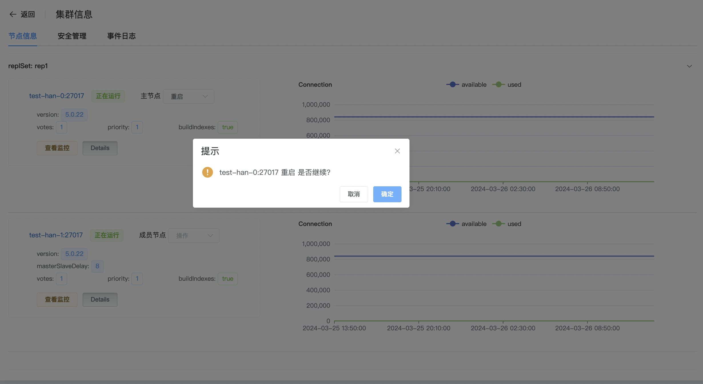
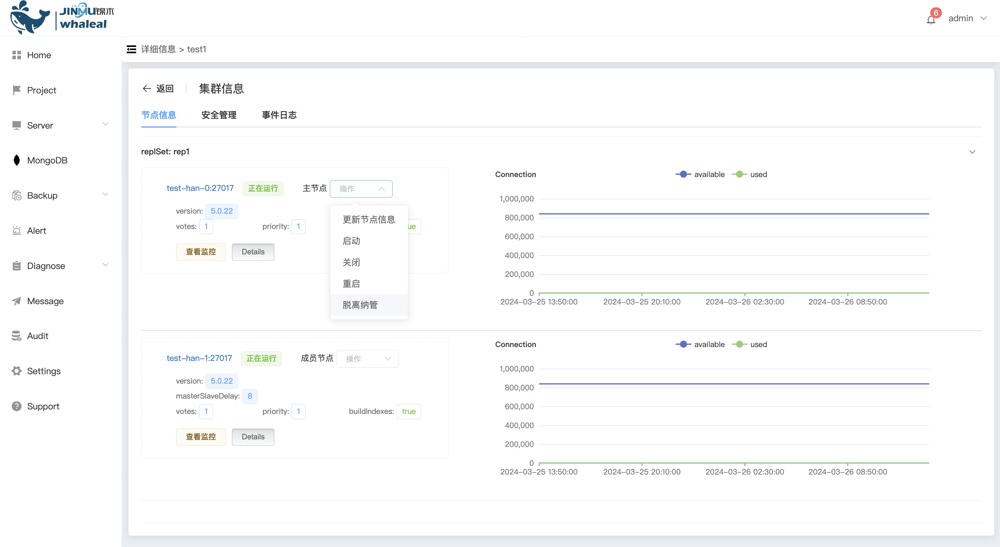

### 节点操作

针对集群中的某个节点进行操作管理,包括启动关闭重启,脱离纳管,成为主节点等操作

#### 1、更新节点信息

a. 点击 MongoDB 选项按钮

b. 点击你要操作的集群名称名称

c. 点击 操作 选择 更新节点信息

d. 点击 确定 ,进行更新节点信息

#### 2、启动

仅启动当前选择节点

a. 点击 操作 选择启动

b. 点击 确定,进行启动

#### 3、关闭

仅关闭当前选择节点

a. 点击 操作 选择关闭

b. 点击 确定,进行关闭

#### 4、重启

仅重启当前选择的节点

a. 点击 操作 选择重启

b. 点击确定 ,进行重启操作

#### 5、脱离纳管

脱离纳管,针对选择的节点,从平台中脱离管理,不影响服务器中的mongo集群节点

a. 点击 操作 选择脱离纳管

b. 点击确定 ,进行脱离纳管

#### 6、成为主节点

可以把选择的成员节点设置升级成为主节点

a. 点击 操作 选择成为主节点

b. 点击 确定 ,进行升级为主节点

