### MongoDB

在 WAP 平台上，你可以创建 MongoDB 集群，包括单节点、复制集和分片集群的部署。同时，你还能够将已部署的 MongoDB 实例纳入 WAP 平台进行集中管理。

**创建单实例**

点击创建单实例,需要填写所属项目,主机名,端口,数据目录,以及选择mongodb 的版本和认证方式

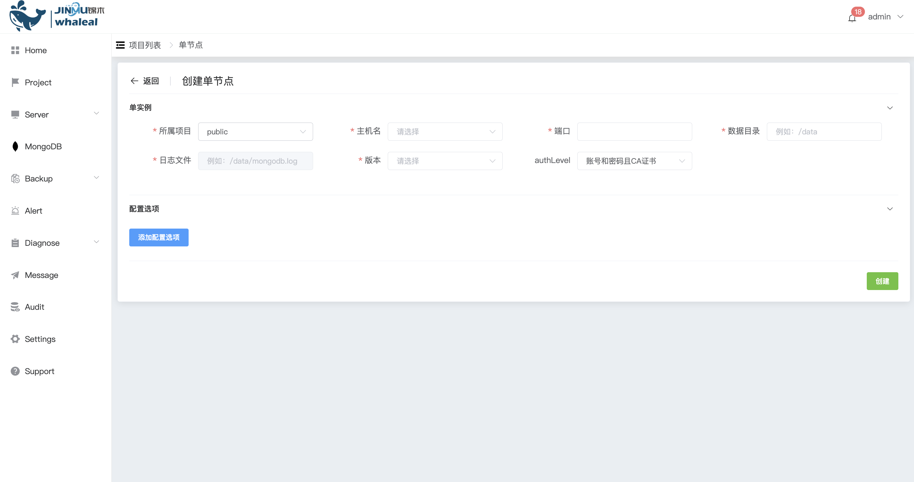

也添加相应mongodb配置项,添加完成点击创建

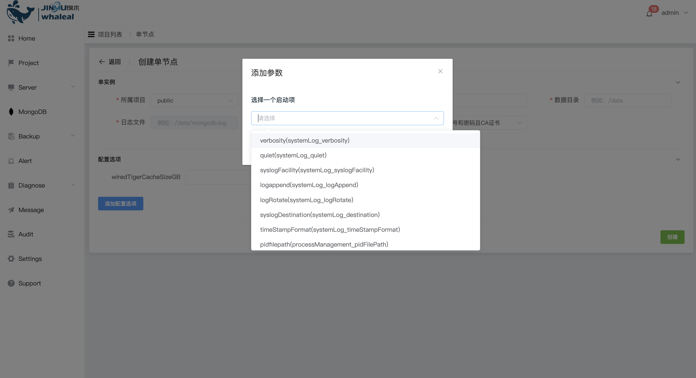

**创建复制集**

点击创建复制集,配置所属项目,复制集名称,认证方式,和版本号,以及成员配置完成后点击确认

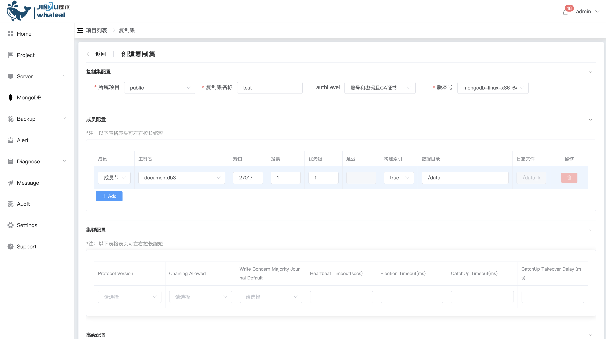

**创建分片集群**

点击创建片集群,配置所属项目,分配集群名称,认证方式,和版本号,以及shard、config、mongos的配置填写完成后点击创建

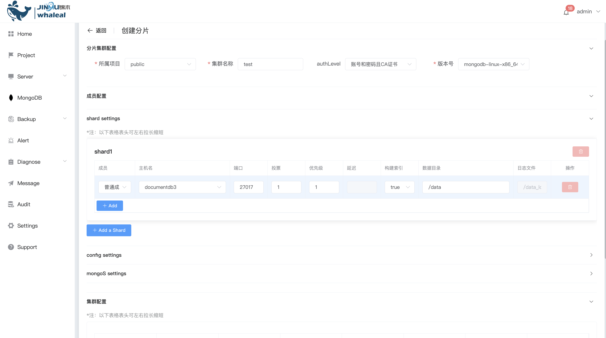

**连接到集群**

点击右边操作-连接集群,可以看相应的连接方式,

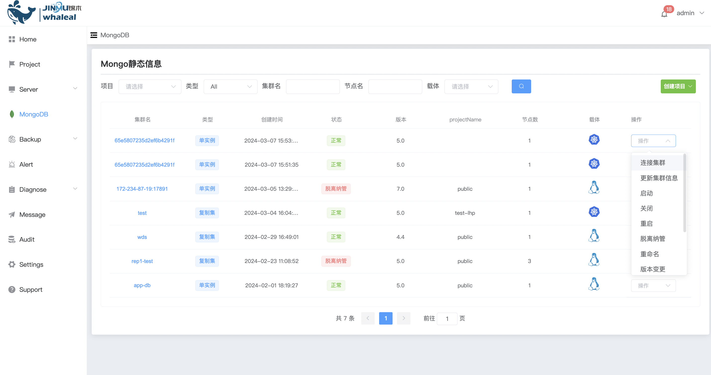

我们提供的3种连接方式,你可以选择相应的连接方式

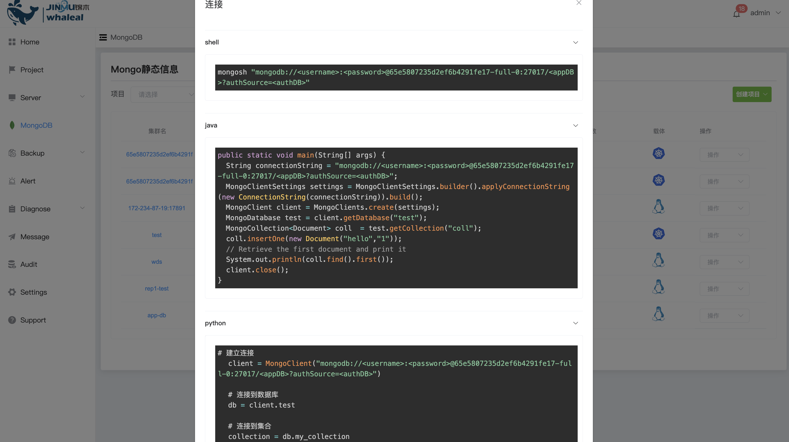

**更新当前的群集信息**

更新集群信息后,会刷新当前群集的配置信息

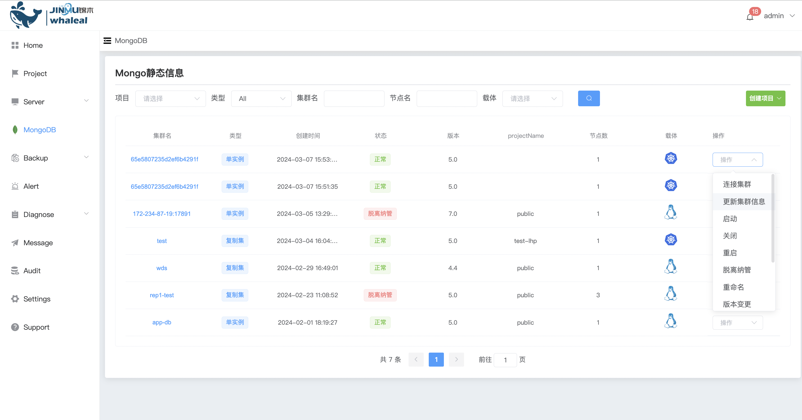

**启动集群**

启动当前mongodb集群

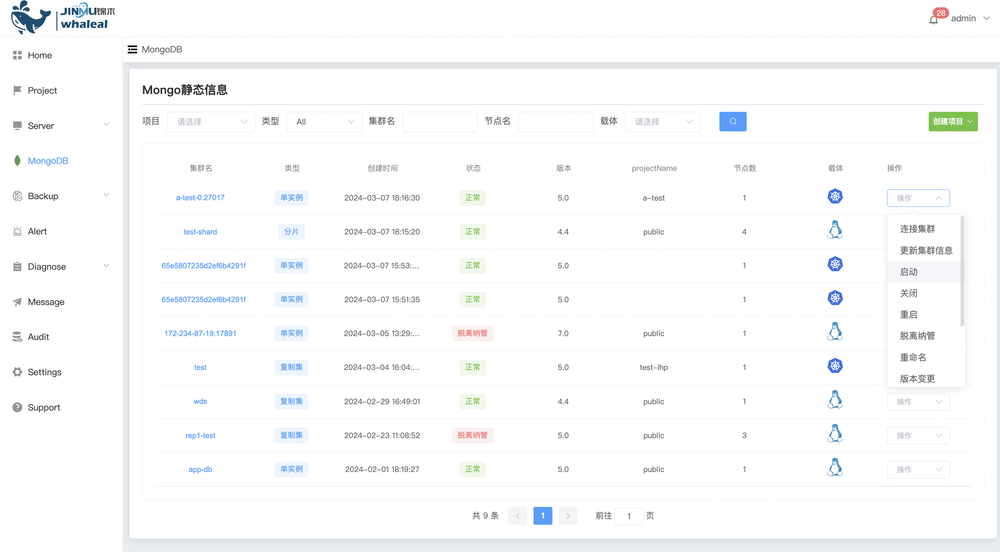

**关闭集群**

关闭当前mongodb 集群

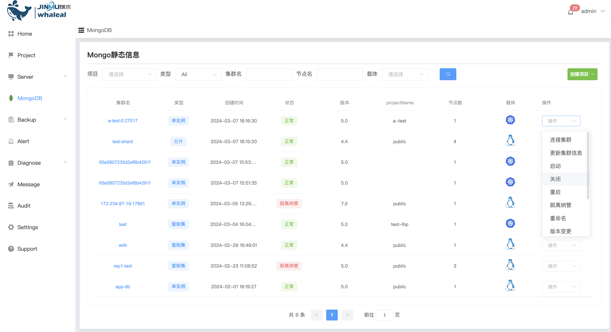

**重启集群**

重启当前mongodb 集群

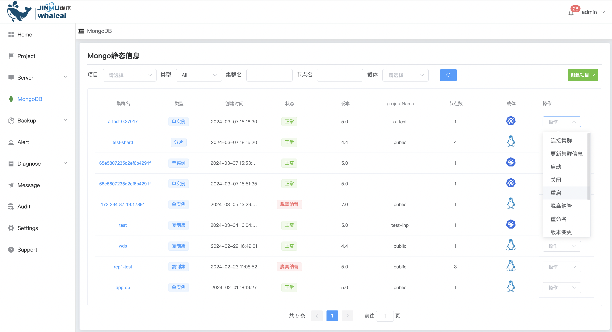

**脱离纳管**

群集脱离纳管后,会从wap平台中删除,服务器主机中的mongodb还存在

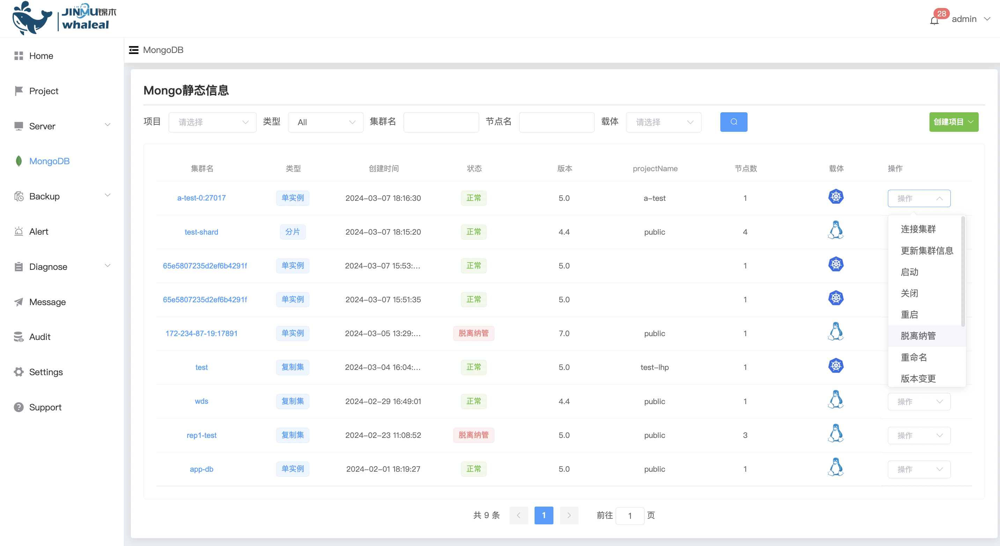

**重命名**

重命名当前mongodb集群名称

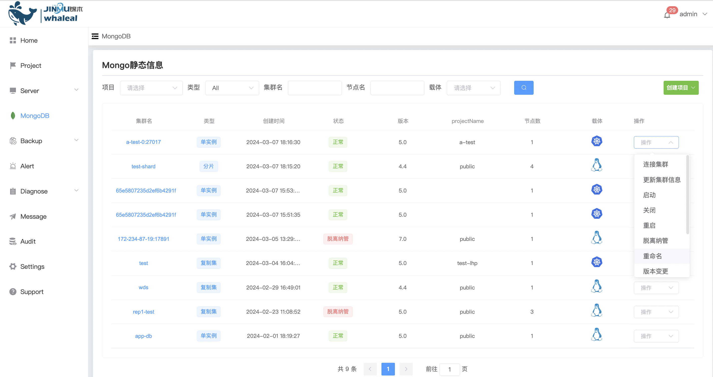

**版本变更**

MongoDB 版本的升级和降级功能，支持单实例、复制集和分片集群的升级和降级操作。

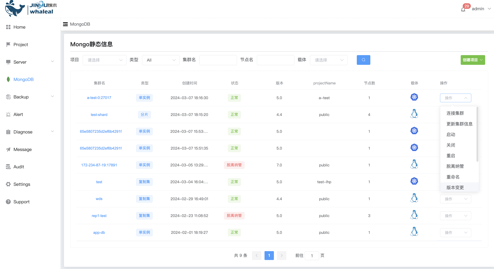

选择版本号,是否开启备份,开启备份后在升级或降级前会备份一份mongodb数据

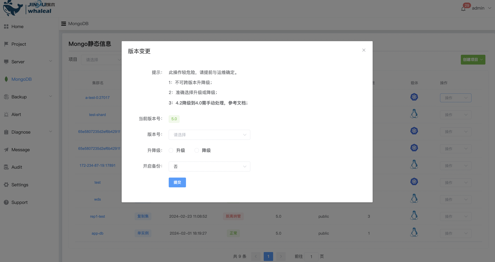

**群集变更**

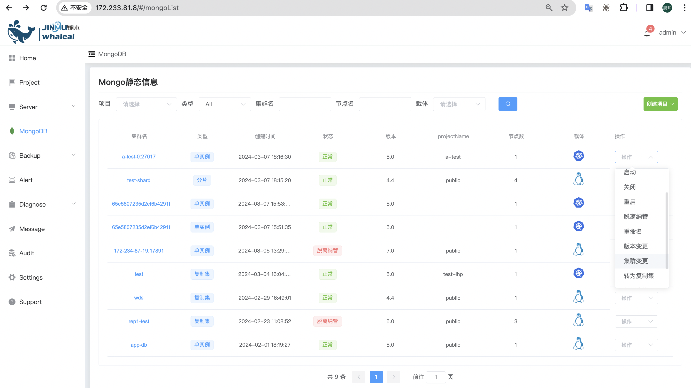

群集变更,添加修改配置参数

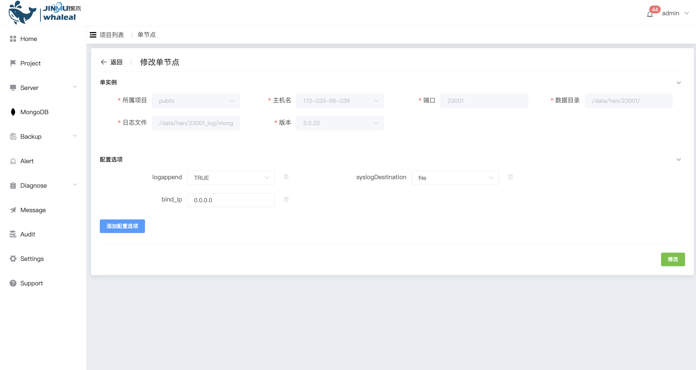

