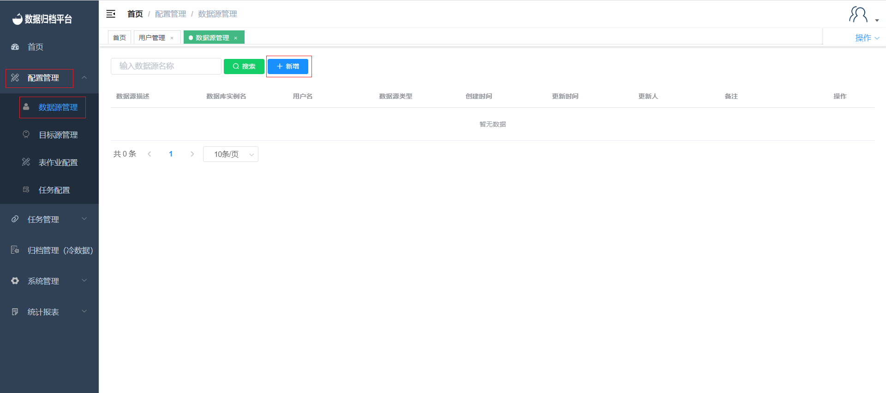
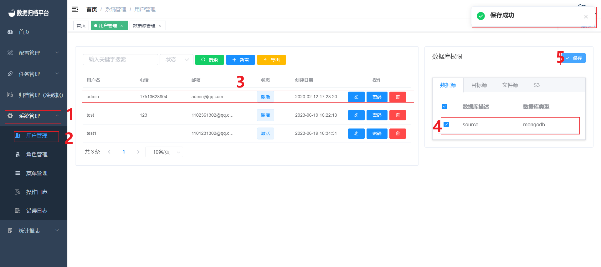

#### 		数据源管理

##### 			新增数据源

​	数据源新增，点击配置管理下的数据源管理即可查看平台内所有数据源信息。点击第一张图中“新增”按钮弹出第二张图所示表单，即可新增数据源信息；数据源可选MongoDB、MYSQL、Oracle、DB2。连接数据库所用的用户名和密码需要自行输入，option为可选项填项配置相关数据库的某些连接方式等。点击“测试”按钮可验证用户信息是否能连接数据库。之后点击确认保存数据源。

##### 			修改数据源

​	点击右侧操作栏中蓝色按钮，出现编辑数据源表格与新增数据源表格类似修改过后点击测试，出现测试通过完成后点击确认即可修改完成。

##### 			删除数据源

​	点击右侧操作栏中红色按钮，出现删除提示，若需删除点击确定即，可若误点可点击取消按钮。

##### 			绑定数据源用户

​	点击系统管理下的用户管理即可显示所有用户信息，点击需要操作的用户后勾选右侧需要添加的数据源后进行保存即可将数据源绑定至用户。

