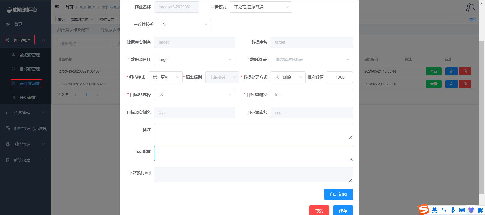
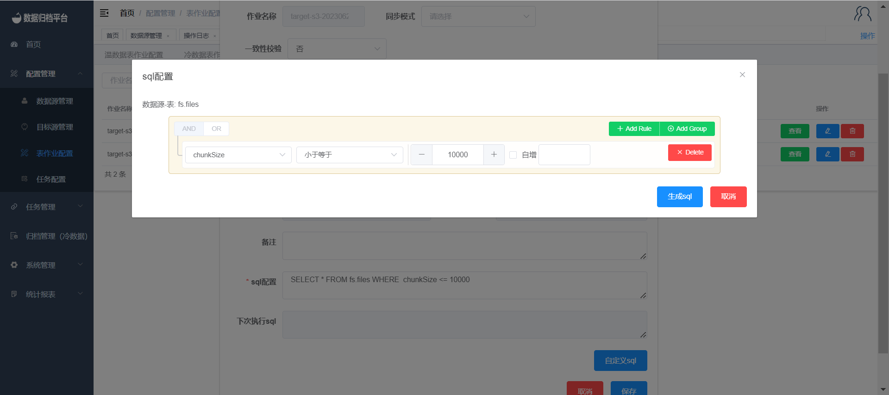

#### 			添加S3增量作业

​		点击配置管理菜单下的表作业配置，在S3表作业页面点击蓝色新增按钮弹出以下表单，自行选择需同步的数据源库表与目标S3，同步S3时的源端需为MongoDB的Gridfs数据。之后归档模式选择增量更新。表作业具有一致性校验功能，选择是后可填写所需校验的百分比，同步后平台将对同步的数据进行一致性校验，由于S3特性相同文件名称上传将覆盖原有的文件所以同步模式可选择不处理直接替换、最新的文件替换、ID+文件名方式进行同步。数据处理方式可选人工删除或系统删除，此功能在同步完成后将源表进行删除。

