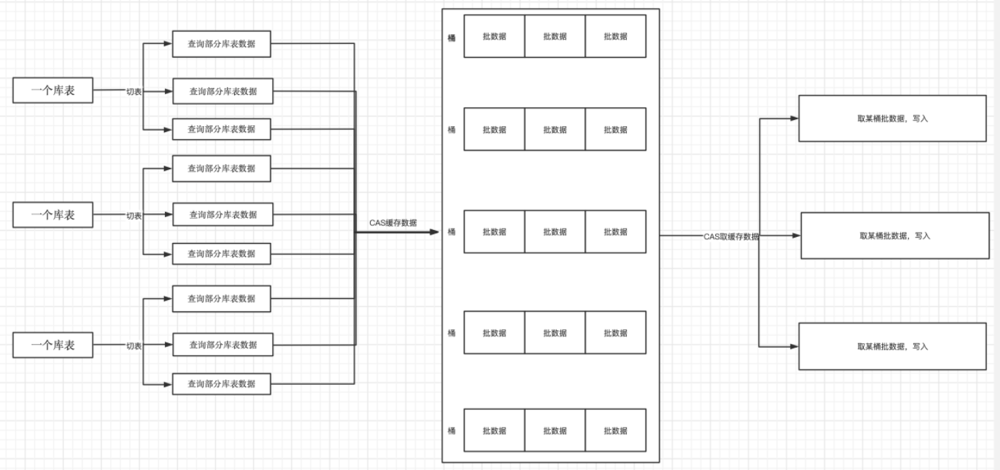

# DDT架构简介

## 背景

    Mongodb数据库的全量迁移和实时同步。我司研究开发新型的数据迁移项目，由此DDT项目诞生。

## 项目介绍

名称：DDT

语言: 纯java开发

定位: Mongodb数据库的全量迁移和实时同步

## 功能介绍

DDT是Mongodb数据同步组件

迁移功能包括：

# DDT功能模块及描述

## 同步模式

- **全量同步：** 全量同步表，仅同步程序启动前的源表数据。

- **实时同步：** 实时同步源端产生的oplog（操作日志）。

- **全量和增量同步：** 全量同步后，仅同步同步期间对源表进行的操作。实时同步的开始时间为全量同步的开始时间，实时同步的结束时间为全量同步的结束时间。

- **全量和实时同步：** 全量同步后，开始进行实时同步，实时同步的开始时间为全量同步的开始时间。

## 附加特性

- **延迟同步：** 在实时同步期间可以延迟设置读取oplog。

- **同步DDL：** 在实时同步期间，用户可以自定义同步某些DDL操作。

- **源表索引：** 在全量同步期间，用户可以设置是否在总数据同步60%以后，开始同步源表的索引列表。

- **多表并行：** 在全量同步时，设置多源表同时同步还是单表依次同步。

- **同步源表名单：** 使用正则表达式设置需要的同步表名单。

- **时间区间实时同步：** 实时同步时，可以设置同步某时间区间内的oplog。

## MongoDB版本

- **支持版本：** DDT支持3.2，3.4，3.6，4.0，4.4，5.0，6.0版本的MongoDB。

**架构**

说明:

一个Jvm Container对应多个instance，每个instance对应于一个的迁移程序

instance分为三部分

a. source (从源数据库上提取数据，可分为全量/实时实现)

b. cache (将源库上的数据按照目标库的需求进行缓存)

c. target (将数据更新到目标库，可分为全量/实时/对比的实现)

## DDT流程图

### 实时迁移

注：

使用cas机制确保每个库表在同一时刻仅有一个线程对该库表进行分桶

使用cas机制确保每个库表桶在同一时刻仅有一个线程对该库表桶的数据进行写入

当进行库表分桶时发现DDL操作时，把该DDL之前的数据进行写入，然后再执行DDL操作

### 全量迁移

注：

使用cas机制确保每个区在同一时刻仅有一个线程对该区的桶队列进行写入/读取

一个source表的数据可以放在任意区，一个target可以从任意区取数据。但一个区同时最多有一个线程进行操作

