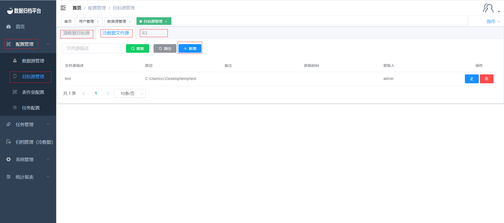

### Target Source Management

#### Adding Warm/Cold/S3 Data Target Sources

To add a new target source, navigate to "Target Source Management" under the "Configuration Management" menu. If you want to add a warm data target source, click on "Warm Data Target Source." For cold data target sources, click on "Cold Data File Source." Similarly, for S3 target sources, click on "S3." Then, click the "New" button to bring up the form for adding a new target source. The process for cold data and S3 is similar to adding a data source. After completing the necessary details, click "Confirm" to save the target source. For cold data file sources, click "Confirm" after filling in the required information.

#### Modifying Warm/Cold/S3 Data Target Sources

Click the blue button to edit a target source. The process for modifying warm data target sources and S3 is similar to modifying a data source. For cold data file sources, modify the path and click "Confirm" to save the changes.

#### Deleting Warm/Cold/S3 Data Target Sources

Click the red button to delete a target source. A confirmation prompt will appear. If you intend to delete the target source, click "Confirm." If not, click "Cancel."

#### Binding Warm/Cold/S3 Data Target Sources to Users

The process of binding target sources is similar to binding data sources. If you want to bind a target source, click on the target source, and then check the relevant sources. The process is the same for file sources and S3. After that, click "Save" to grant the user access to the selected sources.

