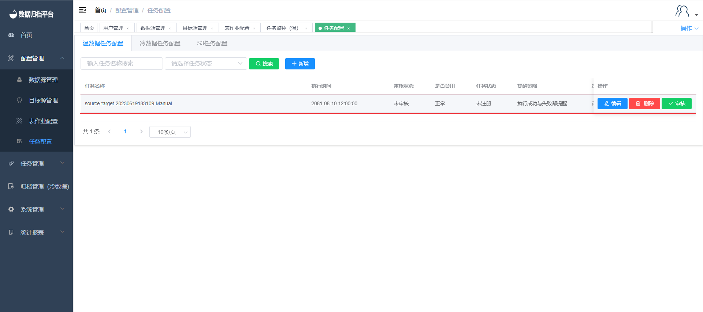
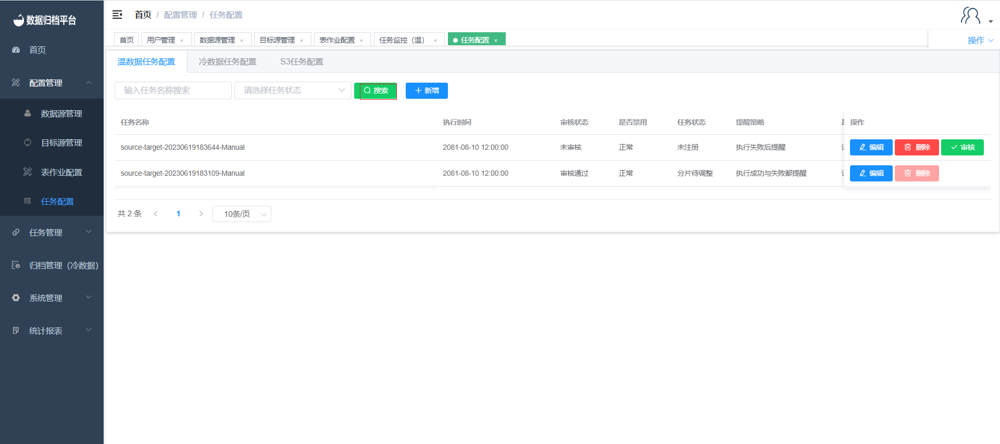

### Task Configuration

#### Adding Warm/Cold/S3 Tasks

To configure a new task, go to "Task Configuration" under the "Configuration Management" menu. Click on "Warm Data Task Configuration" to view all warm data archiving task information. Click on "Cold Data Task Configuration" to view all cold data archiving task information. Similarly, click on "S3 Task Configuration" to view all S3 archiving task information. After selecting the type of task you want to add, click the "Add" button to bring up the table shown in the second image. Click "Add Job" to show the already configured table job configuration, and then associate the desired table jobs with the task configuration, as shown in the third image. A task can have multiple table jobs associated with it. You can choose between manual tasks, recurring tasks, and one-time tasks. For one-time tasks, you can set the execution time using a Cron expression, while recurring tasks must have a Cron expression for scheduling. Since a task can have multiple table jobs, you can configure the execution mode to be either serial or parallel. You can also set the task timeout and configure the number of retries in case of failure. Additionally, you can set up email notifications for task success or failure. Once the configuration is complete, as shown in the fourth image, click "Confirm." After configuration, the task needs to be reviewed by a management user.

#### Editing Warm/Cold/S3 Tasks

Click the edit button to open the table shown in the first image. This task configuration can be edited or deleted until it is reviewed by a management user. Once reviewed, the task cannot be edited or deleted. After editing the task, click "Confirm" to save the changes.

#### Deleting Warm/Cold/S3 Tasks

Before being reviewed by a management user, tasks can be edited or deleted. Click the red "Delete" button to show a confirmation prompt. If you are sure you want to delete the task, click "Delete." If not, click "Cancel."

#### Searching Warm/Cold/S3 Tasks

There are two condition boxes before the search button. Fill in the criteria and click "Search" to filter the task configurations that match the specified criteria.

