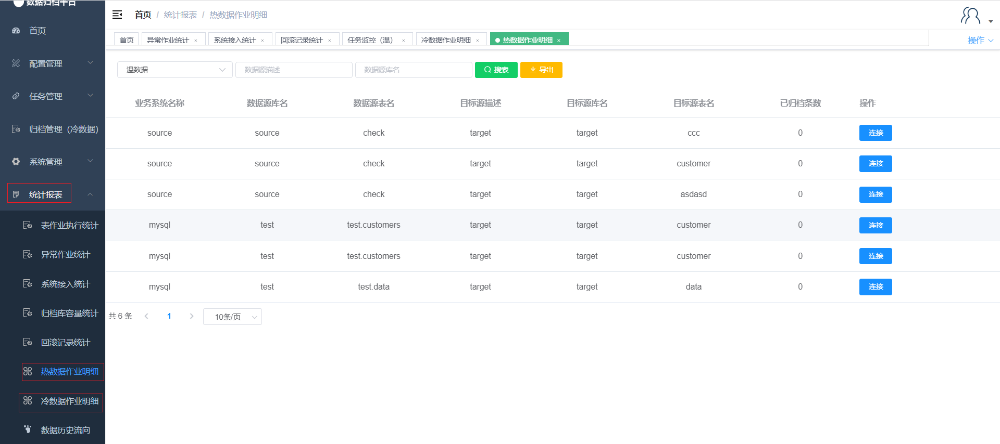

#### Job Details

Clicking on "Job Details" under the "Statistics Report" menu displays the detailed information about jobs within the platform. This page includes a search button, search criteria fields, and an export button.

##### Search

The green button in the image above is the search button. On the left side, there are three criteria fields. After filling in the filtering criteria, click "Search" to filter out job details that match the criteria.

##### Export

The yellow button is the export button, which allows you to export the job details statistics information as an xlsx file.

##### Link

For each job detail, there is a "Link" button. Clicking the link button will navigate you to the task monitoring page for that specific job.