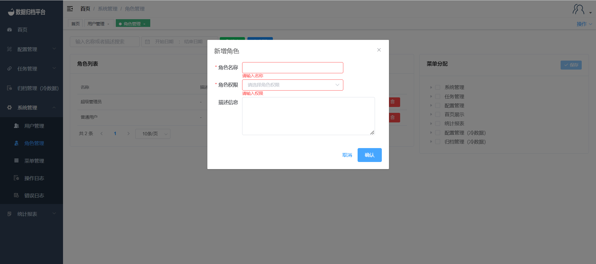
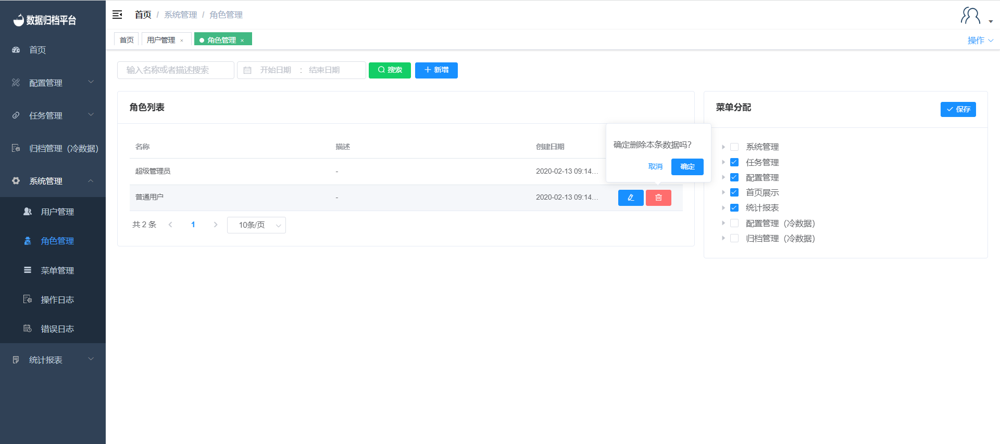
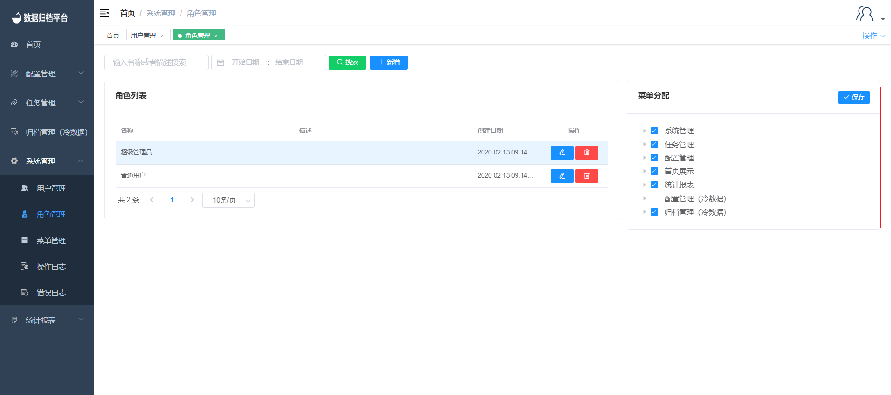

#### Role Management

Clicking on "Role Management" under the "System Management" menu, which is visible only to administrator users, will take you to a page where you can view information about all role permissions categories in the platform.

##### Search

The green button at the top is the search button. On the left side, there are two criteria fields. Fill in these fields and click "Search" to filter the desired role list.

##### Add

The blue button is the add button. Clicking the "Add" button will open the interface as shown in the image. Fill in the role name and role permissions to add role information.

##### Edit

Clicking the blue pencil icon on the right side of a role opens the edit role dialog. You can modify the role's name, permissions, or add a description. Click "Save" when done.

##### Delete

The red button on the right side is the delete button. Clicking the delete button will prompt whether you are sure you want to delete the role. If you confirm deletion, click "OK"; if not, click "Cancel."

##### Menu Assignment

Clicking on a role reveals the menus associated with that role on the right side. Check and assign menus according to the actual permissions and menus the role should have. Save the data to bind the menus that the role can operate with.

