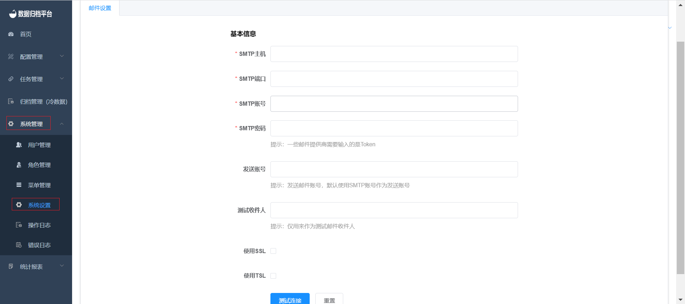

##### SMTP Email Settings

Clicking on "System Settings" under the "System Management" menu, which is visible only to administrator users, will take you to a page where SMTP configuration is displayed. After filling in the basic configuration, click the "Test Connection" button. If the test is successful and you receive a test email, a "Save" button will appear. Once the SMTP configuration is saved, alert emails for task configurations will be sent from the email address configured here.

